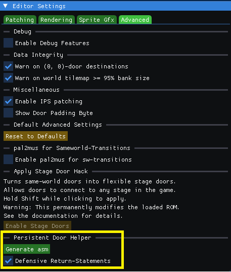
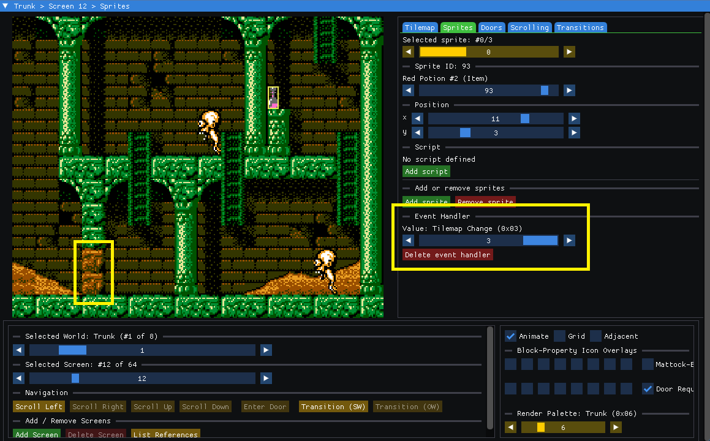

<hr>

# Advanced Modding

<hr>

[Echoes of Eolis](https://github.com/kaimitai/faxedit) includes an optional set of advanced features for creating ROM hacks that go beyond the capabilities of the original Faxanadu engine.

These features allow projects to:

- Extend the original script engine with custom opcodes
- Create persistent world state using up to 248 extended flags
- Build reusable script subroutines using `JSR` and `Return`
- Implement new gameplay mechanics entirely through scripts
- Create conditional tilemap changes that permanently alter the world
- Inject runtime code automatically without manually relocating assembly

The advanced systems are completely optional. Projects that do not enable them produce behavior identical to the original game. No knowledge of 6502 assembly is required to use the built-in runtime library. Most projects simply enable the desired opcodes and use them from ordinary iScript assembly.

This document assumes you are already familiar with the basic iScript assembly syntax described in the [scripting documentation](scripting-guide.md).

<hr>

## Table of Contents

- [Getting Started](#getting-started)
- [Learning the System](#learning-the-system)
- [Extended Script System](#extended-script-system)
  - [Configuring Runtime Opcodes](#configuring-runtime-opcodes)
  - [Assembly Process](#assembly-process)
  - [Compatibility](#compatibility)
  - [Runtime Helpers](#runtime-helpers)
  - [Custom Script Opcode Library Reference](#custom-script-opcode-library-reference)
  - [Example: Keep all Doors in World 1 (Trunk) Unlocked](#example-keep-all-doors-in-world-1-trunk-unlocked)
- [Tilemap Change System](#tilemap-change-system)
  - [Overview](#overview)
  - [How it Works](#how-it-works)
  - [Assembly Syntax](#assembly-syntax)
  - [Typical Workflow](#typical-workflow)
  - [Example: Persisting Mattock-breakable Blocks](#example-persisting-mattock-breakable-blocks)
  - [Configuration](#configuration)
  - [Limitations](#limitations)
- [Bank 15 Hack Injection Points](#bank-15-hack-injection-points)
- [RAM Used by Custom Hacks](#ram-used-by-custom-hacks)

<hr>

## Getting Started

Echoes of Eolis loads its default configuration from ```eoe_config.xml```. This file should never be modified. It is part of the application and may be replaced when upgrading to a newer version.

Instead, project-specific configuration belongs in ```eoe_config_override.xml```. Any settings present in the override file replace the corresponding defaults in ```eoe_config.xml```, while all omitted settings continue to use the built-in values.

Many projects never need an override file. However, the advanced scripting system uses it to define the project's custom script language, making an override file the recommended starting point for the features described in this document.

A skeleton override file, ```eoe_config_override-advanced.xml```, is included in the ```util``` directory. Copy it to the directory containing the Echoes of Eolis executables, rename it to ```eoe_config_override.xml```, and modify it as needed.

The provided file is only a starting point. It enables a representative selection of the built-in runtime opcodes, but most projects should remove unused entries, reorder them if desired, and add or replace implementations as their scripting language evolves.

Think of the runtime library as a toolbox. Each ```Impl``` entry selects one tool from that toolbox. The selected tools become new script opcodes in your project's scripting language.

When the advanced scripting features are used, ```eoe_config_override.xml``` does more than configure the tools - it also defines the project's scripting language. The iscript_opcodes map specifies which opcodes exist, their mnemonics, argument types, and any runtime implementations they use. **The XML is no longer just configuration - it defines the project's scripting language.** When assembling iScripts through the GUI, this configuration is reloaded automatically before assembly. This makes it possible to edit the scripting language in ```eoe_config_override.xml``` and immediately assemble scripts using the new definition without restarting Echoes of Eolis.

Both the graphical editor and command-line tool use the same scripting implementation and configuration. The opcode definitions are used by both applications when assembling and disassembling scripts.

The custom scripting opcodes are defined in ```iscript_opcodes``` in the configuration xml. Opcodes 0-23 define the vanilla scripting language, and should typically be left as-is. Opcodes 24 and up will be configured based on a project's needs. The opcode numbers themselves are arbitrary, but each opcode must have a unique number. The configured opcode map does not need to be dense: Echoes of Eolis automatically densifies it when loading the scripting language. However, all opcodes that specify an ```Impl``` must appear after all opcodes without an ```Impl```.

Most advanced projects only need to:

1. Enable the runtime opcode implementations they intend to use by editing or adding entries to ```iscript_opcodes``` that specify an ```Impl``` value. The ```Impl``` selects one of the built-in runtime implementations.
2. Use the new opcodes in your assembly source files
3. Assemble their script file as usual

The assembler automatically determines which runtime helpers are required, assembles them into free space, rebuilds the script dispatch table when necessary, and reports the amount of ROM space consumed.

No manual relocation, address calculation, or runtime installation is required by the script author.

#### Quick Setup

1. Copy ```util/eoe_config_override-advanced.xml``` next to the executables and rename it to ```eoe_config_override.xml```.
2. Open the ```iscript_opcodes``` map in this file.
3. Leave opcode entries 0-23 unchanged. These define the vanilla scripting language.
4. Review the example runtime opcodes starting at entry 24. Remove any you do not need, add others, or rearrange them as desired. Opcode numbers must be unique, but gaps are allowed; Echoes of Eolis automatically densifies the opcode map when it is loaded. All opcodes with an Impl must appear after all opcodes without one. **You can change the opcode set at any time later; existing assembly will continue to build as long as every opcode it uses is still defined in the map.**
5. Use the configured mnemonics in your assembly source and assemble as usual.


```text
 eoe_config_override.xml
           │
           ▼
   opcode definitions
           │
           ▼
    iScript system
       │       │
       ▼       ▼
   assemble  disassemble
       │       │
       └── ROM ┘
```

<hr>

## Learning the System

The advanced features are designed to be combined, and there are often several ways to solve the same problem. If you are new to the runtime library, it is recommended to create a small "toy" project before modifying a larger ROM.

For example, try creating a script that:

- Sets an extended flag
- Checks that flag on a later visit
- Changes a few metatiles on a screen
- Adds a custom script opcode such as IfWorld or IfScreen

Building a small experiment like this makes it much easier to understand how the runtime library, script engine, and tilemap change subsystem interact before using them in a larger project.

Once you are comfortable with the workflow, the same techniques can be combined to build persistent doors, environmental puzzles, quests, scripted events, and entirely new gameplay mechanics.

<hr>

## Extended Script System

The Echoes of Eolis iScript system extends the original Faxanadu scripting engine with an optional runtime library that allows new script opcodes to be added without modifying the original game engine. The system is fully data-driven and is designed to preserve vanilla behavior unless extensions are explicitly enabled.

Unlike the original game, where the script opcode table is fixed, the assembler generates a new opcode dispatch table during assembly. Vanilla opcode implementations are preserved, while any enabled runtime implementations are assembled into free space and appended to the dispatch table automatically.

The runtime library is assembled on demand. Helper routines and opcode implementations are only emitted if they are required by the opcodes configured for the current project. As a result, different projects may produce different runtime layouts while remaining fully compatible with the same scripting system.

The flow of the advanced features is roughly as follows.

```text
      Assembly (.asm)
             │
             ▼
      iScript assembler
             │
             ▼
       Modified ROM
             │
             ▼
     Echoes of Eolis
             │
             ├── Edit maps
             ├── Assign screen handlers
             └── Test / continue editing
```


### Configuring Runtime Opcodes

Runtime opcode implementations are configured through ```eoe_config_override.xml```.

Only opcodes that specify an ```Impl``` value are implemented by the runtime library. All remaining opcodes continue to use the game's original implementations.

### Assembly Process

When a script file is assembled, the assembler performs the following steps:

- Reads the configured opcode definitions.
- Determines which runtime implementations and helper routines are required.
- Assembles the runtime library into the configured free space.
- Rebuilds the script opcode jump table.
- Redirects the game's dispatcher to the newly generated table.

This process is completely automatic. Script authors only need to use the desired opcodes in their assembly source; the required runtime support is generated automatically.

### Compatibility

The extended script system preserves the original Faxanadu scripting engine. Existing scripts continue to function without modification, and projects that do not enable runtime opcode implementations produce behavior identical to the original game.

### Runtime Helpers

Several runtime opcodes share common helper routines. These helpers are emitted only when at least one opcode requires them.

Examples include:

- Flag operand decoding
- Quest flag operand decoding
- Generic value comparison used by conditional opcodes
- Player metatile position normalization

This minimizes ROM usage while allowing new opcode implementations to reuse common functionality.

### Custom script opcode library reference

| Impl | Arguments | Description | Example |
|------|-----------|-------------|---------|
| SetFlag | Byte | Sets an extended flag (0-247) | SetFlag 110 ; sets flag 110 |
| ClearFlag | Byte | Clears an extended flag (0-247) | ClearFlag 110 ; clears flag 110 |
| IfFlag | Byte, Label | Jumps if the extended flag is set | IfFlag 110 @target ; jumps to @target if flag 110 is set |
| SelectFlag | Byte | Selects an extended flag for later use by the selected-flag opcodes | SelectFlag 110 ; prepares use of flag 110 |
| SetSelectedFlag | None | Sets the currently selected extended flag | |
| ClearSelectedFlag | None | Clears the currently selected extended flag | |
| IfSelectedFlag | Label | Jumps if the currently selected extended flag is set | |
| SetQuestFlag | Byte | Sets a vanilla quest flag (0-7) | SetQuestFlag 3 ; sets quest flag 3 |
| ClearQuestFlag | Byte | Clears a vanilla quest flag (0-7) | ClearQuestFlag 3 ; clears quest flag 3 |
| IfQuestFlag | Byte, Label | Jumps if the vanilla quest flag is set | IfQuestFlag 3 @target ; jumps to @target if quest flag 3 is set |
| JSR | Label | Jumps to the label and stores current address (jump to subroutine) | JSR @sub ; jump to @sub and prepares a return |
| Return | None | Returns execution to after the last JSR | Return ; returns to the instruction after the last JSR |
| IfWorld | Byte, Label | Jumps if the current world equals the argument | IfWorld 1 @is_trunk ; jumps to @is_trunk if current world is 1 |
| IfScreen | Byte, Label | Jumps if the current screen equals the argument | IfScreen 3 @is_screen_3 ; jumps to @is_screen_3 if current screen is 3 |
| IfStage | Byte, Label | Jumps if the current stage equals the argument | IfStage 2 @is_stage_2 ; jumps to @is_stage_2 if current stage is 2 |
| IfYX | Byte, Label | Jumps if the player's normalized metatile position equals the argument | IfYX $a4 @pos_4_10 ; jumps to @pos_4_10 if player position is (x=4, y=10) |
| IfDoorYX | Byte, Label | Jumps if the currently selected door has the specified packed YX coordinate | IfDoorYX $a4 @door_4_10 ; jumps to @door_4_10 if current door position is (x=4, y=10) |
| ForceDoor | None | Overrides a failed door requirement, allowing the current door transition to proceed | |
| RunScreenHandler | None | Executes the custom screen event handler (used by the tilemap change subsystem) | |
| GetXP | Short (0-65,535) | Gives player xp; note that "next rank" can only increase by 1 each time XP is given | GetXP 100 ; player gets 100xp |
| Die | None | Kills the player when the script ends | |
| IfAddrEquals | Short, Byte, Label | Jumps to label if value at cpu-address equals the byte | IfAddrEquals $03d1 5 @music_no_is_5 |
| IfAddrBetween | Short, Byte, Byte, Label | Jumps to label if value at cpu-address lies between the byte operands | IfAddrBetween $03d1 2 5 @music_no_is_between_2_and_5 |
| SetAddr | Short, Byte | Sets value at given cpu-address (must be RAM) to the byte value given | SetAddr $03d1 5 ; set music to 5 |
| AtlasDevShakeScreen | Byte, Byte, Byte | Shakes the screen for the given number of NMI frames, alternating the scroll register by the given amplitude every given number of frames, then restores the entry scroll position | AtlasDevShakeScreen 60 2 1 ; shakes for 60 frames at amplitude 2, flipping every frame |
| AtlasDevFadeOut | Byte, Byte | Fades the background/UI palette toward black over the given number of NMI frames, stopping at the given stage depth (1-4) | AtlasDevFadeOut 60 4 ; fades fully to black over 60 frames |
| AtlasDevFadeIn | Byte, Byte | Fades the background/UI palette back in over the given number of NMI frames, reversing the given stage depth (1-4) | AtlasDevFadeIn 60 4 ; fades back in over 60 frames |
| AtlasDevSetMusic | Byte | Stops the music with 0, or selects song 1-16; values above 16 are ignored | AtlasDevSetMusic 5 ; play song 5 |
| AtlasDevPlaySFX | Byte | Plays public sound effect $00-$1c through the game's own effect entry point, exactly as in ordinary play; higher IDs are ignored | AtlasDevPlaySFX 4 ; play effect 4 |
| AtlasDevIfMusic | Byte, Label | Jumps when the given song is the one currently selected | AtlasDevIfMusic 5 @already_playing |
| AtlasDevSetPortrait | TextBox | Sets the dialogue portrait on an already-open interaction; GENERIC is the plain box, the named portraits carry one | AtlasDevSetPortrait GURU ; switches the open box to the Guru portrait |
| AtlasDevClearPortrait | None | Runs the vanilla portrait teardown: id cleared, image cleared, area palette restored. The window and text survive, so the script keeps talking | AtlasDevClearPortrait ; drops the portrait, keeps the box |
| AtlasDevHideTextbox | None | Repaints the background over the dialogue rectangle. The interaction is NOT closed: the context, the rectangle and the script all survive | AtlasDevHideTextbox ; the box disappears, the script runs on |
| AtlasDevOpenTextbox | None | Opens the generic dialogue box the game itself uses for an NPC, at the engine's own adaptive position, and lays the text grid | AtlasDevOpenTextbox ; opens a box, making later text visible again |
| AtlasDevCloseDialogue | None | Closes a portrait conversation: clears the textbox context and repaints the larger portrait-and-text rectangle | AtlasDevCloseDialogue ; tears the portrait conversation down |
| AtlasDevEntitySayMessage | Byte, string | Gives the message to the entity in the given slot, so it is spoken with that entity's own portrait context | AtlasDevEntitySayMessage 2 "Who goes there?" |
| AtlasDevShowSequentialMessages | string, string, string, string | Shows up to four messages in order, one A press between each. An unused slot is a plain 0. B skips the rest; the remaining operands are still consumed, so the stream never desyncs | AtlasDevShowSequentialMessages "One." "Two." "Three." 0 |
| AtlasDevShowNumberInMessage | string, Byte | **Do not use yet.** Reveals the message without its A wait, renders a script register as three digits at the text cursor, then runs the engine's own A wait | AtlasDevShowNumberInMessage "You have" 0 |
| AtlasDevShowChoiceToVar | Byte, Byte | **Do not use yet.** Runs the vanilla menu selection loop over Count rows and stores the chosen index in a script register, or $FF if the player cancels with B. Count is clamped to 1-8 | AtlasDevShowChoiceToVar 3 0 ; three rows, result into register 0 |
| AtlasDevShowMessageFromVar | Byte | **Do not use yet.** Shows the message whose id is held in a script register. An out-of-range register, or an id outside 1-193, is a no-op | AtlasDevShowMessageFromVar 0 |
| AtlasDevIfEntityCountAtLeast | Byte, Label | Jumps when at least Count of the eight entity slots hold a live entity. Count 0 always jumps; Count above 8 never does | AtlasDevIfEntityCountAtLeast 1 @some_left |
| AtlasDevCountActiveEntities | Byte | **Do not use yet.** Stores how many of the eight entity slots are live, 0-8, into a script register | AtlasDevCountActiveEntities 0 |
| AtlasDevFindEntity | Byte, Byte | **Do not use yet.** Stores the lowest slot holding the given entity identity into a script register, or $FF when no slot does | AtlasDevFindEntity 58 0 |
| AtlasDevFreezeEntities | None | Pauses every entity's update until AtlasDevResumeEntities; nothing else clears the pause, so a script that freezes must resume | AtlasDevFreezeEntities |
| AtlasDevResumeEntities | None | Ends the pause started by AtlasDevFreezeEntities | AtlasDevResumeEntities |
| AtlasDevIfBossPresent | Label | Jumps when any of the eight slots holds a boss | AtlasDevIfBossPresent @boss_here |
| AtlasDevIfEntityTypePresent | Byte, Label | Jumps when any slot holds the given entity identity; identities above $64 are always false, so an empty slot can never match | AtlasDevIfEntityTypePresent 68 @lady_here |
| AtlasDevIfEntitySlotActive | Byte, Label | Jumps when the slot holds a live entity; there is deliberately no negated form, invert the branch target instead | AtlasDevIfEntitySlotActive 0 @slot0_live |
| AtlasDevIfEntityHidden | Byte, Label | Jumps when the slot's entity is hidden; an invalid slot is not hidden | AtlasDevIfEntityHidden 0 @is_hidden |
| AtlasDevSetEntityHidden | Byte, Byte | Hides (nonzero) or shows (0) the slot's entity; its behaviour keeps running while unseen | AtlasDevSetEntityHidden 0 1 |
| AtlasDevSetEntityHealth | Byte, Byte | Sets the slot's live HP; death fires on subtract-borrow, so 0 means dies to the next hit rather than dead | AtlasDevSetEntityHealth 0 5 |
| AtlasDevSetEntityInvincible | Byte, Byte | Grants that many frames of hit exemption through the engine's own i-frame counter; 0 clears it | AtlasDevSetEntityInvincible 0 60 |
| AtlasDevSetEntityBehavior | Byte, Byte | Selects one of the engine's behaviours for the slot and re-runs its initializer; behaviour 6 is refused | AtlasDevSetEntityBehavior 0 4 |
| AtlasDevSetEntitySpeed | Byte, Byte, Byte | Sets a walker's cached speed, fraction then whole pixels; flyers keep their velocity elsewhere and are unaffected | AtlasDevSetEntitySpeed 0 0 3 |
| AtlasDevSetEntityFacing | Byte, Byte | Faces the slot's entity left (0) or right (nonzero); a free slot is left alone | AtlasDevSetEntityFacing 0 1 |
| AtlasDevEntityFieldToVar | Byte, Byte, Byte | **Do not use yet.** Reads one per-slot byte, field 0-11, into a script register; fields 0-5 come from the $02CC group, 6-11 from the $0344 group | AtlasDevEntityFieldToVar 0 6 2 |
| AtlasDevDrawVarNumber | Byte, Byte, Byte, Byte | **Do not use yet.** Draws a script register as a zero-padded decimal at a raw tile position through the HUD's own digit routine; operands are register, X tile, Y tile, digit count 1-7 | AtlasDevDrawVarNumber 0 4 24 3 |
| AtlasDevIfPlayerFacing | Byte, Label | Jumps when the player faces the requested direction; even values mean left and odd values mean right | AtlasDevIfPlayerFacing 1 @facing_right |
| AtlasDevIfPlayerClimbing | Label | Jumps while the engine's own climbing predicate is true | AtlasDevIfPlayerClimbing @on_ladder |
| AtlasDevIfPlayerGrounded | Label | Jumps when the player is not jumping, falling, or actively climbing | AtlasDevIfPlayerGrounded @on_ground |
| AtlasDevIfPlayerAttacking | Label | Jumps while a sword swing is in progress | AtlasDevIfPlayerAttacking @swinging |
| AtlasDevIfPlayerInvincible | Label | Jumps while the player's hurt/invincibility timer is nonzero | AtlasDevIfPlayerInvincible @protected |
| AtlasDevIfPlayerDead | Label | Jumps while Faxanadu's reserved death-dialogue script (root 31) is executing | AtlasDevIfPlayerDead @dead |
| AtlasDevIfSelectedWeapon | Byte, Label | Jumps when the selected weapon's category-local id equals the operand | AtlasDevIfSelectedWeapon 2 @giant_blade |
| AtlasDevIfSelectedMagic | Byte, Label | Jumps when the selected magic's category-local id equals the operand | AtlasDevIfSelectedMagic 2 @fire |
| AtlasDevWaitFrames | Byte | Waits for 0-255 NMI frames; zero is a no-op | AtlasDevWaitFrames 30 |
| AtlasDevWaitForButtonPress | Byte | Waits for every requested button to be released, then for any requested button's next press edge | AtlasDevWaitForButtonPress $80 |
| AtlasDevIfButtonHeld | Byte, Label | Jumps when any requested button is held in the latest complete controller sample | AtlasDevIfButtonHeld $40 @holding_b |
| AtlasDevIfButtonPressed | Byte, Label | Jumps on the current rising edge of any requested button | AtlasDevIfButtonPressed $80 @pressed_a |
| AtlasDevSetFacing | Byte | Faces the player left (0) or right (any nonzero value) | AtlasDevSetFacing 1 |
| AtlasDevSetPlayerPosition | Byte | Moves the player to a collision-checked packed YX block coordinate | AtlasDevSetPlayerPosition $74 |
| AtlasDevOpenWindow | Byte, Byte, Byte, Byte | Draws a bordered window at X, Y, width, height | AtlasDevOpenWindow 4 8 20 10 |
| AtlasDevShowIcon | Byte, Byte, Byte | Draws one of the 20 resident item icons at a window-relative offset | AtlasDevShowIcon 3 2 2 |
| AtlasDevCloseWindow | — | Restores the game background beneath the current window rectangle | AtlasDevCloseWindow |
| AtlasDevLayText | — | Lays the vanilla 16x4 text grid inside the current window | AtlasDevLayText |
| AtlasDevOpenWindowAtEntity | Byte, Byte, Byte, Byte, Byte | Opens an even-sized window relative to an entity slot, or the player for slots 8+ | AtlasDevOpenWindowAtEntity 0 4 248 20 8 |
| AtlasDevRestoreRect | Byte, Byte, Byte, Byte | Restores an explicit even-aligned rectangle from the game background | AtlasDevRestoreRect 4 8 20 10 |
| AtlasDevShowItemName | Item, Byte, Byte | Draws an item's canonical resident-font name at an absolute tile position | AtlasDevShowItemName WEAPON_HAND_DAGGER 4 12 |
| AtlasDevShowIconEx | Byte, Byte, Byte, Byte | Draws a resident icon with independent shape and palette selection | AtlasDevShowIconEx 3 1 2 2 |
| AtlasDevClearText | — | Blanks all four rows of the current text grid while keeping the window and portrait | AtlasDevClearText |
| AtlasDevLayTextAt | Byte, Byte | Lays the vanilla 16x4 text grid at an explicit tile position | AtlasDevLayTextAt 4 10 |
| AtlasDevClearTextLine | Byte | Blanks one current-window text row; the row operand is masked to 0-3 | AtlasDevClearTextLine 0 |
| AtlasDevLayTextLine | Byte, Byte, Byte | Lays one 16-tile row at X, Y from a caller-selected tile base | AtlasDevLayTextLine 4 10 $40 |
| AtlasDevSetHealth | Byte | Sets health to 0-80 through the game's own HP setter; higher values clamp to 80, the fractional HP byte is cleared, and zero does not itself kill the player | AtlasDevSetHealth 40 ; half Power |
| AtlasDevSetMana | Byte | Sets current MP through the game's own fixed-bank setter, which redraws the HUD magic bar in the same call; 80 ($50) is the fixed maximum and higher values clamp to it | AtlasDevSetMana 80 ; magic completely full |
| AtlasDevFullHeal | — | Refills HP to the game's fixed maximum $50:$00 through the HUD's own setter, so the power bar redraws immediately | AtlasDevFullHeal |
| AtlasDevFullMana | — | Restores MP to the fixed $50 maximum through the game's own setter, redrawing the magic bar in the same call | AtlasDevFullMana |
| AtlasDevIfHealthBelow | Byte, Label | Jumps when the player's HP is strictly below the operand; only the whole-points byte is compared, so equal HP never jumps even with a nonzero fraction | AtlasDevIfHealthBelow 40 @hp_low |
| AtlasDevIfHealthAtLeast | Byte, Label | Jumps when the player's integer HP, the value the HUD bar shows, is at least the operand; the fractional HP byte is ignored | AtlasDevIfHealthAtLeast 40 @healthy |
| AtlasDevIfManaAtLeast | Byte, Label | Jumps when the player's magic points are greater than or equal to the operand; MP is one byte the game caps at 80 ($50) | AtlasDevIfManaAtLeast 40 @enough_mp |
| AtlasDevAddExperience | Short (0-65,535) | Adds experience through the enemy-kill award path: saturating add, promotion check and HUD digit redraw; "next rank" can advance at most once per call | AtlasDevAddExperience 500 |
| AtlasDevSetGold | Byte, Byte, Byte | Sets gold to an exact 24-bit value, given low byte first, and redraws the seven-digit gold HUD through the game's own conversion routine | AtlasDevSetGold 244 1 0 ; gold becomes 500 (244 + 1*256) |
| AtlasDevIfGoldAtLeast | Byte, Byte, Byte, Label | Jumps when the 24-bit gold counter is at least the threshold; the three operands are the threshold's low, middle and high bytes, the counter's own little-endian order | AtlasDevIfGoldAtLeast 232 3 0 @rich ; jumps at 1000 gold or more |
| AtlasDevIfXPAtLeast | Short (0-65,535), Label | Jumps when the player's experience is at least the given value | AtlasDevIfXPAtLeast 3000 @veteran |
| AtlasDevIfItemCount | Item, Byte, Label | Jumps when the exact vanilla ownership count for the item — live carried copies plus a matching selected/equipped register, or the single special-item bit — is at least Count; undefined ids are always false | AtlasDevIfItemCount SPECIAL_RING_OF_ELF 1 @has_ring |
| AtlasDevSetPalette | Byte, Byte, Byte, Byte, Byte | Writes one background sub-palette (four colours at $3F00 + Sub*4) through the PPU command queue; every attribute cell using that sub recolors at once; the staged palette is unchanged, so a later palette flush or reload replaces it | AtlasDevSetPalette 1 $0f $16 $27 $30 |
| AtlasDevRestorePalette | — | Restores the area's own background palette by re-staging it from ROM behind a queue drain and enqueuing the atomic 32-byte upload | AtlasDevRestorePalette |
| AtlasDevLoadBgPalette | Byte | Loads a valid vanilla background-palette index through the vanilla stager, queue drained first; area transitions overwrite the selector | AtlasDevLoadBgPalette 4 |
| AtlasDevLoadSpritePalette | Byte | Loads a valid vanilla sprite-palette index through the vanilla sprite-half stager, queue drained first | AtlasDevLoadSpritePalette 2 |
| AtlasDevFlashScreen | Byte | Holds the PPUMASK greyscale bit for the given number of frames — the engine's own flash idiom — then restores the pre-flash mask bit-exact; 0 is a no-op | AtlasDevFlashScreen 6 |
| AtlasDevSetColorEmphasis | Byte | Atomically replaces PPUMASK colour-emphasis bits 5..7 through the NMI shadow while preserving rendering bits 0..4; masks select emphasis channels and are not brightness levels | AtlasDevSetColorEmphasis $e0 |
| AtlasDevQueuePaletteFlush | — | Bare trigger for queue command $00: flushes the staged $0293-$02B2 palette shadow to PPU palette RAM, with queue back-pressure for repeated calls | AtlasDevQueuePaletteFlush |
| AtlasDevWipeScreenStep | Byte, Byte, Byte | Queues one step of the death-sequence CHR-column erase (command $FA): an AND-mask erosion of one 16-byte CHR tile at the given PPU address, phase-offset per call; repeated calls wait for queue capacity | AtlasDevWipeScreenStep 3 $10 $00 |
| AtlasDevAnimateTiles | Byte, Byte | Rotates up to 8 consecutive PT1 background tiles one pixel right through queue command $FC; Count 0 is a no-op, values above 8 clamp, and 8 steps are the identity | AtlasDevAnimateTiles $40 4 |
| AtlasDevSetTextColor | Byte | Overrides the dialogue glyph colour (and the shared HUD colour) through a one-byte shadow patch and full-palette upload; $FF restores explicitly, while some textbox-close paths also reload the palette | AtlasDevSetTextColor $27 |
| AtlasDevSetAttrRect | Byte, Byte, Byte, Byte, Byte | Assigns a background sub-palette over a rectangle of 32x32-pixel attribute cells; X/Y are limited to 0..7, zero size is a no-op, and nonzero dimensions clip at the 8x8 table edge | AtlasDevSetAttrRect 2 3 4 2 1 |
| AtlasDevPlaceChrTile | Byte, Byte, Byte | Places one CHR tile on the background through the PPU command queue; X is limited to 0..31 and Y to 0..29 | AtlasDevPlaceChrTile $6a 12 8 |
| AtlasDevWarpToDoor | Byte | Warps through the door at packed YX on the current screen. Normal locks are bypassed; region-exit locks are not. A missing door continues the script. A successful warp ends it, so put this last and follow it with End | AtlasDevWarpToDoor 152 ; door at block (8,9) |
| AtlasDevWarpAreaScreenPos | Byte, Byte, Byte | Warps to Area, Screen and packed YX with the game's normal loader. Area 4 and values above 7 are rejected; Screen is not checked. A successful warp ends the script, so put this last and follow it with End | AtlasDevWarpAreaScreenPos 2 0 154 ; Mist, screen 0, block (10,9) |
| AtlasDevSpawnEntity | Byte, Byte | Spawns an entity with the game's normal allocator. Invalid types and a full eight-slot table do nothing | AtlasDevSpawnEntity 2 154 ; coin at block (10,9) |
| AtlasDevDropItem | Byte, Byte, Byte | Spawns a pickup and sets its amount | AtlasDevDropItem 2 5 154 ; coin worth 5 |
| AtlasDevDespawnEntity | Byte | Removes entity slot 0-7. Other values do nothing | AtlasDevDespawnEntity 7 |
| AtlasDevDespawnAllEntities | None | Removes all eight entity slots | AtlasDevDespawnAllEntities |
| AtlasDevSetMetatile | Byte, Byte | Changes one visible metatile. Packed Y must be 0-12 and the tile must exist in the current area | AtlasDevSetMetatile 69 16 ; block (5,4) |
| AtlasDevApplyEffect | Byte, Byte | Starts a timed effect (0 ointment, 1 glove, 2 wing boots, 3 hour glass) for a duration of roughly one second per unit. The effect is masked to 0-3 and the duration clamped to 0-127; the item's normal cost is not charged | AtlasDevApplyEffect 2 30 ; wing boots for ~30s |

**Note**: Runtime implementations are intended for use with custom opcodes. Vanilla opcodes (0-23) continue to use the game's original implementations unless explicitly remapped. This preserves compatibility with existing scripts while allowing projects to extend the scripting language with new functionality.

#### AtlasDev visual effects

```AtlasDevShakeScreen```, ```AtlasDevFadeOut``` and ```AtlasDevFadeIn``` each block script execution until their frame count elapses; NMI, OAM, controller polling and audio keep running, but the calling script does not advance until the effect finishes, so none of the three can be nested or interrupted by another script action. For ```AtlasDevFadeOut``` and ```AtlasDevFadeIn```, a frame count of ```0``` publishes the terminal state immediately instead of animating toward it. For ```AtlasDevShakeScreen```, a frame count of ```0``` is a plain no-op: the scroll register is left untouched.

```AtlasDevShakeScreen``` alternates the live horizontal scroll byte ```$0c``` by the requested amplitude every ```Period``` frames and restores the entry value exactly when it finishes. On a screen with a real adjacent same-area screen, this reads as a shake: one alternation phase is a clean translation of the same picture. On a single-screen interior, where the scroll rests at zero, the offset instead reveals the neighbour nametable page, which usually still holds whichever screen was visited previously, so it reads as a strobe rather than a shake. Both behaviors are deterministic and restore cleanly; the interior behaviour is a legitimate effect modders can use deliberately, not a defect to design around.

```AtlasDevFadeOut``` and ```AtlasDevFadeIn``` both drive the game's own fade routine (```$D0AD```). Its stage loop is hard bounded, exactly the width of the background/UI palette shadow it walks, so it only ever darkens the background palette; sprites, including dialogue portraits, stay lit throughout. This matches vanilla's own fades, which use the same routine at all five of its call sites, and it can be used deliberately for a spotlight look. ```Depth``` selects how many of the four vanilla stages to traverse, 1 to 4, and is clamped in the emitted code exactly as vanilla guards the same delta table; an ```AtlasDevFadeOut``` that is not followed by a matching ```AtlasDevFadeIn``` leaves the background dark persistently.

Each of the three reads its own operand count back out of its declared signature in ```iscript_opcode_impls``` rather than assuming one: the signature shown above is what ships, and declaring ```Args=Byte``` for any of them instead builds the earlier plain frame-count handler (```AtlasDevShakeScreen Frames``` shakes at amplitude 2 every frame; ```AtlasDevFadeOut Frames``` and ```AtlasDevFadeIn Frames``` run the full depth-4 fade).

#### AtlasDev dialogue opcodes

```AtlasDevHideTextbox``` and ```AtlasDevCloseDialogue``` are not two names for
the same thing. ```AtlasDevHideTextbox``` calls the vanilla restore, which only
repaints the background over the dialogue rectangle; the textbox context, the
rectangle and the running script all survive it, which is why it hides rather
than closes. ```AtlasDevCloseDialogue``` is the real teardown for a portrait
conversation: it clears the context and repaints the larger
portrait-and-text rectangle, which the generic restore does not cover.

Text tiles exist only while a box is open, so anything drawn after
```AtlasDevHideTextbox``` is written but not rendered. This is recoverable, not
terminal: ```AtlasDevOpenTextbox``` (or any action that opens a box, including
```AtlasDevSetPortrait```) lays the grid again and the following text reads
normally, with the entity's own dialogue unaffected afterwards. The rule for
scripts is simply to open a box before drawing text.

```AtlasDevOpenTextbox``` deliberately takes no coordinates. The box the game
opens for an NPC is placed adaptively - the engine picks a high or low position
depending on where the player is standing, so the box does not cover them -
and passing explicit coordinates is exactly what would lose that. This opcode
reproduces the vanilla placement rather than replacing it.

```AtlasDevSetPortrait``` takes a textbox context, so ```GENERIC``` is the
plain box and the named portraits each carry one. Every transition is handled:
generic to generic changes only the context, generic to portrait restores the
old rectangle before building the new frames, and portrait to portrait
preserves the original pre-portrait palette so a later ```End``` still restores
gameplay correctly.

```AtlasDevShowNumberInMessage```, ```AtlasDevShowChoiceToVar``` and
```AtlasDevShowMessageFromVar``` **should not be used yet**. Each reads or
writes a script register, so a project must define
```hack_script_var_ram_addr``` and ```hack_script_var_count``` before any of
them can be installed; without those constants the build fails by name rather
than the ROM reading unallocated RAM. They are published for review and have
had no validation outside a purpose-built fixture that supplied that RAM. One
known limitation in ```AtlasDevShowNumberInMessage```: the digits are drawn as
plain tiles at the text cursor and nothing restores the text grid underneath
them, so they remain visible over a following shorter message.

#### AtlasDev entity opcodes

```AtlasDevIfEntityCountAtLeast``` reads the game's own eight-slot entity table
at ```$02cc-$02d3``` and jumps when at least ```Count``` of those slots hold a
live entity. It is meant for wave gating - "once only one guard is left, open
the door" - and it answers that as a branch, so it needs no script variable
and no RAM a project has to allocate.

Two operand ranges are worth stating outright because they are defined
behaviour rather than error cases. ```Count 0``` always jumps, and does so
without reading the table at all: at least zero entities are always present.
```Count 9``` and above never jumps, because eight slots cannot hold nine
entities. Nothing in between needs a range check either; the emitted code
indexes slots 7 down to 0 and never reads past ```$02d3``` for any operand.

What counts as live is the engine's own definition, not a kill counter. Bit 7
set in a slot means the slot is free, and the engine clears a slot itself when
an entity's position leaves the screen. An entity that walks off therefore
stops counting exactly as a defeated one does. The table describes what is
loaded right now, so a script that wants "the player killed three guards"
should track that with flags rather than infer it from the census.

Every opcode above that takes a slot rejects a value outside 0 to 7 rather
than masking it, and a rejected call still consumes its remaining operands, so
the script stream never desynchronizes.

Two practical warnings for ```AtlasDevSetEntityHidden```, both observed in
play. A hidden entity keeps walking, so there is no reliable way to line up an
interaction with it; never hide the NPC that is supposed to perform the
un-hide. And ```AtlasDevDrawVarNumber```'s digits are ordinary background
tiles: a later draw at the same position replaces them, and they otherwise
persist until the screen is redrawn.

The same locality applies to every write these opcodes make. The engine
rebuilds the slot arrays from screen data when the player enters a screen, so
a scripted hide, speed, health or behaviour change lasts exactly until the
player leaves and comes back. That is the engine's own lifecycle, not a
limitation of the opcodes; a change that must persist belongs in a flag that a
script re-applies on each visit.

```AtlasDevCountActiveEntities``` and ```AtlasDevFindEntity``` **should not be
used yet**. Both write a script register, so a project must define
```hack_script_var_ram_addr``` and ```hack_script_var_count``` before either
can be installed; without them ```Config::constant``` throws by name and the
build stops, rather than a ROM shipping that writes RAM nobody allocated.
Reach for ```AtlasDevIfEntityCountAtLeast``` instead wherever the question is
a comparison, which is most of the time; these two are for when the number or
the slot index is itself wanted.

```AtlasDevFindEntity``` answers "absent" for any identity of ```$80``` or
above without reading the table. Bit 7 set is the engine's own free marker, so
no live entity can carry such an identity, and searching for one would
otherwise match an empty slot and report it as a find.

#### AtlasDev player-state conditionals

These eight opcodes are read-only and use state the vanilla engine already
maintains. They require no hooks, scheduler, or project RAM. Every true branch
uses the ordinary iScript jump continuation, and every false branch consumes
the label and continues normally.

```AtlasDevIfPlayerFacing``` reads the engine's facing bit, not the current
controller input, so it remains meaningful while controls are locked. Its
direction operand follows the engine's binary convention: the low bit selects
left (0) or right (1). ```AtlasDevIfPlayerAttacking``` is similarly a state
test: it remains true for the duration of the sword-swing state machine, not
only on the frame when the attack button was pressed.

```AtlasDevIfPlayerGrounded``` means none of jumping, falling, or active
climbing is set. ```AtlasDevIfPlayerClimbing``` is narrower and calls the
same fixed-bank predicate vanilla uses before movement actions. The helper is
byte-identical at CPU ```$ECF6``` in the US, US Rev A, EU and JP ROMs. The
expanded English translation has no verified address yet, so installing this
one opcode there fails by the missing ```rom_player_isclimbing``` constant
unless the project supplies a verified override; the other seven predicates
do not need that routine.

```AtlasDevIfPlayerInvincible``` tests the countdown that blocks ordinary
damage. It therefore covers both vanilla post-hit protection and any other
feature that deliberately writes that timer.

```AtlasDevIfPlayerDead``` tests the script context rather than HP. Faxanadu
clears its one-shot death latch before running any dialogue, and a fatal
fixed-point subtraction can leave fractional HP nonzero. Conversely, the
player can still be alive below one whole HP, so neither the latch nor an HP
test is truthful from inside an iScript. The vanilla death path instead calls
```IScripts_Begin``` with ```$FF```, which maps to reserved root 31 (the
"Remember your mantra" dialogue) and stores 31 as the active root before the
textbox opens. The opcode branches while that root is executing. Modders can
replace the contents of entrypoint 31 to create alternate death dialogue,
penalties, resurrection choices, or quest-specific death events. Calling
entrypoint 31 for an unrelated purpose is therefore unsupported: vanilla
reserves it as the death context.

There is deliberately no ```AtlasDevIfPlayerCasting```. Faxanadu has no
persistent casting state: casting is a one-frame trigger, while the spawned
spell is represented by the magic-object slot. Testing that slot would be
an ```IfMagicActive``` predicate, and calling it "casting" would misdescribe
what the ROM actually knows.

The selected-equipment operands are category-local ids, not packed item ids.
Weapons are 0 Hand Dagger, 1 Long Sword, 2 Giant Blade, and 3 Dragon Slayer.
Magic is 0 Deluge, 1 Thunder, 2 Fire, 3 Death, and 4 Tilte.

#### AtlasDev flow and player-control helpers

These six implementations are independent, opt-in handlers. They require no
resident scheduler, ROM hook, or newly reserved RAM. With only these six
selected, the installed script library occupies 272 bytes: 212 bytes of
handlers and 60 bytes for the two 30-entry dispatch tables.

```AtlasDevWaitFrames``` calls the fixed-bank NMI wait once per requested
frame. Zero is explicitly handled as a no-op. ```AtlasDevWaitForButtonPress```
first requires a fully released sample, then waits for a new rising edge. This
prevents the button used to open a conversation from immediately satisfying
the wait. A button mask may combine buttons; the tests are ANY-of, and a zero
mask is rejected by the assembler. The controller bits are Right ```$01```,
Left ```$02```, Down ```$04```, Up ```$08```, Start ```$10```, Select
```$20```, B ```$40```, and A ```$80```.

The release-gated wait updates the portrait/interaction frame through the
vanilla iScript helper at ```$87B0```. That address is verified for US, US Rev
A, EU, and Randum. No JP or expanded-English address is guessed; selecting
this implementation for either region requires a verified project override.
The two button conditionals and ```AtlasDevWaitFrames``` do not have this
region-specific dependency.

```AtlasDevSetFacing``` changes only player-property bit 6 and then resumes
the script. ```AtlasDevSetPlayerPosition``` accepts a packed top-left block
coordinate, ```$YX```, where each nibble is a 16-pixel grid coordinate. The
assembler rejects Y greater than 10. At runtime the move is accepted only
while the screen is ready, both body cells are ordinary air, and the cell
beneath is ordinary solid ground. A rejected target is a safe no-op. An
accepted move preserves facing, Wing Boots, HP, equipment, inventory, and
progress while clearing transient movement state so physics can resume
normally.

#### AtlasDev windows, icons, and text grids

These twelve handlers expose the drawing primitives used underneath the
vanilla dialogue system. They require no hooks, scheduler, or reserved
project RAM. Selected by themselves, they occupy 548 bytes: 476 handler bytes
and 72 bytes for the two 36-entry dispatch tables. Adding the packet to an
already extended library costs 500 bytes.

```AtlasDevOpenWindow``` writes the live window rectangle at
```$0208-$020B``` and asks the vanilla renderer to draw it. X, Y, width, and
height are clamped independently, so the opcode does not guarantee that
X+width or Y+height remains on-screen. Width and height must be even; the
vanilla two-tile fill loops can wrap and jam the PPU queue on odd dimensions.
```AtlasDevOpenWindowAtEntity``` forces every geometry value even. Slots 0-7
use that entity's live pixel position, while slots 8 and above use the player.
Its signed DX/DY operands are ordinary two's-complement bytes.

```AtlasDevCloseWindow``` restores the background beneath the most recently
described rectangle. ```AtlasDevRestoreRect``` performs the same restoration
after replacing that rectangle with explicit, even-aligned geometry. Window
drawing and restoration enqueue PPU work; allow several frames before drawing
or restoring another large overlapping rectangle. A 15-frame wait is a
conservative transition between ordinary dialogue-sized boxes.

```AtlasDevShowIcon``` selects both shape and the icon's ordinary palette from
one clamped ID, 0-19. ```AtlasDevShowIconEx``` separates shape from palette;
shape still clamps to 19 and palette is masked to five bits by the same
contract used by the ROM. Both positions are relative to the current window.
```AtlasDevShowItemName``` instead uses the resident static font and an
absolute tile position. Packed IDs in categories without a vanilla name table
are consumed safely without drawing.

Faxanadu dialogue streams glyph graphics into one shared 16x4 CHR tile grid,
```$40-$7F```. ```AtlasDevLayText``` places that grid at the current window's
origin+2,+2; ```AtlasDevLayTextAt``` places all four rows explicitly; and
```AtlasDevLayTextLine``` places one 16-tile row from any chosen tile base.
```AtlasDevClearText``` and ```AtlasDevClearTextLine``` erase nametable
references without closing the window or portrait. After clearing, call a lay
opcode before expecting a later ```Msg``` to become visible in that area.

#### AtlasDev visual effect presets

These named constants reproduce values chosen from a rendered matrix and confirmed on hardware. Paste the block into a script's ```[defines]``` section so call sites read as intent rather than magic numbers:

```text
[defines]
SHAKE_RUMBLE_FRAMES     60
SHAKE_RUMBLE_AMP         1
SHAKE_RUMBLE_PERIOD      1
SHAKE_CLASSIC_FRAMES    60
SHAKE_CLASSIC_AMP        2
SHAKE_CLASSIC_PERIOD     1
SHAKE_QUAKE_FRAMES      90
SHAKE_QUAKE_AMP          8
SHAKE_QUAKE_PERIOD       2
SHAKE_SLOW_SWAY_FRAMES  60
SHAKE_SLOW_SWAY_AMP      3
SHAKE_SLOW_SWAY_PERIOD   6
FADE_DEPTH_DIM           1
FADE_DEPTH_DUSK          2
FADE_DEPTH_GLOOM         3
FADE_DEPTH_BLACK         4
```

| preset | call |
|---|---|
| SHAKE_RUMBLE | AtlasDevShakeScreen SHAKE_RUMBLE_FRAMES SHAKE_RUMBLE_AMP SHAKE_RUMBLE_PERIOD |
| SHAKE_CLASSIC | AtlasDevShakeScreen SHAKE_CLASSIC_FRAMES SHAKE_CLASSIC_AMP SHAKE_CLASSIC_PERIOD |
| SHAKE_QUAKE | AtlasDevShakeScreen SHAKE_QUAKE_FRAMES SHAKE_QUAKE_AMP SHAKE_QUAKE_PERIOD |
| SHAKE_SLOW_SWAY | AtlasDevShakeScreen SHAKE_SLOW_SWAY_FRAMES SHAKE_SLOW_SWAY_AMP SHAKE_SLOW_SWAY_PERIOD |
| FADE_DIM | AtlasDevFadeOut 45 FADE_DEPTH_DIM |
| FADE_DUSK | AtlasDevFadeOut 45 FADE_DEPTH_DUSK |
| FADE_GLOOM | AtlasDevFadeOut 45 FADE_DEPTH_GLOOM |
| FADE_BLACK | AtlasDevFadeOut 60 FADE_DEPTH_BLACK |

One recipe, watched and confirmed before being written down:

Heartbeat pulse, five cycles of alternating fade out and fade in at full depth:

```text
    AtlasDevFadeOut 24 FADE_DEPTH_BLACK
    AtlasDevFadeIn  24 FADE_DEPTH_BLACK
    AtlasDevFadeOut 24 FADE_DEPTH_BLACK
    AtlasDevFadeIn  24 FADE_DEPTH_BLACK
    AtlasDevFadeOut 24 FADE_DEPTH_BLACK
    AtlasDevFadeIn  24 FADE_DEPTH_BLACK
    AtlasDevFadeOut 24 FADE_DEPTH_BLACK
    AtlasDevFadeIn  24 FADE_DEPTH_BLACK
    AtlasDevFadeOut 24 FADE_DEPTH_BLACK
    AtlasDevFadeIn  24 FADE_DEPTH_BLACK
```

All three effects are safe to run inside an open dialogue box; the box does not close until the script ends, and an open box does not touch the palette. The box's *close*, however, re-enqueues a palette reload, so a fade that must survive past the end of a conversation has to be re-applied after the box closes.

**Note**: Runtime implementations are intended for use with custom opcodes. Vanilla opcodes (0-23) continue to use the game's original implementations unless explicitly remapped. This preserves compatibility with existing scripts while allowing projects to extend the scripting language with new functionality.

#### AtlasDev audio

```AtlasDevSetMusic``` writes the requested state straight to ```Music_Current``` (```$fa```), which is the same contract the game's own five call sites use, and the sound engine picks the change up on its next pass. ```0``` stops the music and ```1```-```16``` select a song. Values above 16 are deliberately a no-op rather than an error, so a script driving the opcode from a variable cannot push the sound engine into an undefined song. **Note:** the choice lasts until the player leaves the area. Scrolling between screens keeps it, but area changes and building entries set the music themselves, so use this for a moment in the current area rather than to retheme one.

```AtlasDevPlaySFX``` plays a public sound effect through the game's own ```Sound_PlayEffect```, the same entry point its 56 vanilla call sites use, so an effect from a script sounds exactly like one from ordinary play. Whether the music continues underneath depends on which effect you pick, not on the opcode: an effect occupies whatever channels its own sound data uses, so most leave the melodic channels alone and a few take them. (That is separate from the priority arbitration in ```$F36F```, whose per-effect table at ```$F388``` only decides which of two competing effects wins the slot.) Measured from an APU write log with a song playing, effects ```$01``` and ```$04``` are indistinguishable from music alone, while effect ```$16``` triples the melodic writes and zeroes the triangle, so the track audibly drops under it. Only IDs ```$00```-```$1c``` are passed on; the effect routine indexes its table without bounds checking of its own, so higher values are dropped rather than forwarded.

```AtlasDevIfMusic``` answers "is this song currently selected". It needs care that is worth knowing about if you write your own audio opcodes: ```Music_Current``` holds the requested ID up until the NMI picks it up, and the same ID with bit 7 set afterwards. A comparison against only one of those two forms would answer differently depending on which side of a frame boundary the script happened to run, so the opcode accepts both. Each read of ```$fa``` is a single instruction and the NMI preserves the accumulator, so no interrupt window can be observed between the two comparisons. IDs above 16 take the false branch, matching ```AtlasDevSetMusic```'s domain.

None of the three blocks script execution, and none of them claims any state of its own or switches banks.

```SelectFlag``` stores an extended flag number in a temporary runtime variable. ```SetSelectedFlag```, ```ClearSelectedFlag``` and ```IfSelectedFlag``` operate on that selected flag instead of taking a flag number directly. This is particularly useful when multiple scripts share common logic for determining which flag should be used before deciding what operation to perform on it.

The value ```$ff``` is reserved as an **invalid flag**. ```SelectFlag $ff``` clears the current selection. If no valid flag has been selected, ```SetSelectedFlag``` and ```ClearSelectedFlag``` perform no action, while ```IfSelectedFlag``` behaves as though the selected flag is clear. This allows shared subroutines to safely indicate "no matching flag" without requiring additional checks by the caller.

```JSR``` and ```Return``` support a single active subroutine call. Nested ```JSR``` calls are not supported.

```IfYX``` and ```IfDoorYX``` both take an argument on the form ```$yx```, a hex value where the high nibble is y-position and low nibble is x-position in metatile space.

The difference between them is that ```IfYX``` considers the player's current position, and ```IfDoorYX``` considers the position of the door being interacted with. ```IfDoorYX``` should only be used within scripts invoked by in-game door logic.

The extended flags are for general use, whereas the quest flags have special meaning in the game:

| Quest Flag | Description |
|------------|-------------|
| 0 | The Tower of Fortress spring has been opened |
| 1 | The spring in the sky has been opened |
| 2 | The Joker Door spring has been opened |
| 3 | Quest Wing Boots have been obtained (Dropped by Zorugeriru in the Tower of Fortress) |
| 4 | The Quest Mattock has been obtained (Dropped by Wyvern in the Tower of Trunk) |
| 5 | The path to Mascon has been opened (final spring has been opened by pushing the blocks) |
| 6 | Unused |
| 7 | Unused |

<hr>

## Example: Keep all doors in world 1 (Trunk) unlocked

We will need the following custom opcodes in ```iscript_opcodes``` in ```eoe_config_override.xml```

```xml
  <entry byte="24" str="Impl=IfSelectedFlag" />
  <entry byte="25" str="Impl=SetSelectedFlag" />
  <entry byte="26" str="Impl=IfWorld" />
  <entry byte="27" str="Impl=IfScreen" />
  <entry byte="28" str="Impl=IfDoorYX" />
  <entry byte="29" str="Impl=JSR" />
  <entry byte="30" str="Impl=Return" />
  <entry byte="31" str="Impl=ForceDoor" />
  <entry byte="32" str="Impl=SelectFlag" />
```

We only specify the implementation (Impl) value, since the assembler knows the function signatures. Each opcode needs a unique byte value, but the values do not need to be contiguous; Echoes of Eolis automatically densifies the opcode map when it is loaded. All ```Impl``` entries must appear after all non-```Impl``` entries. If you want custom mnemonics that is possible too, for example:

```xml
<entry byte="30" str="Impl=Return,Mnemonic=Ret" />
```

would allow you to write "Ret" instead of "Return" in the asm-files. If a mnemonic is not given, it defaults to the Impl-value itself.

Once these opcodes have been defined, the assembler injects their implementations into free space in bank 12 together with the script bytecode.

##### High-Level Strategy

The vanilla game decides whether a door can be entered before the associated success or failure script executes. We cannot change that flow directly, but we can use the new scripting opcodes to remember which doors have been unlocked and override future failures.

Our strategy is to separate the problem into two parts:

1. **Identify the current door**. A shared subroutine examines the current world, screen, and (when necessary) door position, then stores the corresponding extended flag using ```SelectFlag```.
2. **Perform the desired operation**. Individual scripts simply call the shared selector and then decide what to do with the selected flag. Failure scripts test it with ```IfSelectedFlag```, while the successful key-use script permanently unlocks the door with ```SetSelectedFlag```.

This keeps all door-identification logic in one place. If a door is moved, removed, or a new one is added, only the shared selector needs to be updated. Every script that depends on door identity automatically benefits from the change.

For reference, these are the default failure scripts for doors locked by keys:

| Key Type | Script Entrypoint |
|----------|-----------|
| Jack | 2 |
| Queen | 123 |
| King | 124 |
| Ace | 125 |
| Joker | 126 |

The key-used successfully script has entrypoint ```132```.

```text
                           +----------------------+
                           |   Door interaction   |
                           +----------+-----------+
                                      |
                                      ▼
                            JSR @select_door_flag
                                      |
                                      ▼
                  +-----------------------------------------+
                  | SelectFlag = corresponding door flag    |
                  | (or $ff if no matching door exists)     |
                  +-------------------+---------------------+
                                      |
                     +----------------+----------------+
                     |                                 |
                     ▼                                 ▼
              Success script                    Failure script
             (entrypoint 132)                (entrypoints 2/123/126)
                     |                                 |
               SetSelectedFlag                   IfSelectedFlag
                     |                                 |
                     |                    +------------+------------+
                     |                    |                         |
                     |                  clear                      set
                     |                    |                         |
                     |              show vanilla                ForceDoor
                     |             failure message                 End
                     |
         door permanently unlocked
```

#### Implementation

In world 1, doors are locked with Key J, Key Q and Key Jo. These have failure scripts 2, 123 and 126, respectively - so in this example we will only concern ourselves with these.

In world 1, there are locked doors on screens 11, 30 and 40. On screen 40 there are two locked doors, so we need to distinguish them.

We will use flags 200, 201, 202 and 203 for these 4 doors.

First we create a shared subroutine that selects the persistent flag corresponding to the current door. We can put this anywhere in the ```[iscript]``` section, for example at the end.

```asm
; selects the persistent flag corresponding to the current door
; if no matching door is found, the selected flag remains $ff
@select_door_flag:
  SelectFlag $ff ; clear the selected flag
  
  IfWorld 1 @is_trunk
  Return ; this was not trunk - return to regular handling

@is_trunk:
  IfScreen 11 @trunk_11
  IfScreen 30 @trunk_30
  IfScreen 40 @trunk_40
  Return ; defensive return - not a locked door on any of these screens
  
  ; we know only one door exists on screen 11, so no more checks are needed
  @trunk_11:
  SelectFlag 200
  Return
  
  @trunk_30:
  SelectFlag 201
  Return
  
  @trunk_40:  ; we have two doors on this screen, and need to distinguish them
  IfDoorYX $10 @trunk_40_a ; door with coords (x=0, y=1)
  IfDoorYX $3d @trunk_40_b ; door with coords (x=13, y=3)
  Return ; defensive return - not a locked door on either of these locations
  
  @trunk_40_a:
  SelectFlag 202
  Return
  
  @trunk_40_b:
  SelectFlag 203
  Return
```

The first instruction clears the current selection by storing the sentinel value ```$ff```. If no matching door is found, the subroutine simply returns with no flag selected. As described earlier, ```SetSelectedFlag``` becomes a no-op and ```IfSelectedFlag``` behaves as though the flag is clear.

The defensive ```Return``` statements are not strictly required here since we know the door locations up front, but they make the routine safe if additional screens or doors are added later.

We also add a small shared code block for overriding the default failure-scripts. We can add this after the block we just added.

```asm
@door_already_unlocked:
  Msg "Entering..."
  ForceDoor
  End
```

This code will force us through the door even if we didn't have the requirement, and it will end the script - so that the default failure message about a required key is not shown.

We need to update the key used successfully-script to set the door flag.

```asm
.entrypoint 132
.textbox GENERIC
    JSR @select_door_flag
    SetSelectedFlag
    MsgNoskip "I have unlocked<n>the door."
    End
```

Since we are relying on the failure script to force us through the doors, it is possible that a player had the required key equipped when trying to enter a door - and then the failure script would never have been called. We could do something like the following to tell players they did not need to use the key, by checking if the door was already unlocked in the success script too:

```asm
.entrypoint 132
.textbox GENERIC
    JSR @select_door_flag
    IfSelectedFlag @key_wasted

    SetSelectedFlag
    MsgNoskip "I have unlocked<n>the door."
    End

@key_wasted:
    MsgNoskip "The door was<n>already unlocked<n>and the key was<n>wasted."
    End
```

Before displaying the normal "key used" message, we select the flag corresponding to the current door and set it permanently. If no matching door was found, the selected flag remains ```$ff```, causing ```SetSelectedFlag``` to do nothing.

Then for each of the three failure scripts we care about for world 1, we select the door's flag and check it. If the flag has already been set, we jump to the success handler and bypass the failure.

```asm
.entrypoint 2
.textbox GENERIC
    JSR @select_door_flag
    IfSelectedFlag @door_already_unlocked ; the door flag was set, jump to the success handler
    Msg "There is the<n>mark of <q>Jack<q><n>by the keyhole!"
    End
```

```asm
.entrypoint 123
.textbox GENERIC
    JSR @select_door_flag
    IfSelectedFlag @door_already_unlocked ; the door flag was set, jump to the success handler
    MsgNoskip "There is the<n>mark of <q>Queen<q><n>by the keyhole!"
    End
```

```asm
.entrypoint 126
.textbox GENERIC
    JSR @select_door_flag
    IfSelectedFlag @door_already_unlocked ; the door flag was set, jump to the success handler
    MsgNoskip "There is the<n>mark of <q>Joker<q><n>by the keyhole!"
    End
```

The assembler output in this case would say

```
Installed new script library routines (247 bytes)
```

which was the cost of adding these custom opcodes. Custom opcodes compete for space with the actual script code, so try to only add opcodes you will actually use.

The result of this example is that each door becomes permanently unlocked the first time the correct key is used. All subsequent attempts to enter that same door succeed immediately, while every other locked door continues to behave normally until it has been unlocked once. Because the door-to-flag mapping is centralized in a single subroutine, adding or moving doors only requires updating that one routine.

**Note**: Door success and failure scripts execute after the textbox has already been opened by the engine. Consequently, calling ForceDoor from a failure script still displays a textbox. This is a limitation of the vanilla script system rather than the ForceDoor opcode itself.

**Note**: Echoes of Eolis has a function under ```Settings > Advanced``` for generating the ```@select_door_flag```-script block automatically based on which locked doors exist in your ROM. This is to save users from tediously making this code whenever their door data changes.



The ```Generate asm```-button will generate the asm to the clipboard, and can be pasted directly into the asm-file. You can use this button to refresh the script code whenever your door data changes.

If ```Defensive Return-Statements``` is turned on, the generated asm will include Return-statements that guard against missed lookups. This is not necessary as long as you want **every** key-locked door to stay persistent. You save a few bytes of script code by turning it off.

<hr>

### Tilemap Change System

#### Overview

The tilemap change subsystem allows individual metatiles to be modified dynamically at runtime. Unlike permanent ROM edits, tilemap changes are conditional and are evaluated each time a screen is entered. They can also be forced via a direct call to the screen event handler code in assembly, or via the script engine with opcode ```RunScreenHandler```.

The primary use case is creating persistent world changes, such as opened passages, collapsed walls, destroyed obstacles, new doors and ladders, or other environmental changes controlled by extended flags.

### How it Works

- The assembler reads the [tilemap_changes] section
- It generates a compact binary data structure
- The data is injected into the configured ROM bank and CPU address
- A custom screen event handler is installed automatically
- When the player enters a screen, the handler checks whether any tilemap changes apply
- Matching tile changes are applied before gameplay resumes

#### Assembly Syntax

A new section type ```[tilemap_changes]``` can be added to the assembly file. If it is present, the tilemap change subsystem will be installed.

```asm
[tilemap_changes]

  world 0
  screen 5
  flag 100

  3,4,17
  3,5,18
  4,5,19
```

This says that for world 0, screen 5 - if flag 100 is set the following tilemap changes take place when entering the screen:

- (x=3, y=4) becomes metatile 17
- (x=3, y=5) becomes metatile 18
- (x=4, y=5) becomes metatile 19

The assembler will sort the data, but world needs to be defined before screens, and flags need to be defined before tilemap changes.

In Echoes of Eolis a keyboard shortcut ```Ctrl+Shift+C``` will copy the selected tilemap rectangle on this format, making it easier to create the tilemap change data. The flag number still needs to be specified by users however.

Another keyboard shortcut ```Ctrl+Alt+C``` will copy the same data, but omit the header.

Screen Event Handlers in the original game are as follows:

| Handler ID | Description |
|------------|-------------|
| 0 | Boss Room (boss music plays until all boss-sprites have been killed) |
| 1 | Final Spring Opening (call the drop-ladder to Mascon routine if the corresponding quest flag has been set) |
| 2 | End-Game Room (end-game routine is called once all sprites have been removed from the screen) |

When the ```[tilemap_changes]```-section is present, we are adding a new handler with ID ```3``` which looks up the dynamic tilemap change data, and if there is a match - and the corresponding flag has been set - performs the tilemap update when players enter that screen.

<hr>

#### Typical Workflow


```text
Temporarily edit screens in Echoes of Eolis
                │
                ▼
        Copy tilemap changes
                │
                ▼
Paste into section [tilemap_changes] in the asm-file
                │
                ▼
        Write script logic
                │
                ▼
        Assemble iScripts
                │
                ▼
   Reload ROM in Echoes of Eolis
Set screen handler 3 for screens with dynamic tilemap changes
                │
                ▼
  Patch ROM and test in emulator
```

The special copy operation ```Ctrl+Shift+C``` in EoE will only copy rectangular areas. If you want other shapes for the tilemap changes you will have to modify the output yourself.

<hr>

#### Example: Persisting Mattock-breakable blocks

As a minimum we need to have the following opcodes available;

```xml
  <entry byte="24" str="Impl=SetFlag" />
  <entry byte="25" str="Impl=IfWorld" />
  <entry byte="26" str="Impl=IfScreen" />
```

In practice we probably want to add many more than these, but for this example these will suffice.

In a real scenario we certainly want the script opcode to force the tilemap changing screen event handler to run on command.

```xml
  <entry byte="27" str="Impl=RunScreenHandler" />
```

The normal mattock-breakable blocks are on world 1 (Trunk), screen 12.

We will open this screen in Echoes of Eolis, and remove the mattock breakable blocks and use metatile 66 which is the brick background. We then select these two blocks and use keyboard shortcut ```Ctrl+Shift+C``` which copies the tilemap change to the clipboard - which will look like this;

```
world 1
screen 12
flag ?    ; TODO: specify trigger flag 

3,10,66
3,11,66
```

The copied data describes tiles and positions we want to dynamically change during runtime. Undo the edits in the GUI so the ROM itself remains unchanged, then add the generated block to the assembler source. Let us use flag 100. At the bottom of the asm-file we will then have a section which looks like this;

```
[tilemap_changes]

world 1
screen 12
flag 100

3,10,66
3,11,66
```

We will then update the script for mattock used to set flag 100, if the mattock was used on this screen.

The script looks like this by default:

```
.entrypoint 129
.textbox GENERIC
    MsgNoskip "I've used<n>Mattock."
    End
```

We will check if we are on world 1, screen 12, and if so we set flag 100.

```
.entrypoint 129
.textbox GENERIC
    MsgNoskip "I've used<n>Mattock."

    IfWorld 1 @mattock_trunk
    End ; some other mattock use, exit
	
    @mattock_trunk:
    IfScreen 12 @mattock_trunk_12
    End ; some other mattock use, exit
	
    @mattock_trunk_12:
    SetFlag 100
    End
```

If we build the asm-file with this, a new message will show in the output:

```
Installed tilemap change subsystem (177 bytes)
```

The reported size includes both the generated runtime code and the compiled tilemap change data. It therefore grows as additional tilemap changes are added.

By default the subsystem is installed in bank 9 CPU address $a000 for 16-bank ROMs, or bank 30 address $8000 for 32-bank ROMs. This is configurable.

**Important**: For 16 bank ROMs you need to make sure this subsystem does not overwrite tilemap data which can also live in bank 9.

The final step is to add the screen event handler to the screen. If you had the ROM open in Echoes of Eolis while building this assembly file, you can use button "**Apply External ROM Changes**" to reload the modified scripts from ROM. Otherwise open the file in EoE. Navigate to Trunk screen 12. Go to Sprites and click "Add Event Handler". Assign event handler 3, which is the custom tilemap change handler installed by the assembler. The handler will now execute every time this screen is entered.



The game itself updates the tilemap immediately when the Mattock is used, so we do not need to trigger the handler from the script in this case. In other cases you may want to set a flag and then call the screen event handler immediately from a script. That is what the script opcode ```RunScreenHandler``` is for. We could have written the following at the end of the mattock script;

```
SetFlag 100
RunScreenHandler
End
```

This would update the tilemap immediately instead of waiting until the next time the screen is entered.

The ```RunScreenHandler``` opcode executes the tilemap change screen event handler immediately. This allows the tilemap changes to appear without requiring the player to leave and re-enter the screen. Since the handler redraws tiles directly to the screen, it can overwrite parts of an active textbox, so be sure to test textbox placement when using it during scripted events.

The first time the Mattock is used on this screen, the wall is removed immediately. On subsequent visits, the tilemap change subsystem reapplies the same changes automatically because flag 100 remains set - and screen event handler 3 is activated for this screen.

While this example only replaces two Mattock-breakable blocks, the tilemap change subsystem is completely general. Any metatiles on a screen can be replaced based on an extended flag. This makes it possible to create persistent world changes such as:

- Doors that appear or disappear after an event
- Ladders, bridges, or stairways that become available later
- Opened gates or collapsed walls
- NPC houses or buildings that change over time
- Environmental changes after defeating a boss or completing a quest
- Puzzle elements that permanently alter the world

Since tilemap changes are driven by flags, they persist automatically as long as the corresponding flags are preserved (for example through SRAM support). For ROMs without SRAM support, all the extended flags will be cleared on reset and power off.

<hr>

### Configuration

When the dynamic tilemap changes take place, it is possible to configure the amount of frames to wait between drawing each new metatile. This is set in configuration constant ```hack_tm_change_wait_frames```.

It is also possible to play a sound effect for each metatile. This is set in configuration constant ```hack_tm_change_sound_effect```. (set this to $ff to disable sound effects)

The tilemap change subsystem will be installed in the bank given by config item ```hack_tm_change_bank``` and the CPU address given by ```hack_tm_change_cpu_addr``` in that bank. For the translation hack and derivatives this defaults to ```[$1e:$8000]``` and for all other regions ```[$09:$a000]```. This can be changed in the configuration override file if it conflicts with other data in those locations.

<hr>

### Limitations

Currently the dynamic tilemap changes have these limitations:

- At most 63 screens can have tilemap changes on any world
- At most 127 metatile changes for any screen
- Each screen can only be associated with one flag and one set of metatile changes

<hr>

## Bank 15 Hack Injection Points

Echoes of Eolis can inject several optional ROM hacks. For bank 15, these use space where normally unreachable code lives. The Config ID column shows the corresponding configuration constant in ```eoe_config.xml```. These locations can be changed through configuration overrides if they conflict with other modifications.

| Feature | CPU Address  | Size (bytes) | Comments | Config ID |
|---|---|---|---|---|
| Pal2Mus for Sameworld Transitions | $c033 | 30/37 | Echoes of Eolis - Enabled under Settings > Advanced | hack_sw_trans_pal2mus_addr |
| Stage Door Hack - Set Stage | $df99  | 15/15  | Echoes of Eolis - Enabled under Settings > Advanced | hack_set_pending_stage_addr |
| Stage Door Hack - Extract Requirements | $dfa8  | 15/15  | Echoes of Eolis - Enabled under Settings > Advanced | hack_decode_req_addr |
| Stage Door Hack - Load World | $dfb7  | 8/14  | Echoes of Eolis - Enabled under Settings > Advanced | hack_load_world_addr |
| Stage Door Hack - Palette Handler | $f389 | 23/28 | Echoes of Eolis - Enabled under Settings > Advanced | hack_handle_palette_addr |
| Clear Extended Flags on Init ($0101-$011f) | $d005 | 14/17 | iScript assembler - if any of the opcodes SetFlag, IfFlag or ClearFlag are enabled | hack_clear_persistent_flags |
| Event Handler Table | $cb0c | 8/11 | iScript assembler - If section [tilemap_changes] exists when a script file is assembled | hack_tm_handler_table_cpu_addr |
| Event Handler Code | $e894 | 23/30 | iScript assembler - If section [tilemap_changes] exists when a script file is assembled | hack_tm_handler_cpu_addr |

<hr>


Runtime extensions also reserve some RAM locations.

## RAM used by custom hacks

| Feature | RAM Address | Comments | Config ID |
|---|---|---|---|
| Extended flag system | $0101-$011f | Used by the opcodes SetFlag, IfFlag, ClearFlag and the tilemap change subsystem | - |
| Selected extended flag | $0184 | Used by the opcodes SelectFlag, IfSelectedFlag, SetSelectedFlag and ClearSelectedFlag | hack_script_selected_flag_ram_addr |
| Tilemap Change subsystem | $e2-$e5 | Used as temporary variables when drawing the tilemap changes | - |
| Custom script opcodes JSR and Return | $0182-$0183 | Used to store the return address | hack_script_jsr_ram_addr_lo, hack_script_jsr_ram_addr_hi |
| Stage Door Hack | $07fe-$07ff | Stores the pending destination stage during cross-stage door transitions | - |

The extended flags are cleared on game initialization (reset and power cycles), but will not be stored in mantras. They will only persist across sessions if stored in SRAM.

<hr>
