# Echoes of Eolis - User Documentation

This is the user documentation for Echoes of Eolis (version beta-1), a Faxanadu data editor which can be found on its [GitHub repository](https://github.com/kaimitai/faxedit/). It is assumed that users are somewhat acquainted with Faxanadu on the NES.

We currently only support editing the US version of the nes-ROM. You can start the editor with a filename parameter to make the editor load a given ROM, or use the file picker that appears if no ROM is loaded at startup, to select a file to load. The editor depends on a ROM being loaded and cannot be used without one.

We use some conventions in the editor:

* Hold down shift to use some buttons which make big changes to your data; loading xml and deleting screens and such
* Yellow sliders are selection sliders to navigate to objects within a container; these will not make any changes to your data, only select it.
* Faxanadu is divided into what has come to be commonly known as "worlds", of which there are eight. We label them - in order - as "Eolis", "Trunk", "Mist", "Towns", "Buildings", "Branches", "Darmoor Castle" and "Evil Lair". All worlds are modeled pretty much in the same way, but worlds "Towns" and "Buildings" are associated with some special handling. More on that in the various sections below.

The main window for file operations is [Project Control]("project-control).

The data we can edit forms a data hierarchy, from the top-level game metadata down to the individual screens and their sub-data.

## Table of Contents

- [Project Control](#project-control)
- [Game Metadata](#game-metadata)
  - [Stages](#stages)
  - [Spawn Points](#spawn-points)
  - [Building Sprite Sets](#building-sprite-sets)
  - [Push-Block](#push-block)
  - [Jump-On Animation](#jump-on-animation)
- [World Metadata](#world-metadata)
  - [Metatile Definitions](#metatile-definitions)
  - [Palette](#palette)
  - [Mattock Animation](#mattock-animation)
  - [Cleanup](#cleanup)
- [Screen Metadata](#screen-metadata)
  - [Screen Tilemap](#screen-tilemap)
  - [Screen Sprites](#screen-sprites)
  - [Screen Doors](#screen-doors)
  - [Screen Scrolling](#screen-scrolling)
  - [Screen Transitions](#screen-transitions)

# Project Control

This is the screen used for file operations and data analysis.

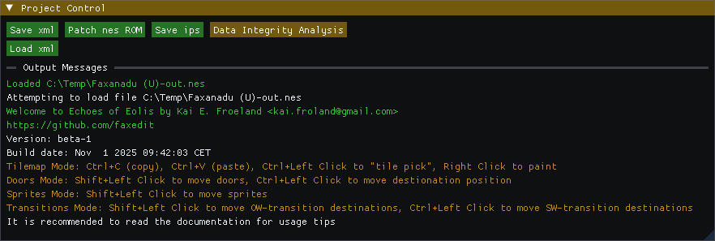

* Save xml: Saves the project as an xml-file, the recommended master data format
* Patch nes ROM: Writes the ROM file, appends -out to the filename so your loaded file is not overwritten. Will show output messages regarding the used data sizes
* Save ips: Generates an ips patch file
* Data Integrity Analysis: Does some checking on whether there is problems in your data
* Load xml: Reloads xml from file and re-populates your data. Hold Shift to use.
* Output Messages: The messages from the editor

The tilemaps are stored in three different regions in ROM. If you run into size problems and need to cut down somewhere, know that the tilemaps for the worlds are stored in 3 different groups:

* Group 1: Eolis, Mist, Towns
* Group 2: Trunk, Branches
* Group 3: Dartmoor Castle, Buildings, Evil Lair

# Game Metadata

## Stages

In addition to the worlds in the game, there is a concept of "stage". The game defines six stages, and each of these is associated with a world. When the game starts both your world and stage are set to zero. Each stage is associated with a next stage and a previous stage, and your stage value is updated whenever you pass through a next-stage or previous-stage door. Stage transitions can be a bit confusing - the stage number doesn’t simply increase or decrease as you move between them. Instead, your current stage acts as an index into the stage metadata to determine the next stage. In the original game the stages are increasing and consistent backward and forward, but this doesn't have to be the case. If you want to keep things simple, you can only edit the worlds for each stage, as well as the door requirements, and leave the rest.

We do not allow changing the world for stage 0, as the game code seems to ignore the stage to world mapping when starting the game.

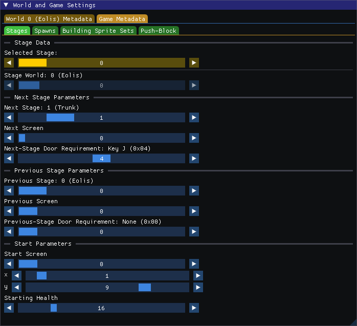

* Selected Stage: Slider which selects the stage you are editing
* Stage World: The world associated with this stage
* Next Stage: The stage you will be on if you go to the next stage
* Next Screen: The screen you will be on (in the stage's world) if you go to the next stage
* Next-Stage Door Requirement: The requirement needed to pass through a next-stage door

Notice that the player position for the next and previous stages are not given here. They are given by door parameters.

Similarly for the Previous-Stage Parameters

The bottom section represents some start parameters:

* Start Screen: The screen you start on when the game begins
* x: Start x-Position on that screen
* y: Start y-Position on that screen
* Starting Health: The health you start the game with

## Spawn Points

During gameplay you will hold a spawn point value, which ranges from 0 to 7. When you speak to a spawn-point setting guru your value will be set. When you die, or restore the game from a mantra, the spawn point will also be restored. Whenever you die or restore, you are placed in the Guru room, and the spawn point is associated with some data that determines where in the game you will be when you exit the Guru room.

* Spawn location: Slider for selecting which spawn point to edit
* World: The world you will be on when exiting the Guru room
* Screen: The screen of that world you will be on
* x and y: The position of that screen you will be on
* Stage Number: The stage you will be on

Note that stage cannot be deduced from the world, since most Guru doors are in the Towns world, which is not associated with a stage - it is therefore stored separately in the game.

* Deduce: The editor traverses all doors in the game and looks for spawn-setting gurus. Whenever it finds one, it sets the parameters for that spawn point based on the door entries. To determine stage number for doors not on a stage-world, it traverses the screens left and right until it finds and other-world transition - and if that world is associated with exactly one stage that stage number will be used. An output message will say whether deduction was successful or not. If you have one world mapped to several stages, for example, you need to handle some of these settings manually.

## Building Sprite Sets

Whenever you enter a door to building, a sprite set index is loaded from that door's metadata. Screens in the Buildings world do not have any sprites associated with them, but act as templates. The sprite set index is used to look up a sprite set - which is a set of sprites with optional scripts, and populates the screen with them. In this window you can edit the definitions of these sprite sets.

This data is on the exact same format as screen sprite sets, but we have to treat them separately in the editor. Internally these sprite sets are just the sprite data for the Buildings world, but the number of sprite sets here does not match the number of screens in that world. (which it does for all other worlds)

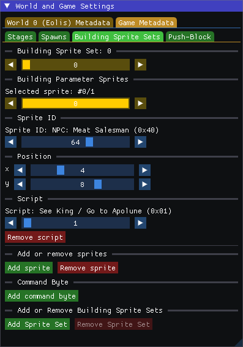

* Building Sprite Set: Slider which selects which sprite-set to edit
* Selected Sprite: The selected sprite within this sprite-set
* Sprite ID: What kind of sprite the selected sprite is
* (x, y): Position of the sprite in the room
* Script: A script-index used by an NPC. Optional. Can be added or deleted.
* Add or Remove sprite: Adds or Removes the selected sprite from the sprite set
* Command-byte: A value which determines the following based on its value:
  * 0 - Automatically initiate the push-block animation when entering
  * 1 - Play boss music if a boss sprite is on screen, until the boss is dead
  * 2 - Play boss music if a boss sprite is on screen, until the boss is dead. Also starts the end-game sequence once all sprites are gone.
* Add or Remove building sprite set: Adds or Removes the selected sprite set. Hold shift to use. Sprite set will not be deleted if any building-doors use it, and we don't allow deleting sprite sets with index less than 70 - since some sprite sets are hard coded in the game and not used by any doors. (at least the end-game sequence sprite set index is hard coded)

## Push-Block

When you have opened all three springs in the game, and obtained the Ring of Ruby, you can push some blocks to reveal the final fountain and cause a tilemap change. In the original game a ladder falls down opening the path to Mascon.

If all requirements are fulfilled, and you push against blocks with block property 6 (push-block) the animation is triggered based on these parameters.

If a room has command byte 0 set, the animation will also play automatically when you enter that room if the corresponding quest flag is set.

For the quest flag to be set, however, you need to be on a certain stage (not world!) and screen when you push these blocks.

The push-block logic takes several parameters, and basically defines a line-drawing function; starting at a position (x, y), draws a certain number of blocks with a certain metatile id, with a certain change in position for each iteration.

To see a rendering of the metatiles defined in this tab you need to navigate to the corresponding stage's world.

Here is what the window looks like when you are navigated to the world where block-push quest-flag is happening.

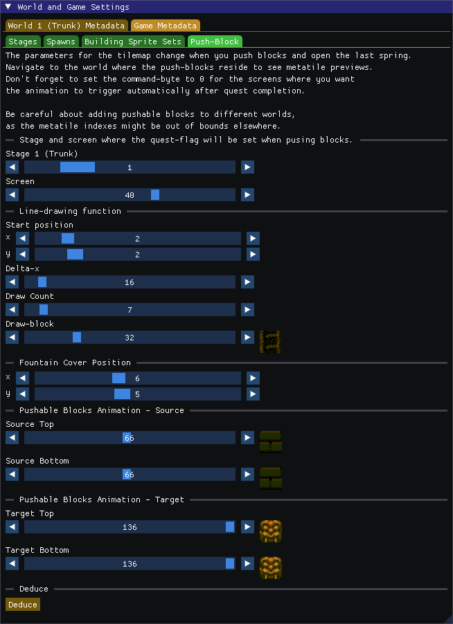

* Stage: The stage the quest flag can be set on. We also show the corresponding world here
* Screen: The screen of that world the quest flag can be set on

Then come the line-drawing parameters

* (x, y): The position the line starts at
* Delta-x: The change in position for each new drawing. 16 will be a vertical line since the screen width is 16 tiles. A value of 17 means vertically down to the right, 255 means a backward horizontal line since the byte value wraps around and becomes -1.
* Draw Count: The number of metatiles that will be drawn. (iteration count)
* Draw-block: The block that will be drawn on these positions, forming a line.

Be careful when setting these parameters — if your (x, y) drawing position goes off-screen (e.g., y > 12), it may overwrite unrelated RAM values.

* Fountain Cover Pos (x, y): The position for the top of the pushable blocks. When you push the blocks for the first time, the game takes your current position and uses that, but when you enter the screen and the animation happens automatically it needs to get this position from somewhere.
* Pushable block animations source and target: Four metatiles which animates the pushable blocks themselves. The source tiles are what the pushed block will be replaced with, and the target tiles are what the tiles at the pushed-to location will be replaced with.
* Deduce: Will search the game for two pushable blocks on top of each other, and fill out as much of the information here automatically as it can.

## jump-On Animation

Blocks with property 5 will morph into other blocks when jumped or walked on. This is a feature supported by the game engine, but it was never used in the original game.

It is similar to the Mattock Animation in that it defines a 4-block animation cycle with a destination metatile. The mattock animations are set per world however, whereas the jump-on animation is game-wide. In other words, when you define the animation you define it for all worlds simultaneously.

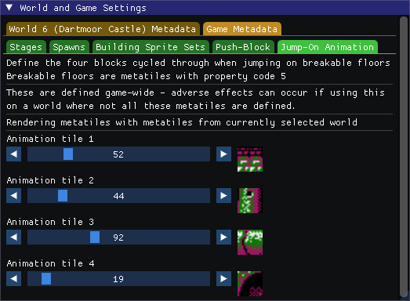

Set the four metatiles here. The metatiles will be rendered based on the available metatiles in the selected World - as long as the metatile index is within bounds fo that world. Using jump-on with undefined metatiles will probably result in garbled graphics showing up in the game.

# World Metadata

The metadata for the currently selected World in the main window can be edited in these tabs.

## Metatile Definitions

Metatiles are defined on a per-world basis, and are used to make tilemaps for all screens in that world. 

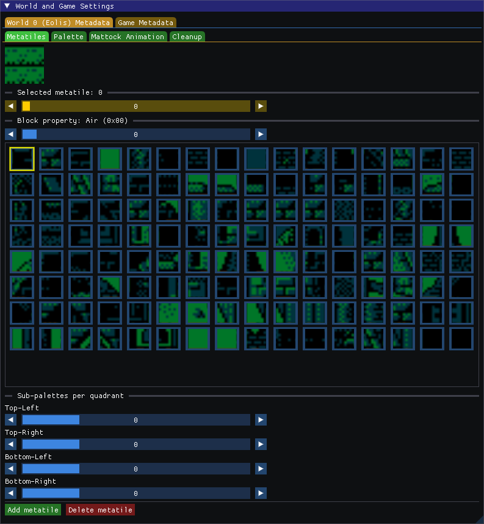

The tiles on the bottom are NES-tiles used by this world's NES tilemap, and are used to define the metatile graphics. One NES-tile for each of the four quadrants of the metatile.

Right-clicking on the metatile will place the selected NES-tile on the clicked quadrant. Ctrl+Right Click will select the NES-tile from the clicked quadrant. ("color picker"). We are including this functionality for completeness' sake.

The other things you can change for a metatile are the following:

* Selected Metatile: The metatile you are currently editing
* Block Property: A number ranging from 0-15. The property of the metatile in screens. They are to my knowledge the following:
  * 0: Air
  * 1: Solid
  * 2: Ladder
  * 3: Door
  * 4: Foreground
  * 5: Jump-On (experimental)
  * 6: Pushable
  * 10: Same-World Transition Ladder
  * 12: Other-world / Return from building
  * 13: Other-world / Return from building (foreground)

Missing values here have no meaning as far as I can tell, although based on game data it looks like property 11 at one point in the development cycle of the game meant "mattock-breakable" - but this is handled differently in the actual game.

Property 5 (jump-on) is referenced in the game code, but no metatiles in the original game use it.

Property 6 (pushable) is only used for the two push-blocks in the entire original game, but you are free to put them on other screens.

Property 10 (same-world transition ladder) makes a block climbable, but if placed at the edge of the screen, will make the game look for a same-world transition for the screen when passing it - and initiate a transition if one was found. While the blocks are climbable, the transition will trigger if placed at the edges of screens and just walking through them horizontally. In the original game there is only one pair of screens with a same-world transition, and it was then used for a vertical transition.

Property 12 and 13 (other world / return) are placed at the edge of screens where other-world transitions are defined. It makes the game look for an other-world transition for this screen when clipping the blocks. It is also be used in buildings to return you to where you entered the building. All the bottom right blocks inside the buildings have property 12 in the original game.

Sub-palettes per quadrant:

Each metatile is associated with 4 sub-palettes. These are the sub-palettes the metatile will be drawn at depending on the parity of the coordinates:

* x even, y even: Sub-palette 0
* x odd, y even: Sub-palette 1
* x even, y odd: Sub-palette 2
* x odd, y odd: Sub-palette 3

No metatiles in the original game use this functionality. In the original game all metatiles have the same value here for all its quadrants. It looks like it can be buggy if text boxes appear and such - and the palette attribute table cannot be properly restored.

* Add / Remove metatile: Adds a new metatile, or deletes the selected metatile. Metatiles which are placed on any screen tilemap cannot be deleted. The same goes for metatiles that are part of mattock animations and block-push parameters.

## Palette

This defines the default palette for the world. When you take a stage-door into the world, this palette is used. You can override the palette using same-world doors and transitions. For world Trunk, for example, the default palette is 6 - but doors leading into towers change this to 7. Similarly for Mist and its towers. The editor will show a label for the palettes.

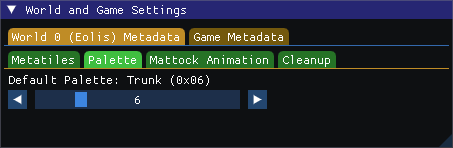

## Mattock Animation

Which blocks are breakable is defined on a per-world basis. A mattock animation defines the breakable block, what this block turns into after having been broken, and two blocks in between used as its animation.

Each slider lets you pick a world metatile for each of the four parts of the animation. The most important is the first one which defines which block is actually breakable, and the last one, which defines what you end up with.

## Cleanup

Some utility functions added to the editor. If there are any more hard coded metatile IDs or screen numbers in the game, using this could cause problems - although I do not know of any.

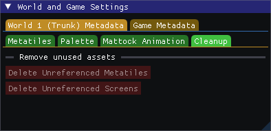

* Delete Unreferenced Metatiles: Deletes all metatiles from this world which are not part of any screen tilemap - and not part of other metadata.
* Delete Unreferenced Screens: Deletes all screens from this world which are not referenced by any other screens.

In both these cases, after deletion - the remaining references are re-index to stay consistent.

# Screen Metadata

The Screen window consists of three parts. On the left part is the screen tilemap itself, which can be edited. The right side defines the editing mode, which will be described below. The bottom part has sliders for selecting current world and screen, as well as some navigation buttons that will take you to destinations defined by the screen. These buttons will take palette into account, which cannot easily be done when cycling through screens using the slider.

If for example you want to see a Mist Tower or Trunk Tower, it is best to go to the screen containing a door to that tower and using the button "Enter Door" - as the palette info from the door will be taken into account when rendering from then on. Any change to selected screen via the slider will revert to the default palette for that world.

Finally you can add or remove (hold shift to use button) screens for all worlds apart from Buildings. Screens that are referenced from other screens cannot be deleted, in that case you need to remove the references first.

If two screens on a world are using the exact same tilemap, you do not need more than two bytes of data to store it in ROM as the pointer will be deduplicated. The tilemaps are stored separately from all other screen data, so these screens could still have different sprites, doors and so on. This could be a way to cheaply increase the world size, and maybe use different palettes for the two screens.

In the original game there are some screen pointers pointing to the same data, so there are duplicate screens - but none of these duplicates are ever used.

## Screen Tilemap

When the Tilemap tab is active, you are in Tilemap mode - and can define the screen's image.

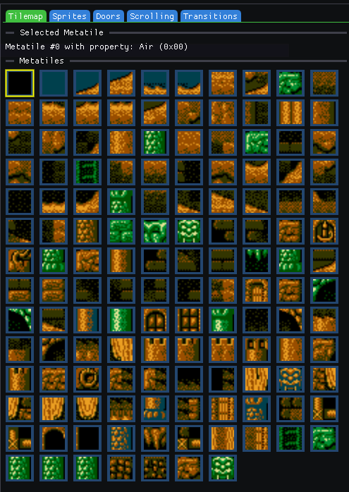

The top section shows which metatile is selected, and which property it has.

The bottom section is where you select the metatile to use when drawing.

The slider at the bottom lets you select which sub-palette to render all the metatiles with. This is for visualization only, and will not make any changes to your data.

The controls for making a screen tilemap image is as follows:
* Left click: Select a tile position on the tilemap
* Right click: "Paint" with the selected metatile on the tilemap
* Shift+Left click: Select a rectangular area of the tilemap
* Ctrl+Left click: Select the clicked tile as your selected metatile ("color picker")
* Ctrl+C: Copy rectangular area to clipboard (one clipboard per world)
* Ctrl+V: Paste clipboard at selected tilemap position of clipboard fits
* Shit+V: Show clipboard rectangle at position if it fits, without pasting anything. To see where your clipboard data would be pasted.

The clipboards are per-world since the metatile definitions are world-specific.

## Screen Sprites

When the Sprites tab is active, you are in Sprites mode - and can define the screen's sprites.

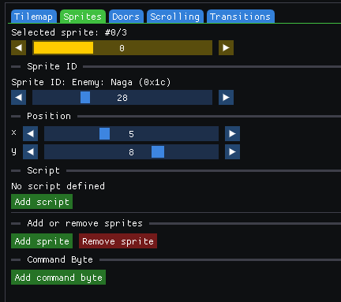

This is exactly the same interface as the Building Sprite Sets, but in this case it is one set of sprites for the screen instead.

The top slider selects current sprite, then you define the sprite ID and position, and optionally add a script to it.

The add and remove sprite buttons are always active. You can delete sprites without worrying about references.

The command-byte is screen specific, and the values are the same as for building sprite-sets: 0 is block-push animation, 1 is boss-room and 2 is endgame-room.

The selected sprite will be enclosed by a bounded rectangle according to its size, and you can move it on the tilemap by holding shift and clicking at the desired position.

## Screen Doors

When the Doors tab is active, you are in Doors mode - and can define the screen's doors.

Doors come in different types, and the different types have different parameters.

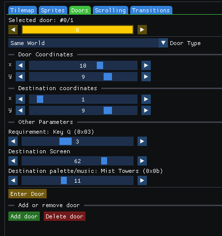

* Selected door: The screen's door you are currently editing
* Door Type: Each door is one of four types; Buildings, Same-World, Next-Stage and Previous-Stage.
* Door coordinates: The entry coordinates of the door on the screen. This must be on top of a metatile with the door-property, or else the game will not look for your door definitions when you try to enter.
* Destination coordinates: Where you appear on the destination screen after entering the door. Does not seem to matter for doors to buildings however, as these use a hard-coded position not currently imported to the editor.

These parameters are common to all door types. The rest of the parameters depend on door type.

### Next-stage and previous-stage doors

These doors get their destination world and screen via the stage configuration, and is shared across all doors of this type within the world. If the world is defined to be used for exactly one stage, as it is in the original game, the editor will show the destination world, screen and entry requirements here - but you need to actually edit them in the stage metadata if you want to change them.

### Door to building

These doors go to a room in the Buildings world. The parameters they take are:

* Requirement: Entry-requirement to use the door (none, key or ring)
* Destination screen: The building room it goes to
* Sprite set: An index to the sprite set from the Building Sprite-Sets to populate the room with when you enter.

After this a list of the contents of the sprite set is shown, so you know what is in the building:

Sprite descriptions followed by their optional script description

### Same-World Door

These doors take you to a screen on the same world (not necessarily same stage!) and take the following additional parameters:

* Requirement: Entry-requirement to use the door (none, key or ring)
* Destination screen: The screen on the same world it goes to
* Destination palette/music: The palette to be used when entering. In the original game this is typically used to override the world's default palette when entering towers.

You can add or remove doors of all types at any time. No reference check is necessary to keep data integrity.

When in Door-editing mode, Shift+Click moves the door entry position to the clicked position on the tilemap. Ctrl+Click moves the exit position.

If the door is not of building-type, and the door destination is unambiguous, an "Enter Door"-button will let you go to the door destination while taking palette setting into account. (we do not go to buildings since the screens are templated)

## Screen Scrolling

The screens in a world are connected to each other via regular scrolling. When you exit the screen horizontally you keep your vertical position, and you keep your horizontal position when you exit vertically. This makes it look like the screens are physically connected.

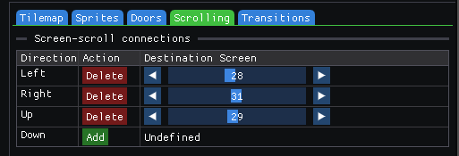

In this tab you can define the scroll-connection for a screen in all four directions. Connections are optional data and can be added and deleted at will. The destination screen slider lets you set the destination screen number for any direction.

## Screen Transitions

Transitions are optional screen data. You can define transitions between screens that don't use regular scrolling. There are two types: Same-world transitions and other-world transitions.

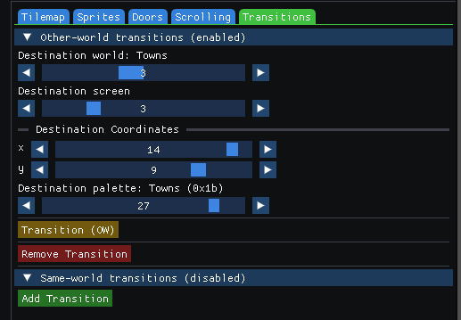

### Same-World Transition

A screen can be connected to another screen in the same world. The following parameters are given:

* Destination screen
* Destination coordinates (x, y)
* Destination palette

In the original game this is only used in one set of screens, where the horizontal position of entry and exit didn't line up. They didn't even use the palette override functionality, so one can wonder why they didn't just align the screens instead.

In any case, to trigger a same-world transition, you need to pass through a metatile with block property 10 when you exit the screen to trigger a lookup into the sw-transition table.

### Other-World Transition

This is the same as same-world transtions, but it has one more parameter to define the destination world in addition to the other parameters.

To trigger an other-world transition, you need to clip a metatile with block property 12 or 13. 13 is foreground, and is typically used when you go from the overworld into a town.

In the original game all other-world transitions are defined from overworld-screens into town screens, and from town-screens back to the overworld.

You can define these transitions between any two worlds (apart from the Buildings world probably), but one important thing to note is that it allows you to change world without changing your stage. This can allow players to reach stage-doors in several ways, and since the stage-door destinations will change depending on the stage number you could have a door with different destinations depending on how you got to that door.

When in Transitions-editing mode, Shift+left Click moves the other-world destination position to the clicked position on the tilemap. Ctrl+Left Click moves the same-world destination position.
