# Echoes of Eolis - User Documentation

This is the user documentation for Echoes of Eolis (version beta-7), a Faxanadu data editor which can be found on its [GitHub repository](https://github.com/kaimitai/faxedit/). It is assumed that users are somewhat acquainted with Faxanadu on the NES.

This application is always bundled with the latest version of [FaxIScripts](https://github.com/kaimitai/FaxIScripts) - a Faxanadu script and music assembler - which has its own documentation.

<hr>

You can start the editor with a filename parameter to make the editor load a given ROM, or use the file picker that appears if no ROM is loaded at startup, to select a file to load. The editor depends on a ROM being loaded and cannot be used without one.

It also depends on configuration file eoe_config.xml being present, as this file contains necessary constants per ROM region. This configuration file contains the needed information to know which ROM region you are using, and how to read and write data from it - which differs between regions.

The editor will automatically deduce the ROM region, unless you specify it as a command-line parameter following a ROM-filename.

We use some conventions in the editor:

* Hold down shift to use some buttons which make big changes to your data; loading xml and deleting screens and such
* Yellow sliders are selection sliders to navigate to objects within a container; these will not make any changes to your data, only select it.
* Faxanadu is divided into what has come to be commonly known as "worlds", of which there are eight. We label them - in order - as "Eolis", "Trunk", "Mist", "Towns", "Buildings", "Branches", "Darmoor Castle" and "Zenis". All worlds are modeled pretty much in the same way, but worlds "Towns" and "Buildings" are associated with some special handling. More on that in the various sections below.

The main window for file operations is [Project Control](#project-control).

The data we can edit forms a data hierarchy, from the top-level game metadata down to the individual screens and their sub-data.

## Table of Contents

- [Project Control](#project-control)
- [Game Metadata](#game-metadata)
  - [Stages](#stages)
  - [Spawn Points](#spawn-points)
  - [Building Sprite Sets](#building-sprite-sets)
  - [Push-Block](#push-block)
  - [Jump-On Animation](#jump-on-animation)
  - [Palette to Music map](#palette-to-music-map)
  - [Fog metadata](#fog-metadata)
- [World Metadata](#world-metadata)
  - [Metatile Definitions](#metatile-definitions)
  - [Scenes](#scenes)
  - [Mattock Animation](#mattock-animation)
  - [Cleanup](#cleanup)
- [Screen Metadata](#screen-metadata)
  - [Screen Tilemap](#screen-tilemap)
  - [Screen Sprites](#screen-sprites)
    - [Building Sprite Set visualization](#building-sprite-set-visualization)
  - [Screen Doors](#screen-doors)
  - [Screen Scrolling](#screen-scrolling)
  - [Screen Transitions](#screen-transitions)
- [Background Graphics](#background-graphics)
  - [World gfx](#world-gfx)
  - [World palettes](#world-palettes)
  - [Background gfx](#background-gfx)
  - [Background palettes](#background-palettes)
  - [HUD](#hud)
  - [chr banks](#chr-banks)
  - [Tips for bmp import](#tips-for-bmp-import)
- [Sprite Graphics](#sprite-graphics)
  - [Frame-Centric Viewing, Bank-Centric Editing](#frame-centric-viewing)
  - [NPC Frames and General Information](#npc-frames-and-general-information)
  - [Player Frames](#player-frames)
  - [Portrait Frames](#portrait-frames)
  - [Sprite Gfx Settings](#sprite-gfx-settings)
- [Cinematics](#cinematics)
  - [Intro](#intro)
  - [Outro](#outro)
  - [Cinematic Editor Window](#the-cinematic-editor-window)
- [Configuration Files](#configuration-files)

<hr>

# Project Control

This is the screen used for file operations and data analysis.

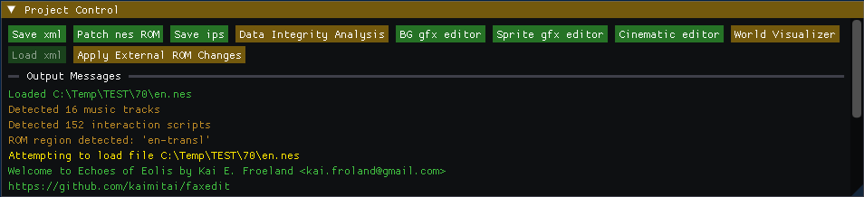

* Save xml: Saves the project as an xml-file, the recommended master data format
* Patch nes ROM: Writes the ROM file, appends -out to the filename so your loaded file is not overwritten. Will show output messages regarding the used data sizes (hold shift to patch the ROM in-place)
* Save ips: Generates an ips patch file
* Data Integrity Analysis: Does some checking on whether there is problems in your data
* BG gfx editor: Opens or closes the Background Graphics Editor window
* Sprite gfx editor: Opens or closes the Sprite Graphics Editor window
* Cinematic editor: Opens or closes the Cinematic Editor window
* Load xml: Reloads xml from file and re-populates your data. Hold Shift to use.
* Apply External ROM Changes: Re-reads the loaded rom from disk, and regenerates iScripts and music track counts. Should be used if the ROM undergoes external changes.
* Output Messages: The messages from the editor

The tilemaps are stored in four different banks in ROM, but the tilemaps for all screens for any world need to be fully contained within one bank. The editor will tell you which banks it used for which worlds, and report on used and available space.

Some Keyboard shortcuts are always availabe when a ROM is loaded:
* Ctrl + S: Save xml
* Ctrl + Shift + L: Load xml
* Ctrl + P: Patch ROM
* Ctrl + Shift + P: Patch ROM in-place (patch the loaded ROM directly)

Holding Alt when patching a ROM will enable semi-static patching mode - which generates ROMs that are compatible with the [Faxanadu Randomizer](https://github.com/Notlobb/Randumizer/), with the limitation that sprites, screen connections and metadata will remain unpatched.

<hr>

# Game Metadata

## Stages

In addition to the worlds in the game, there is a concept of "stage". The game defines six stages, and each of these is associated with a world. When the game starts both your world and stage are set to zero. Each stage is associated with a next stage and a previous stage, and your stage value is updated whenever you pass through a next-stage or previous-stage door. Stage transitions can be a bit confusing - the stage number doesn’t simply increase or decrease as you move between them. Instead, your current stage acts as an index into the stage metadata to determine the next stage. In the original game the stages are increasing and consistent backward and forward, but this doesn't have to be the case. If you want to keep things simple, you can only edit the worlds for each stage, as well as the door requirements, and leave the rest.

We do not allow changing the world for stage 0, as the game code seems to ignore the stage to world mapping when starting the game.

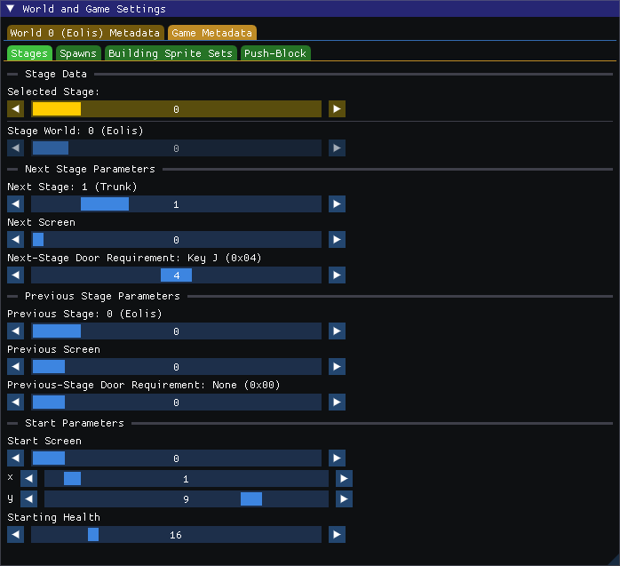

* Selected Stage: Slider which selects the stage you are editing
* Stage World: The world associated with this stage
* Next Stage: The stage you will be on if you go to the next stage
* Next Screen: The screen you will be on (in the stage's world) if you go to the next stage
* Next-Stage Door Requirement: The requirement needed to pass through a next-stage door

Notice that the player position for the next and previous stages are not given here. They are given by door parameters.

Similarly for the Previous-Stage Parameters

The bottom section represents some start parameters:

* Start Screen: The screen you start on when the game begins
* x: Start x-Position on that screen
* y: Start y-Position on that screen
* Starting Health: The health you start the game with

<hr>

## Spawn Points

During gameplay, the player always holds a spawn point value, starting at 0 and increasing upward.

In the original game, there are eight spawn points (0–7). When you speak to a spawn‑setting Guru, your current spawn point is updated. When you die or restore from a mantra, the spawn point is restored as well.

Whenever you die or restore, you appear inside the Guru room. The spawn point determines where you will be placed when exiting that room, including world, screen, coordinates, and stage.

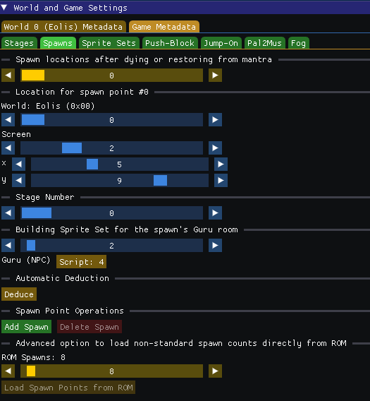

* **Spawn location** — Select which spawn point index to edit.
* **World** — The world you will appear in after leaving the Guru room.
* **Screen** — The screen within that world.
* **x / y** — Your position on that screen.
* **Stage Number** — The stage you will be on.
* **Building Sprite Set** - The index of the Building Sprite Set the guru room will be populated with when you spawn. This will be the same sprite set that has a sprite which has a script that sets the spawn's index value. (iScript opcode SetSpawn)

**Note**: Stage cannot be deduced from world alone. Many Guru doors are in the Towns world, which has no stage association, so the stage must be stored separately.

### Deduce

The Deduce button analyzes the ROM and attempts to infer spawn‑point data automatically:
It scans all doors to buildings in the game.

Whenever it finds a spawn‑setting NPC inside a building, it fills in the spawn‑point parameters based on the door’s destination.

If a door is not on a stage‑world (Tows for example, where most Gurus are), the editor walks screens left and right of the door until it finds a world transition.

If there is a transition to another worlds, and that world maps to exactly one stage, that stage is used.

A message will indicate for how many spawn points deduction fully succeeded. Usually deduction can not happen for spawn 0, unless a script explicitly sets a spawn point to 0 somewhere - which is not done in the original game's scripts.

If a world maps to multiple stages, for example, some spawn points must be set manually. Then deduction can not fully take place.

**Important**: If you reload from XML, script information is not preserved, so deduction cannot run. Use Apply External ROM Changes in the Project Control window to refresh scripts before deducing.

**Add Spawn**: Creates a new spawn point.

To make the game actually use it, you must add a script (via [FaxIScripts](https://github.com/kaimitai/FaxIScripts/) for example) that sets this spawn index when talking to an NPC.

**Delete Spawn**: Removes the last spawn point.

### Advanced Options

These options allow extraction of a non‑standard number of spawn points from the ROM.

By default, the editor loads 8 spawn points because the ROM does not explicitly store how many exist. If you know your ROM contains more (e.g., 12), you can:

Set the slider to the desired number.

Hold Shift.

Click Load Spawn Points from ROM.

Using the XML format is recommended because it explicitly records the number of spawn points.

### Mantra Compatibility
The original game encodes the spawn index using three bits, allowing values 0–7.
If you add more spawn points, Echoes of Eolis will patch the mantra logic so all spawn points can be encoded and decoded correctly.

However:

All mantras will change.

You cannot rely on mantras found online.

Rest assured mantras will still be internally consistent within your modified ROM.

You can generate mantras for non‑standard spawn counts using [FaxIScripts](https://github.com/kaimitai/FaxIScripts/) for the US version of the ROM.

## Building Sprite Sets

Whenever you enter a door to building, a sprite set index is loaded from that door's metadata. Screens in the Buildings world do not have any sprites associated with them, but act as templates. The sprite set index is used to look up a sprite set - which is a set of sprites with optional scripts, and populates the screen with them. In this window you can edit the definitions of these sprite sets.

This data is on the exact same format as screen sprite sets, but we have to treat them separately in the editor. Internally these sprite sets are just the sprite data for the Buildings world, but the number of sprite sets here does not match the number of screens in that world. (which it does for all other worlds)

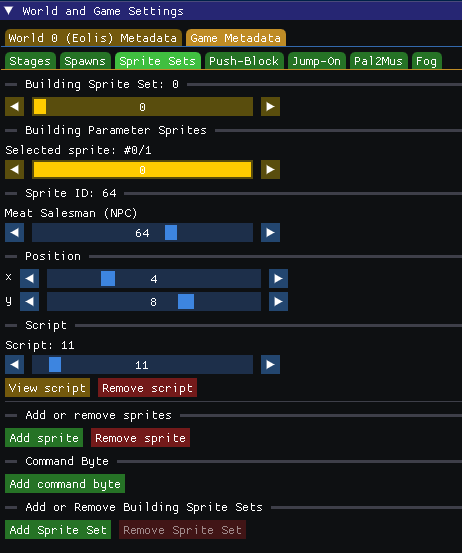

* Building Sprite Set: Slider which selects which sprite-set to edit
* Selected Sprite: The selected sprite within this sprite-set
* Sprite ID: What kind of sprite the selected sprite is
* (x, y): Position of the sprite in the room
* Script: A script-index used by an NPC. Optional. Can be added or deleted.
* Add or Remove sprite: Adds or Removes the selected sprite from the sprite set
* Command-byte: A value which determines the following based on its value:
  * 0 - Automatically initiate the push-block animation when entering
  * 1 - Play boss music if a boss sprite is on screen, until the boss is dead
  * 2 - Play boss music if a boss sprite is on screen, until the boss is dead. Also starts the end-game sequence once all sprites are gone.
* Add or Remove building sprite set: Adds or Removes the selected sprite set. Hold shift to use. Sprite set will not be deleted if any building-doors use it, and we don't allow deleting sprite sets with index less than 70 - since some sprite sets are hard coded in the game and not used by any doors. (at least the end-game sequence sprite set index is hard coded)

## Push-Block

When you have opened all three springs in the game, and obtained the Ring of Ruby, you can push some blocks to reveal the final fountain and cause a tilemap change. In the original game a ladder falls down opening the path to Mascon.

If all requirements are fulfilled, and you push against blocks with block property 6 (push-block) the animation is triggered based on these parameters.

If a room has command byte 0 set, the animation will also play automatically when you enter that room if the corresponding quest flag is set.

For the quest flag to be set, however, you need to be on a certain stage (not world!) and screen when you push these blocks.

The push-block logic takes several parameters, and basically defines a line-drawing function; starting at a position (x, y), draws a certain number of blocks with a certain metatile id, with a certain change in position for each iteration.

To see a rendering of the metatiles defined in this tab you need to navigate to the corresponding stage's world.

Here is what the window looks like when you are navigated to the world where block-push quest-flag is happening.

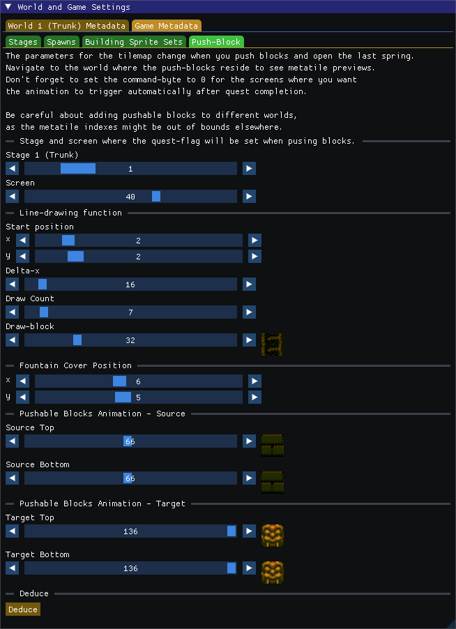

* Stage: The stage the quest flag can be set on. We also show the corresponding world here
* Screen: The screen of that world the quest flag can be set on

Then come the line-drawing parameters

* (x, y): The position the line starts at
* Delta-x: The change in position for each new drawing. 16 will be a vertical line since the screen width is 16 tiles. A value of 17 means vertically down to the right, 255 means a backward horizontal line since the byte value wraps around and becomes -1.
* Draw Count: The number of metatiles that will be drawn. (iteration count)
* Draw-block: The block that will be drawn on these positions, forming a line.

Be careful when setting these parameters — if your (x, y) drawing position goes off-screen (e.g., y > 12), it may overwrite unrelated RAM values.

* Fountain Cover Pos (x, y): The position for the top of the pushable blocks. When you push the blocks for the first time, the game takes your current position and uses that, but when you enter the screen and the animation happens automatically it needs to get this position from somewhere.
* Pushable block animations source and target: Four metatiles which animates the pushable blocks themselves. The source tiles are what the pushed block will be replaced with, and the target tiles are what the tiles at the pushed-to location will be replaced with.
* Deduce: Will search the game for two pushable blocks on top of each other, and fill out as much of the information here automatically as it can.

## jump-On Animation

Blocks with property 5 will morph into other blocks when jumped or walked on. This is a feature supported by the game engine, but it was never used in the original game.

It is similar to the Mattock Animation in that it defines a 4-block animation cycle with a destination metatile. The mattock animations are set per world however, whereas the jump-on animation is game-wide. In other words, when you define the animation you define it for all worlds simultaneously.

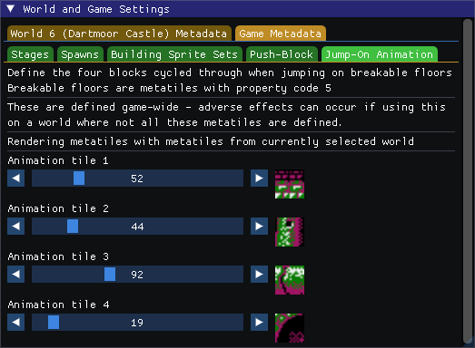

Set the four metatiles here. The metatiles will be rendered based on the available metatiles in the selected World - as long as the metatile index is within bounds for that world. Using jump-on with undefined metatiles will probably result in garbled graphics showing up in the game.

## Palette to Music map

Same-world doors can come with a palette change, which is part of the door's parameters. Some palettes can be defined to also introduce a music change. This is how towers work in the original game; when you enter a door the palette changes and a music change is triggered too.

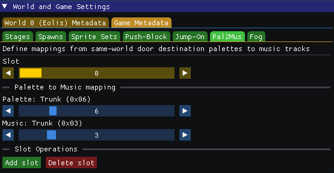

If a palette change occurs and it has no entry in this map, the current music will keep playing as you enter the same-world door.

You can also resize the mapping table with the Add and Delete buttons.

## Fog Metadata

The fog effect happens in world 2 (Mist) in the original game, but not inside Mist towers.

The reason is that for the fog to be in effect, a certain combination of world number and palette number must be active. This combination can be set here. If you set world number to 8 (invalid world number) the fog will not be active anywhere.

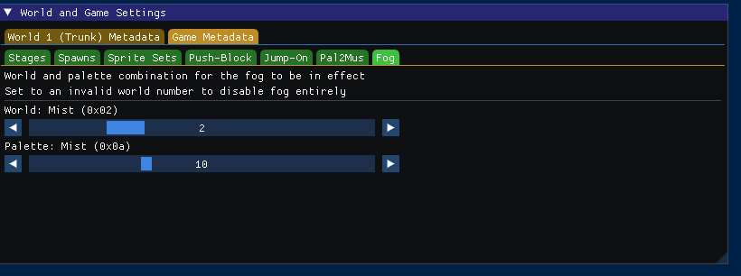

Another reason we need to know the fog world, is that the fog generating code is using certain chr-tiles of that world's tileset to generate the fog effect. When importing bmp we have to keep these tiles fixed, or else we will ruin the fog graphics.

<hr>

# World Metadata

The metadata for the currently selected World in the main window can be edited in these tabs.

## Metatile Definitions

Metatiles are defined on a per-world basis, and are used to make tilemaps for all screens in that world. 

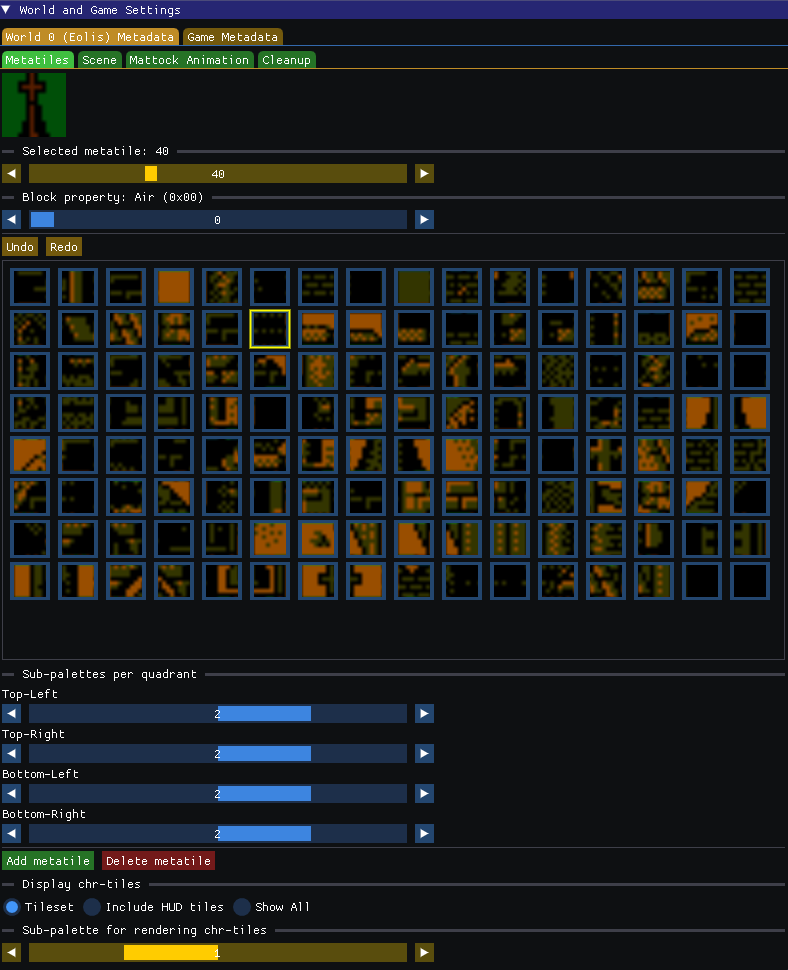

The tiles on the bottom are chr-tiles used by this world's tilemap, and are used to define the metatile graphics. One chr-tile for each of the four quadrants of the metatile.

Right-clicking on the metatile will place the selected NES-tile on the clicked quadrant. Ctrl+Left Click will select the NES-tile from the clicked quadrant. ("color picker").

The Undo and Redo buttons interface with an edit history for each individual metatile - but only the tilemap portion; which chr-tiles it is composed of. Deleting screens or metatiles will clear all undo history, as will bmp import for world tilesets.

The other things you can change for a metatile are the following:

* Selected Metatile: The metatile you are currently editing
* Block Property: A number ranging from 0-15. The property of the metatile in screens. They are to my knowledge the following:
  * 0: Air
  * 1: Solid
  * 2: Ladder
  * 3: Door
  * 4: Foreground
  * 5: Jump-On (experimental)
  * 6: Pushable
  * 10: Same-World Transition Ladder
  * 12: Other-world / Return from building
  * 13: Other-world / Return from building (foreground)

Missing values here have no meaning as far as I can tell, although based on game data it looks like property 11 at one point in the development cycle of the game meant "mattock-breakable" - but this is handled differently in the actual game.

Property 5 (jump-on) is referenced in the game code, but no metatiles in the original game use it.

Property 6 (pushable) is only used for the two push-blocks in the entire original game, but you are free to put them on other screens.

Property 10 (same-world transition ladder) makes a block climbable, but if placed at the edge of the screen, will make the game look for a same-world transition for the screen when passing it - and initiate a transition if one was found. While the blocks are climbable, the transition will trigger if placed at the edges of screens and just walking through them horizontally. In the original game there is only one pair of screens with a same-world transition, and it was then used for a vertical transition.

Property 12 and 13 (other world / return) are placed at the edge of screens where other-world transitions are defined. It makes the game look for an other-world transition for this screen when clipping the blocks. It is also be used in buildings to return you to where you entered the building. All the bottom right blocks inside the buildings have property 12 in the original game.

Sub-palettes per quadrant:

Each metatile is associated with 4 sub-palettes. These are the sub-palettes the metatile will be drawn at depending on the parity of the coordinates:

* x even, y even: Sub-palette 0
* x odd, y even: Sub-palette 1
* x even, y odd: Sub-palette 2
* x odd, y odd: Sub-palette 3

No metatiles in the original game use this functionality. In the original game all metatiles have the same value here for all its quadrants. It looks like it can be buggy if text boxes appear and such - and the palette attribute table cannot be properly restored.

* Display chr-tiles
  * Tileset: Show only the chr-tiles which belong to the current world
  * Include HUD tiles: The same as above, but include the HUD tiles which are always loaded in the ppu during gameplay. Stable metatiles can be made out of these.
  * Show All: Will show all chr-tiles, including those which update dynamically during gameplay for text and such. Will cause visual glitches if used in a metatile definition, but could possibly be used creatively.

* Add / Remove metatile: Adds a new metatile (as a copy of the currently selected metatile), or deletes the selected metatile. Metatiles which are placed on any screen tilemap cannot be deleted. The same goes for metatiles that are part of mattock animations and block-push parameters.

* List References: Shows a list of all screens (if any) using this on its tilemap, or global references like push-block and mattock animations. Metatiles in use cannot be deleted. This functionality can be used to find building screens which use the same metatile under different tilesets, which should be avoided if you plan on using bmp-import for building screens metatiles.

## Scenes

This tab allows you to change some default settings of the current world; palette, music and tileset.

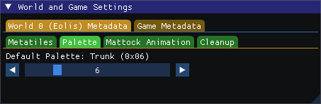

For the buildings world, each screen has a definition here, and for buildings you can also define the entry position when you enter a door to building.

Default palette and music can be overriden using same-world doors and palette to music mappings.

Note that on player death or restore, the tileset for the Guru room your start in is hard coded in the game to be 6. The same happens when you beat the game and are transported to the King's room.

## Mattock Animation

Which blocks are breakable is defined on a per-world basis. A mattock animation defines the breakable block, what this block turns into after having been broken, and two blocks in between used as its animation.

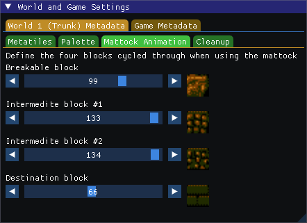

Each slider lets you pick a world metatile for each of the four parts of the animation. The most important is the first one which defines which block is actually breakable, and the last one, which defines what you end up with.

## Cleanup

Some utility functions added to the editor. If there are any more hard coded metatile IDs or screen numbers in the game, using this could cause problems - although I do not know of any.

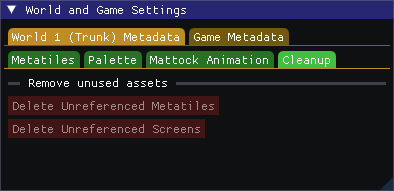

* Delete Unreferenced Metatiles: Deletes all metatiles from this world which are not part of any screen tilemap - and not part of other metadata.
* Delete Unreferenced Screens: Deletes all screens from this world which are not referenced by any other screens.

In both these cases, after deletion - the remaining references are re-index to stay consistent.

# Screen Metadata

The Screen window consists of three parts. On the left part is the screen tilemap itself, which can be edited. The right side defines the editing mode, which will be described below. The bottom part has sliders for selecting current world and screen, as well as some navigation buttons that will take you to destinations defined by the screen. These buttons will take palette into account, which cannot easily be done when cycling through screens using the slider.

If for example you want to see a Mist Tower or Trunk Tower, it is best to go to the screen containing a door to that tower and using the button "Enter Door" - as the palette info from the door will be taken into account when rendering from then on. If you navigate to another world, the default palette will be used again.

You can add or remove (hold shift to use button) screens for all worlds. Screens that are referenced from other screens cannot be deleted, in that case you need to remove the references first.

The "List References"-button will show all incoming references to the current screen; doors, transitions and such, as well as global references - like start screen, spawn point screens and so on.

This tab also has some checkboxes for adding icon overlays to:
* Block properties (0-15)
* Mattock-breakable blocks
* Door requirements

In addition there is a checkbox to turn on or off sprite animations, and a checkbox to turn on or off gridlines.

If two screens on a world are using the exact same tilemap, you do not need more than two bytes of data to store it in ROM as the pointer will be deduplicated. The tilemaps are stored separately from all other screen data, so these screens could still have different sprites, doors and so on. This could be a way to cheaply increase the world size, and maybe use different palettes for the two screens.

In the original game there are some screen pointers pointing to the same data, so there are duplicate screens - but none of these duplicates are ever used.

The screen tilemap data is compressed using a simple algorithm. You save bytes by using a metatile which is the same as the one immediately preceding it, one sixteen tiles before it or seventeen tiles before it. (when traversing row-wise from top left to bottom right)

## Screen Tilemap

When the Tilemap tab is active, you are in Tilemap mode - and can define the screen's image.

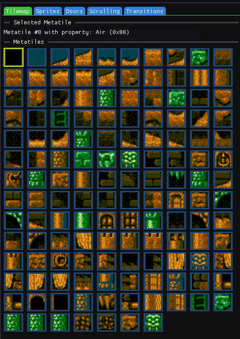

The top section shows which metatile is selected, and which property it has.

The bottom section is where you select the metatile to use when drawing.

All metatiles are drawn with the top-left attribute defined for that metatile. In practice the attribute for each quadrant should probably be the same. If they differ between quadrants, they will still render correctly on the tilemap itself.

The controls for making a screen tilemap image is as follows:
* Left click: Select a tile position on the tilemap
* Right click: "Paint" with the selected metatile on the tilemap
* Shift+Left click: Select a rectangular area of the tilemap
* Ctrl+Left click: Select the clicked tile as your selected metatile ("color picker")
* Ctrl+C: Copy rectangular area to clipboard (one clipboard per world)
* Ctrl+V: Paste clipboard at selected tilemap position of clipboard fits
* Shit+V: Show clipboard rectangle at position if it fits, without pasting anything. To see where your clipboard data would be pasted.
* Ctrl+Z: Undo the last action
* Ctrl+Y: Redo the last undone action

The undo and redo have a history of 250 steps. Destructive structural changes - deleting a screen or a metatile definition - will clear all the undo history for the related world.

The clipboards are per-world since the metatile definitions are world-specific.

## Screen Sprites

When the Sprites tab is active, you are in Sprites mode - and can define the screen's sprites.

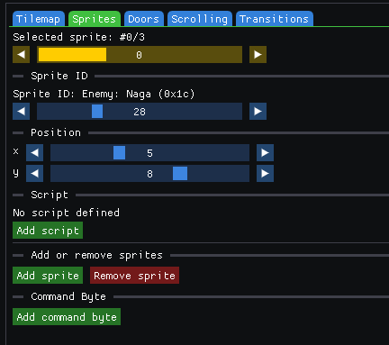

This is exactly the same interface as the Building Sprite Sets, but in this case it is one set of sprites for the screen instead.

The top slider selects current sprite, then you define the sprite ID and position, and optionally add a script to it.

The add and remove sprite buttons are always active. You can delete sprites without worrying about references.

The command-byte is screen specific, and the values are the same as for building sprite-sets: 0 is block-push animation, 1 is boss-room and 2 is endgame-room.

The selected sprite will be enclosed by a bounded rectangle according to its size, and you can move it on the tilemap by holding shift and clicking at the desired position.

### Building Sprite Set visualization

When you are in world 4 (Buildings), sprites cannot be placed directly in the screens. The sprites used for the building rooms are determined by a combination of screen number (room) and building sprite set given by a door to building.

We allow editing building sprite sets when you are in the buildings world, but be aware that what you are editing are not sprite sets for any particular screen. This feature is available only to make it easier to visualize what the building sprite sets will look like when you attach it to a building-door.

If you use this feature, make sure to define your sprite set when navigated to the screen you ultimately want your door to point to.

## Screen Doors

When the Doors tab is active, you are in Doors mode - and can define the screen's doors.

Doors come in different types, and the different types have different parameters.

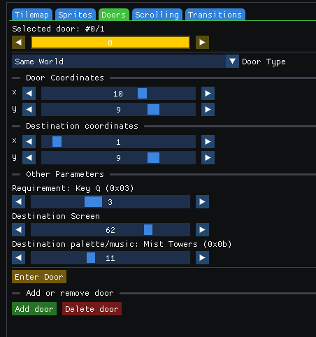

* Selected door: The screen's door you are currently editing
* Door Type: Each door is one of four types; Buildings, Same-World, Next-Stage and Previous-Stage.
* Door coordinates: The entry coordinates of the door on the screen. This must be on top of a metatile with the door-property, or else the game will not look for your door definitions when you try to enter.
* Destination coordinates: Where you appear on the destination screen after entering the door. Does not seem to matter for doors to buildings however, as these positions come from the building scene objects.

These parameters are common to all door types. The rest of the parameters depend on door type.

### Next-stage and previous-stage doors

These doors get their destination world and screen via the stage configuration, and is shared across all doors of this type within the world. If the world is defined to be used for exactly one stage, as it is in the original game, the editor will show the destination world, screen and entry requirements here - but you need to actually edit them in the stage metadata if you want to change them.

### Door to building

These doors go to a room in the Buildings world. The parameters they take are:

* Requirement: Entry-requirement to use the door (none, key or ring)
* Destination screen: The building room it goes to
* Sprite set: An index to the sprite set from the Building Sprite-Sets to populate the room with when you enter.

After this a list of the contents of the sprite set is shown, so you know what is in the building:

Sprite descriptions followed by their optional script description

### Same-World Door

These doors take you to a screen on the same world (not necessarily same stage!) and take the following additional parameters:

* Requirement: Entry-requirement to use the door (none, key or ring)
* Destination screen: The screen on the same world it goes to
* Destination palette/music: The palette to be used when entering. In the original game this is typically used to override the world's default palette when entering towers.

You can add or remove doors of all types at any time. No reference check is necessary to keep data integrity.

When in Door-editing mode, Shift+Click moves the door entry position to the clicked position on the tilemap. Ctrl+Click moves the exit position.

If the door destination is unambiguous, an "Enter Door"-button will let you go to the door destination while taking palette setting into account.

Note: A world can have 64 unique door destinations. The number of actual doors is not the limiting factor. Each world has space for 32 same-world door destinations, and 32 door-to-building destinations. The destination bytes are as follows:

Same-World Doors:
  * Destination Screen
  * Destination Palette
  * Door Requirement
  * Unused padding byte (always 0 in the original game)

Doors to Building:
  * Destination Screen (building room)
  * Sprite-Set
  * Door Requirement
  * Unused padding byte (always 0 in the original game)

The editor will deduplicate identical destination parameter sets, if any exist for any world.

Note: The "Towns" world does not support same-world doors in the original game, but the editor will update a normalization constant in the door logic to accomodate it. The towns world allows more than 32 door to building destinations, but the sum of same world and building destinations must still be no more than 64.

## Screen Scrolling

The screens in a world are connected to each other via regular scrolling. When you exit the screen horizontally you keep your vertical position, and you keep your horizontal position when you exit vertically. This makes it look like the screens are physically connected.

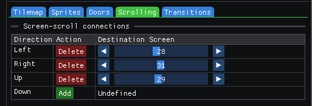

In this tab you can define the scroll-connection for a screen in all four directions. Connections are optional data and can be added and deleted at will. The destination screen slider lets you set the destination screen number for any direction.

## Screen Transitions

Transitions are optional screen data. You can define transitions between screens that don't use regular scrolling. There are two types: Same-world transitions and other-world transitions.

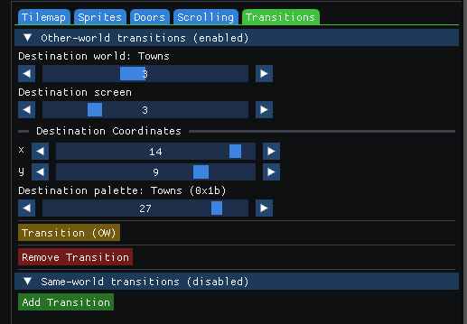

### Same-World Transition

A screen can be connected to another screen in the same world. The following parameters are given:

* Destination screen
* Destination coordinates (x, y)
* Destination palette

In the original game this is only used in one set of screens, where the horizontal position of entry and exit didn't line up. They didn't even use the palette override functionality, so one can wonder why they didn't just align the screens instead.

In any case, to trigger a same-world transition, you need to pass through a metatile with block property 10 when you exit the screen to trigger a lookup into the sw-transition table.

### Other-World Transition

This is the same as same-world transtions, but it has one more parameter to define the destination world in addition to the other parameters.

To trigger an other-world transition, you need to clip a metatile with block property 12 or 13. 13 is foreground, and is typically used when you go from the overworld into a town.

In the original game all other-world transitions are defined from overworld-screens into town screens, and from town-screens back to the overworld.

You can define these transitions between any two worlds (apart from the Buildings world probably), but one important thing to note is that it allows you to change world without changing your stage. This can allow players to reach stage-doors in several ways, and since the stage-door destinations will change depending on the stage number you could have a door with different destinations depending on how you got to that door.

When in Transitions-editing mode, Shift+left Click moves the other-world destination position to the clicked position on the tilemap. Ctrl+Left Click moves the same-world destination position.

# Background Graphics

We have functionality for editing the graphics by importing bmp files. The NES does not support arbitraty bitmaps, and there are some strict rules we need to follow for our graphics to look good.

NES background graphics are made out of chr-tiles, which are 8x8 pixel images, where each pixel has a value 0 to 3.

One background palette can be active at any one time, and a palette has 4 sub-palettes. When combining a chr-tile with a palette, we get a colored chr-tile.

Even though the sub-palettes have 4 colors, they share the first color - meaning at most 13 distinct background colors can be active at any one time.

On top of this, a sub-palette is not active per chr-tile, but for a 2x2 region of chr-tiles, which we call a metatile.

So these are the effective rules for a NES screen:

The screen is made out of 8x8 pixel chr tiles.

Only 4 distinct colors can be active for any one 16x16 pixel region (2x2 chr-tiles) of the screen.

Only 13 distinct colors can be active for the screen as a whole.

The number of chr-tiles the picture processing unit (ppu) of the nes can access at one time is limited to 256.

## World gfx

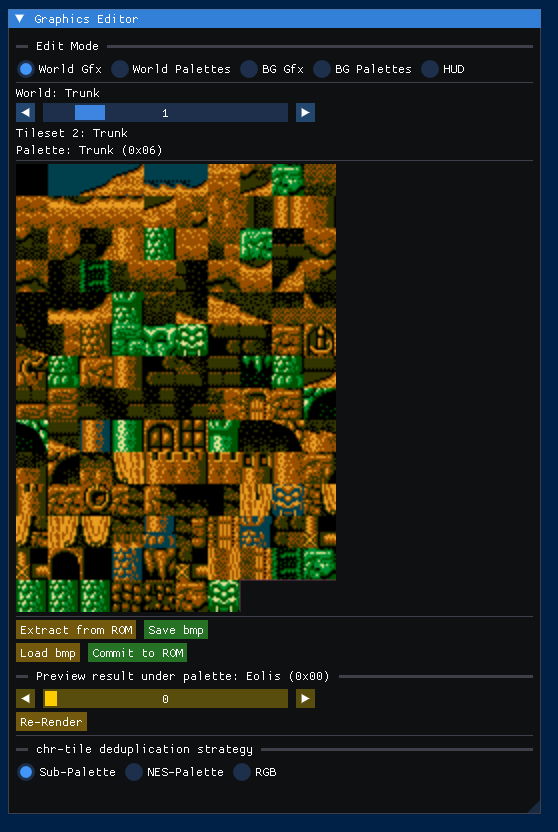

In this edit mode, you can extract a world's (or building screen's) metatiles as a bmp - and import one back in.

* Extract from ROM: Make a texture out of your current metatile definitions and show them as an image.
* Save bmp: Save the tilemap as a bmp. The output messages will tell you where it was stored.
* Load bmp: Import a bmp as a metatile tilemap, and render it here. The rendering will show you what your import will look like in the game.

When loading a bmp to a world's chr-data, we have to make sure we don't ruin the chr-data of any other world using the same tilset. In the original game Dartmoor and Zenis use the same tileset. If importing for Zenis, the importer will keep chr-tiles used by metatile definitions in Dartmoor fixed - and the other way around.

For buildings screens the opposite is true. Here different screens in the same world can use different tilesets, but the metatile definitions are shared. The importer will not touch the metatile definitions used by screens which do not use the same tileset as the one that is being imported. It is important that users make separate metatile definitions for each tileset for this reason. For the buildings world, if you want to import graphics for new metatiles, it is not enough to just make a new metatile for the world - the metatile actually has to be used in the screen you are importing for. The gfx importer looks at actual metatile usage so that unrelated metatiles do not get clobbered. In other words, you need to declare to the bmp importer which metatiles it is allowed to touch by actually using those metatiles on screen tilemaps.

The data integrity analysis will check if a metatile is used on several building screens with different tilesets. This should be avoided.

Also, do not make any changes to screen tilemaps or metatiles between the time you export a bmp and the time you import it, otherwise the importer might be working under the wrong assumptions.

The importer will not generate any new metatiles, it will only update the graphics of metatiles that already exist.

* Commit to ROM: If you are happy with the result, you can commit your import to ROM in memory and it will show in your screen tilemaps. If you are not happy with the result, you can extract from ROM again to clear your staging data. If you have a screen loaded in the tilemap editor using this tileset, you will immediately see the change there, and the chr-tile picker in world metadata will also be updated.
* If there is any staging data, a "preview result under other palette"-slider will be available. This is there so you can check your result if you want your metatiles to render under different palettes, if you have doors to towers for example. You need to click the "Re-render" button to regenerate your output image. This does not change any data however, it is for rendering purposes only.
* chr-tile deduplication strategy; When importing bmp, we want to generate as few chr-tiles as possible while still rendering the imported bmp. We have different strategies to decuplicate, and they are:
  * Sub-Palette: chr-tiles are considered equal only if they have the same byte output (strict)
  * NES-palette: chr-tiles are considered equal if their palette indexes resolve to the same NES-palette colors. If you only need your metatiles to show in the context of one single palette, this is a good option.
  * RGB: chr-tiles are considered equal if they resolve to the same RGB-colors after applying the NES palette and resolving its rgb-values defined in the config xml. (loose)

## World palettes

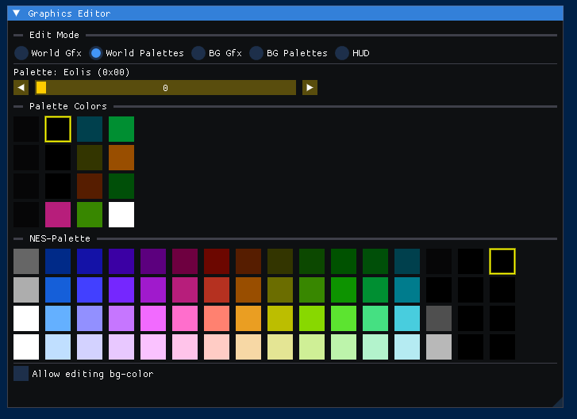

This screen allows you to change the 4 sub-palettes for any of the world-palettes.

The sub-palettes show at the top as a 4x4 grid, and the full NES-palette shows at the bottom. You can select a palette color, and then change which NES color it resolves to. If you have a screen loaded in the tilemap editor using this palette, you will immediately see the change.

We have a checkbox "Allow editing bg-color", which users can toggle to edit the first color of each sub-palette. Faxanadu seems to set this to color $0f (black) regardless of value in ROM, so there is little use in changing this color unless you have a modified ROM which does not enforce this.

The Undo and Redo buttons are per palette. The copy and paste buttons apply to the entire palette as a whole.

Note that palette 16 is used by the Title Screen graphic, so we only allow editing this palette in the BG Gfx section. It can be used as the default palette for a world in the Scenes metadata, however.

## Background gfx

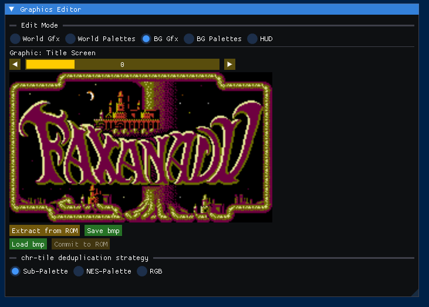

This screen functions similarly to the World Gfx screen, but deals with background tilemaps instead; The title, intro and outro screen - as well as a virtual tilemap for the items when rendered as background objects (and not as sprites).

The intro and outro screens share one tileset. When editing one the other's chr-tiles must be fixed, otherwise we would ruin the other image.

## Background palettes

This screen works the same way as the world palettes, but applies to the palettes used by the background screens. For the items tilemap we defined a palette, but in the game the palette used depends on the world's palette - and items can look different in different contexts.

## HUD

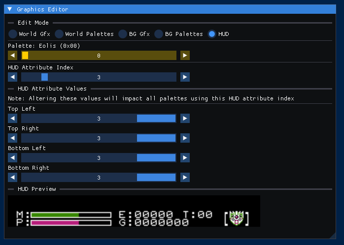

For completeness' sake we have a HUD-editor with a preview.

The game has a mapping from palette number to HUD attribute index, and each HUD attribute index is associated with 4 sub-palettes which are used for the metatiles making up the HUD gfx.

When editing the HUD attributes for each quadrant, you are editing for all palettes using this HUD attribute index.

This is for advanced modding only, but if you change palette you might want to use this functionality. Note also that only the bottom left and bottom right palette attribute is of consequence, as the top two rows of the HUD are blank.

The original game only uses 4 different HUD attributte indexes, although there are 24 slots available.

## chr banks

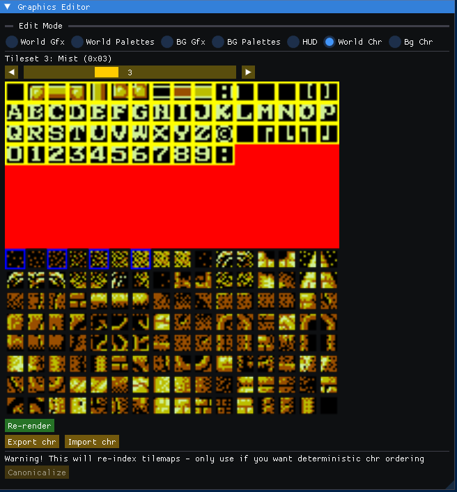

There are two screens for viewing the tile chr banks - one for world tilesets, and one for gfx images. The entire 256-entry tilebank loaded into the PPU will be visible here, with color coding as follows:
* Black outline: Editable chr-tiles. These make up the tileset-specific bank
* Yellow outline: Read-only chr-tiles. These can be used as part of tilemaps, and the bmp import will read these - but never change them.
* Red: Unusable chr-tiles. These change during runtime and there is no guarantee what these will actually look like, so they are ignored.
* Blue: Unrelocatable. They are part of the editable section, but should not be moved. For the world tilesets these are the chr-tiles used to generate the fog effect, and for image chr this only appears in the title screen, where an empty tile is used to draw outside the image. The bmp import will treat these too as read-only, so nothing is inadvertedly broken.

The ```Re-render``` button will re-draw the tilebank. Use this after bmp-imports for example, to refresh the view.

The ```Export chr``` button will save the editable portion of a tilebank as a chr-file which can be edited by external tools like yy-chr.

The ```Import chr``` button will load a chr-file and update the editable chr bank with it.

The ```Canonicalize``` button will canonicalize the chr-bank; that is deduplicate and sort the chr-tiles, and all tilemaps referencing the bank will be re-indexed. This is just an advanced feature for deterministic builds, and has limited practical use for most users. Hold shift to use this button, and keep in mind that it will change more data than the chr bank itself.

In general, if you export a bank as a chr-file, and then perform actions that change tilemaps (like bmp-import or canonicalization) those previously exported chr-files are invalidated. If you import them again all referencing graphics will usually become garbled. In other words, export chr-files ***after*** bmp-imports if you want to use both features.

The bmp import is image-centric, and changes tilemaps, attribute tables and chr-banks. The chr-import is bank-centric and only changes the chr-tiles themselves, regardless of how many tilemaps use the bank.

If you import a chr-file to a bank, you can re-render all images using that bank to see the new result. For world tilesets the re-rendering will be automatically seen in the screen tilemap editor.

<hr>

## Tips for bmp import

When editing NES gfx you are working under heavy constraints, but there are some things you can do to help the bmp importer.

Make sure your graphics are aligned on an 8x8 pixel grid, and that you are aware of the "1 sub-palette per 2x2 chr-tile region" rule. The closer your colors are to your import palette the better. If your import bmp only uses colors from the import palette, and you follow all the rules of NES graphics, the importer will have an easy time.

Try to use sub-palettes which have distinct colors. If you have two indexes of the same color, the importer will assign all the matching colors to the first palette index.

If you need your chr-tiles to be rendered under several sub-palettes ensure the colors you want to match have the same index. If you want the color yellow under one sub-palette to be red under another sub-palette, the red and yellow color must have the same index. Otherwise more chr-tiles must be generated, even if the graphics are otherwise identical.

The hardest gfx to make is the intro and outro screens. They are rendered under two different palettes, their **shared** chr-tile bank consists of 128 tiles - but you need to render 2 screens which are drawn with a total of 1920 tiles - in other words a lot of re-use is necessary.

You can start by importing a totally blank bmp to one of them and commit, that will free up all tiles for the other - and once you have a result for one of them, you can iteratively generate the other.

When loading a bmp an output message will tell you how many chr-tiles were reclaimed (how many more you can make and still be within the limits), or how many it needed to approximate. If approximation was necessary, your chr-count overflowed and the importer had to re-use tiles and just chose the tiles that fit the best to generate the rest of the image. Ideally you don't want to overflow.

For some images, if you import a bmp you exported from ROM, it will still fail to stay within the limits. This might seem counter-intuitive, but this is because there were palettes with the same color within a sub-palette - and it therefore failed to match it to chr-tiles it potentially could have matched it if the same-color was distributed to different indexes in some way. It becomes computationally prohibitive to try all such combinations however. You can temporarily alter palettes like that to have all colors distinct within each 4-color sub-palette, and then change the colors back after the import.

Experiment and have fun!

<hr>

# Sprite Graphics

Sprite graphics are used for the following:

  - Player animations
  - Weapon animations
  - Shield Animations
  - NPC and item animations
  - Portraits
  - UI elements (arrows, question marks etc)

Sprite graphics are drawn in the context of animation frames. Animation frames are rectangular tilemaps which are drawn in the context of sprite chr-banks. A difference between background and sprite graphics, is that sprite tiles can be flipped horizontally or vertically (or both) and that each individual tile can be drawn with one sub-palette. There are no attribute tables when it comes to sprites. In addition to this, sprites can have transparent pixels.

Therefore, animation frames do not only reference chr-tiles; for each chr-tile there is also metadata which says whether the sprite has any flips, and which sub-palette it uses when drawn.

In addition to this, tiles in animation frames are optional. A tile can be defined to be empty, in which case nothing is drawn, and there is no associated metadata.

Each frame has tile-dimensions of at least 1x1.

Each animation frame also has three metadata items associated with it:

  - x-offset: How many pixels to translate the entire frame in the x-direction
  - y-offset: How many pixels to translate the entire frame in the y-direction
  - x-pivot: The vertical midpoint of the sprite, used when flipping it - when an npc changes direction for example. This will usually be half the pixel width of a frame.

There are three pools of animation frames in the game:

  - NPC pool: Defines NPCs, items and UI elements
  - Player pool: Defines player animation frames for each armor, weapon and shield type
  - Portrait pool: Defines portraits, with five frames each; body, eyes (2 frames) and mouth (2 frames)

Sprite chr-tiles are swapped in dynamically during gameplay, and to understand the limitations we're working under, we need to consider how the 256-tile pool in the PPU is allocated.

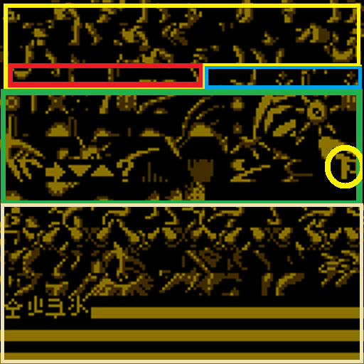

The yellow block at the top is where the player tiles are loaded during gameplay. These have indexes $00-$2f when the player has a shield.

The red block goes from $30 to roughly $38 when the player has a shield, otherwise the player body can extend into it.

The blue block goes from rougly $38 to $3f, and contains the tiles for the currently held weapon. (roughly means it depends, and details will follow below)

The green block goes from $40 to $8f, and is what I call the "common chr-bank". These tiles are always loaded in the PPU during gameplay, and contains the tiles necessary to draw UI elements, magic effects, coins and bread.

The last block goes from $90-$ff, and is what I call the "dynamic chr-bank". This is where tiles for NPCs and items are loaded when entering a new screen. This region is also used for portraits. When a portrait is loaded all other sprites are hidden, and this block is used exclusively for portrait tiles.

The tile with index $7f, while not part of any animation frames, has a special meaning in the game, and is used for sprite 0-hit detection. If this tile is empty the game will enter an infinite loop waiting for a hit that never comes.

## Frame-Centric Editing

The Sprite Gfx Editor lets you selecte any of the three animation frame collections, and browse through all the animation frames. Each frame will be associated with a chr-bank in which context it is drawn. Some frames can be associated with more than one chr-bank.

The chr-banks are as follows:

  - NPCs: The "common" chr-bank (for magic effects, UI elements etc), or npc-specific chr-banks (monsters, items)
  - Player: Armor chr-bank, Weapons chr-bank or Shields chr-bank
  - Portraits: One portraits-specific chr-bank

When the player enters a new screen, all sprites defined for that screen are loaded into the PPU starting at tile index $90. In this case the chr-tiles are always pulled from the npc-specific chr-bank, even if it is empty or points to garbage gfx. Some sprites are only meant to be spawned during gameplay, in which case this chr-loading will not happen. These sprites will have animation frames that in reality reference the common chr-bank, so when explicitly making them part of a screen we are forcing them to be drawn in the wrong context. This is why some sprites look garbled when placed on screens.

The editor will associate the right sprites with the common chr-bank when appropriate, and with sprite-specific banks when appropriate.

## NPC Frames and general information

The sprite gfx editor will look the same for all frame collections. The radio buttons at the top will set the collection context.

When NPCs are selected the following window will be shown:

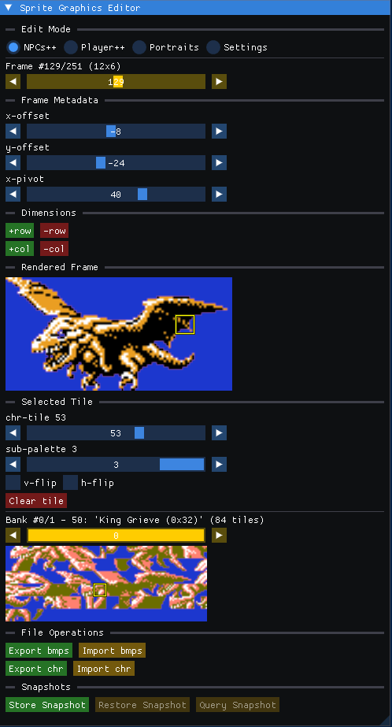

At the top is the frame selector, which allows you to select any frame in the collection.

Then come the metadata sliders, which allows users to change the frame metadata:

 - x-offset
 - y-offset
 - x-pivot

 The dimension buttons will allow changing the dimensions of the frame, by adding or removing rows or columns.

 Then comes the actual rendered frame, with a pulsating background color so transparency can be seen at a glance.

 If a tile on the frame is selected, the following section allows you to set the metadata for that tile:

  - chr-index (in the corresponding chr-bank)
  - sub-palette (0-3)
  - v- and/or h-flip

If the selected tile is empty, you can add a tile at the cursor position. If a tile is defined, it can be cleared.

Then comes the bank-selector. Usually there will only be one bank, but for NPCs there are several banks in some cases. For example the four springs, the two mattocks, the two red potions and such. The chr-bank description will say which sprite it belongs to.

You can select tiles from the chr-bank and "draw" on the animation frames by holding the right mouse button.

So while there is a rudimentary editor to work on the animation frames directly, it is expected that new graphics will be made with the bmp-import functionality. The editor round-trips all 430 or so animation frames with bmp-export and re-import. (Round-trip means: Export all frames to bmps, import them again and patch ROM - then export BMPs from patched ROM - and all bmps, both new and original, will be identical) Not only that, the importer often generates fewer chr-tiles than the original game to describe the same graphics.

In other words, the bmp import functionality is powerful, but you need to obey the restrictions of the NES that the original developers had to obey:

  - Each chr-tile describes an 8x8 pixel area
  - Each chr-tile can only use 3 different colors + transparency, and these 3 colors must be part of a sub-palette. Sub-palette index 0 means transparency, while indexes 1, 2 and 3 are actual colors.

The bmp-importer is helped by obeying these rules, and by using colors close to the ones defined in the sprite palettes. Also, when there is symmetry tiles can be re-used by applying flip flags. An image editor which can show gridlines for each 8 pixels in the x and y direction could be useful to ensure you always know which areas will be converted to a chr-tile on import.

Export bmps will extract all animation frames using the currently selected chr-bank.

Import bmps will import all animation frame bmps necessary to rebuild the currently selected chr-bank, and generates all the animation frames from scratch. The frame metadata however will be taken from the existing frames, as they can not be deduced from pure gfx data represented by bmp files. This metadata can be manually adjusted in the editor however.

If the current bank is the common chr-bank, the bmp importer will ensure that the 0-hit tile lands on the correct index even if it is not part of any bmp.

Since the bmp-import regenerates animation-frames, bmp import will not be possible for frames that are referenced by different chr-banks - unless all those chr-banks are identical. If so, the bmp importer will update all the chr-banks at the same time. If you really want to use the same frame in the context of actually different chr-banks, you need to use the chr-import, described below.

The bmp import will fail if it has to generate too many chr-tiles to describe the bmps. In that case you need to simplify your graphics or look for more symmetry. Note that if an 8x8-area on a bmp is fully transparent, no chr-tile will be created - instead that tile will be marked as blank in the generated animation frame.

After the bmp import/export is the chr import/export. chr-files are binary representations of the chr-tiles making up the selected bank. These operations happen on banks, and not on frames. So you can freely export and import chr-files without having any changes done to any animation frames.

If you want to have different graphics for the different mattocks (quest and non-quest), for example, you can navigate to NPC frame 227 where you see that two chr-banks are defined; 80 and 91. 80 and 91 are the sprite IDs of these sprites. If you import chr for bank 80 you can make it look different from the mattock using bank 91, but since they use the same animation frame you need to ensure that the layouts of the bank are the same - so that the animation frame makes sense in both contexts. The editor will show you how it will look in game.

When importing chr for the common bank, a warning will be issued if you do not include the 0-hit tile at index $7f - but it will not be added to the bank by force.

At the very bottom are the snapshot operations. These can be used as an undo-interface for sprite gfx editing. There is one snapshot-stack for each of the three frame collection types.

  - Store Snapshot: Pushes the selected bank(s) and all related frames to the snapshot stack. Useful if you want to manually edit some frames but want the option to go back.
  - Restore Snapshot: Pops the snapshot from the stack and applies it to the related banks and frames.
  - Query Snapshot: Tells you how many banks and frames are in the snapshot at the top of the stack.

When importing bmp-files, a snapshot will be made of all related chr-banks and animation frames, so you can immediately undo if you don't like the result.
When importing a chr-file, a snapshot will be made of the chr-bank you are replacing.

## Player Frames

Player frames draw from three chr-banks; player, weapons and shields.

The player itself has eight animation states:

  0. Walking #1
  1. Walking #2
  2. Walking #3
  3. Jumping
  4. Prepare Attack/Use Item
  5. Idle
  6. Attack
  7. Climb

  The player also has eight armor/shield states:

  0. Leather Armor (frames 0-7)
  1. Leather Armor and shield (frames 8-15)
  2. Studded Mail (frames 16-23)
  3. Studded Mail and shield (frames 24-31)
  4. Full Plate (frames 32-39)
  5. Full Plate and shield (frames 40-47)
  6. Battle Suit (frames 48-55)
  7. Battle Suit and shield (frames 56-63, unused)

In the game there is no shield when wearing the Battle Suit, since the shield is the helmet. So the last two sets of frames can safely be identical, or frames 56-63 and 106 can be left blank.

The animation frames come in the order of armor state, and then animation state.

It is possible that bmp import will succeed for these frames, but ROM patching could still fail. This could be if the total chr-bank is less than 256-tiles, safely within limits, but that one of the armor states can not be fully encoded within the player chr-area of the PPU. If you want to alter the player graphics of state "Leather Armor and Shield", for example, you should ensure there is enough tile re-use within frames 8-15.

The maximum number of tiles that can be used for each player armor state across all its eight animation frames are is as follows:

  0. Leather Armor - 56 tiles
  1. Leather Armor and shield - 50 tiles
  2. Studded Mail - 56 tiles
  3. Studded Mail and shield - 50 tiles
  4. Full Plate - 56 tiles
  5. Full Plate and shield - 50 tiles
  6. Battle Suit - 52 tiles
  7. Battle Suit and shield - 52 tiles

The next 32 frames describe the weapons, in order:

  0. Hand Dagger (frames 64-71)
  1. Long Sword (frames 72-79)
  2. Giant Blade (frames 80-87)
  3. Dragon Slayer (frames 88-95)

Each of the four weapons use eight frames, and these frames are syncronized with the player animation states above.

These frames also use a weapons chr-bank.

The maximum number of tiles that can be used for each weapon across all its eight animation frames are is as follows:

  0. Hand Dagger - 8 tiles
  1. Hand Dagger - 8 tiles
  2. Long Sword - 8 tiles
  3. Dragon Slayer - 12 tiles

The chr-bank for weapons is quite small, and since the frames are small too - it could potentially be easier to use chr-import rather than bmp-import for editing weapons.

When a shield is equipped, this will always occupy exactly 6 tiles in the PPU, indexes $30-$35.

When a shield is not equipped, the player chr can grow all the way up to the weapon tile which starts at $38 - or $34 for the Dragon Slayer. (when Dragon Slayer is equipped, no shield chr will be loaded, so this will always be safe)

The next 3 frames, 96-98, describe the shields, but in this case the different shields use the same animation frames. Under the hood they have metadata which influences how the frames are drawn - and therefore we do not support editing shield frames in this version. You can still import chr-files however to edit the graphics.

The shield frames are syncronized with the player state as follows:

  96. Walking #1, #2 and #3, Jumping, Idle
  97. Prepare Attack/Use Item
  98. Attack
  66. Climb (note that this is the same frame as "hand dagger, walking #3" and is an empty frame)

The chr-bank doesn't need more than the 18 tiles it has, because there are three shields and only 6 shield frames can be in the PPU at the same time. The shields and their chr-bank indexes are:

  0. Small Shield (chr tile-indexes 0, 1, 6, 7, 12, 13)
  1. Large Shield (chr tile-indexes 2, 3, 8, 9, 14, 15)
  2. Magic Shield (chr tile-indexes 4, 5, 10, 11, 16, 17)

Frames 99-106 use the player chr-bank once again. This is a simple 1-tile animation frame which is used to extend the player's arm when attacking. The order is different to the armor states given above.

   99. Leather Armor arm-extend
  100. Studded Mail arm-extend
  101. Full Plate arm-extend
  102. Dragon Slayer arm-extend
  103. Leather Armor and Shield arm-extend
  104. Studded Mail and Shield arm-extend
  105. Full Plate and Shield arm-extend
  106. Dragon Slayer and Shield arm-extend (unused)

If an error message occurrs during ROM patching, it will refer to "player n" or "weapon n", where n is the armor state in the case of player frames, or weapon number in the case of weapon frames.

## Portrait Frames

Portraits all draw from one chr-bank, and benefit greatly from symmetry for tile re-use. Each portrait consists of five frames. The first frame is the static body, without eyes or a mouth.

The next two frames are the eyes, which are animated - and the x- and y-offsets are defined so that they land on the empty eye-area of the body.

The next two frames are the mouth, which is also animated - and the x- and y-offsets are also defined so that they land on the empty mouth-area of the body.

Since all portrait frames use the same chr-bank, all frames will have to be regenerated on bmp-import.

## Sprite Gfx Settings

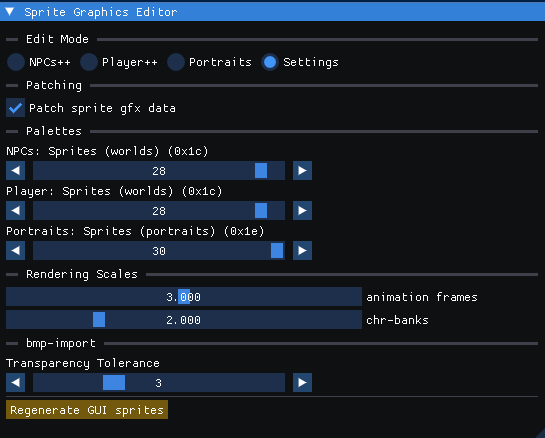

This window contains some settings regarding sprite gfx editing.

A checkbox will let you decide whether to patch sprite gfx at all when patching ROM.

The palettes can be set for NPCs, Player and Portrait frames. These palettes will be used for rendering, and for bmp export and import. The palettes themselves can be viewed and edited in the "World Palettes" in the BG Gfx Editor.

The rendering scales will decide the scales of the rendered animation frames and chr-banks.

Transparency tolerance is how far off the hot-pink color a color can be and still be considered transparent.

Ideally you want to match the hot-pink transparency color exactly, as seen in exported bmps.

The color is

```(r, g, b) = (255, 105, 180)```

If the transparency is set to 3, which is the default, any color in the range

```(r, g, b) = (252-255, 102-108, 177-183)```

will be considered transparent.

The "Regenerate UI Sprites" button will syncronize how the NPCs and items look in the GUI with how the sprite graphics are defined.

<hr>

## Cinematics

The intro and outro animations in Faxanadu are driven by a cinematic state engine. The player character moves "into the screen" during the intro, and "out of the screen" during the outro, giving a 3D-effect.

The player character is drawn with different animation frames depending on 5 different depths stages. During the outro there are also three other animated objects on screen; a waterfall and two ripple effects on the water.

We enable users to change the depth stage definition, the initial positions of the player during the intro and outro, as well as the velocities per stage. We also enable setting the initial position and velocities of the decorative objects.

To change the actual animation graphics we provide an interface which works the same as for the other sprite graphics.

All the positions are given in pixel coordinates (x, y) where x and y can range from 0 to 255. The screen is 256 pixels wide and 240 pixels high. Any object with a y-position higher than 240 will not be visible on screen.

The top left pixel has coordinates (0, 0) and y increases as you go downward, and x increases as you go right.

If you want to make your own cinematic, use an emulator which shows the entire screen to be sure you get the correct pixel coordinates. Also keep in mind that the (x, y)-positions are added to the x- and y-offset of any given animation frame. For the player animation frames the offsets are -(w/2) and -(h/2) where w and h are the pixel dimensions of the frame. This ensures that the frame is drawn centered on the traversal trajectory even when the frame sizes shrink or expand.

Velocities are given as delta-x and delta-y where the delta ranges between -128 and 127.

To show or hide the cinematic editor window, use the button "Cinematic editor" in the Project Control window.

<hr>

### Intro

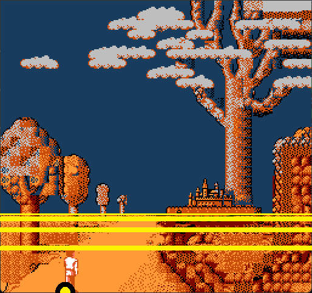

This picture shows some editable attributes for the intro cinematic

- Yellow circle: Player start position
- Yellow lines: Depth thresholds (y-positions)

When the player character reaches a new line, the depth stage value increases and the player is rendered with a different subset of animation frames.

Once the player reaches the final line (which is the second to last y-cutoff), a palette fadeout happens and the game begins.

<hr>

### Outro

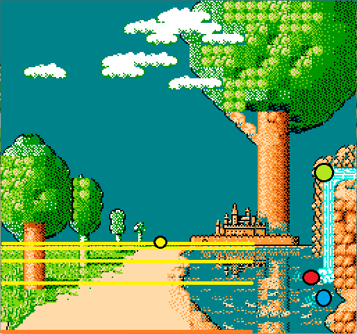

This picture shows some editable attributes for the outro cinematic

- Yellow circle: Player start position
- Yellow lines: Depth thresholds (y-positions)
- Orange line: Final threshold
- Green circle: Waterfall position
- Red circle: Ripple (left) start position
- Blue circle: Ripple (down/left) start position

<hr>

### Player

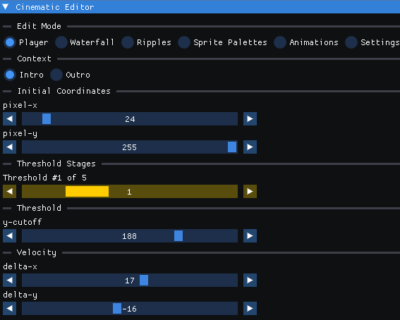

The first edit mode is "Player", used to define the player character animation.

There are two contexts; intro and outro.

For each of these, you can set the player character start position.

There are five depth stages, which can be selected with the yellow slider.

Each stage has a y-cutoff threshold value. This is the y-value the character must reach to trigger the next depth stage.

Each stage also has a velocity, which is the speed the character moves at in the x- and y-directions until it reaches the next y-cutoff. These are given as sub-pixel velocities.

During the intro, once the player reaches the y-cutoff for threshold 3, the palette fade-out begins and the game starts. Therefore the last cutoff is not used directly, although it is used for lookup during palette fade-out. It is best to leave it at 0.

For the intro the y-values need to decrease for each depth stage, and the velocity needs to all have negative y-values - so that the character keeps moving up the screen and triggering depth changes.

During the outro, once the player character reaches the last cutoff value, the sprite is removed and no longer rendered. The outro animation will still play until the music ends. In the original game the last y-cutoff is 250, which is beyond the bottom border of the screen - meaning the player walks entirely off screen and is then removed from the scene.

The cinematic engine uses a fractional accumulator to move the player character, and this seems to be sensitive to changes. The intro seems to handle any velocities, whereas the outro seems to cause visual glitches for x-velocities outside of a certain range. In particular the x-velocity for outro depth stage 1 must be chosen carefully.

If you want to test the outro, keep an eye on RAM address $068f in an emulator. This is the y-value of the player sprite. At the end of the outro, this ram variable is supposed to reach the value given as y-cutoff in depth stage 4. If this does not happen, it might glitch and start counting backward at the point it was supposed to end, while also rendering animation frames from garbage locations. If this happens try with different x-velocities, espescially for depth stage 1. It needs to be ensured that $068f actually hits the final y-cutoff value defined in the last outro depth stage data. (250 in the original game)

Once this behavior is better understood, the documentation will be updated. It is possible we can fix this with changes to assembly code.

<hr>

### The Cinematic Editor Window

<hr>

#### Waterfall

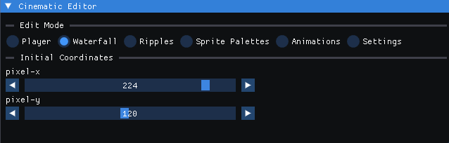

The waterfall is animated with two animation frames, and doesn't move. This simple edit mode allows you to set the pixel position (top left position) of the waterfall.

<hr>

#### Ripples

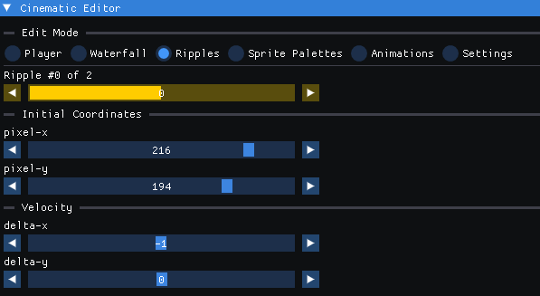

There are two animated ripple objects. Each of them are rendered with three different animation frames, and are hidden for 7 out of 10 animation steps. They are only shown part of the time.

The yellow slider allows you to select a ripple, and for each ripple you can set the pixel start-position as well as its velocity. These velocities are not fraction, but actual pixels per tick. Therefore conservative values are used.

<hr>

#### Palettes

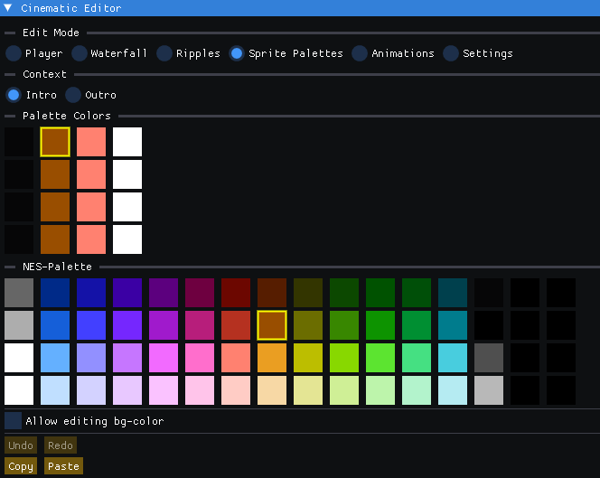

There are two palettes used by the cinematic engine. One during the intro animation, and one during the outro. This edit mode lets you change these palettes.

<hr>

#### Animation Frames

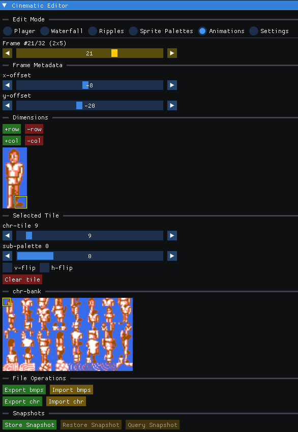

This edit mode lets you edit the actual animation frame graphics, and set their metadata. This works more or less exactly like the sprite graphics editor.

Note that the bmp import and export uses the intro palette for the first 12 frames, and the outro palette for the rest. This is given by configuration constant *cinematic_palette_cutoff*.

The chr-bank for cinematic frames can accomodate 144 chr-tiles, and the original game uses all of them. bmp import will fail if more than 144 chr-tiles are required to describe all frames.

<hr>

#### Cinematic Settings

The last mode, settings, lets you set two toggles:

- Whether or not to patch cinematic data at all. Enabled by default.
- Whether or not to fail patching on potential data overflow. Enabled by default.

If the animation frame graphics are expanded, they will spill into the free space in bank 12. This space is also potentially used by iScript bytecode. Configuration constant **iscript_data_rg2_start** defines where the free space region for overflowing iScript bytecode code can be stored, and if cinematic data patching needs to use this space, it will fail by default. The error message will tell you a minimum value for **iscript_data_rg2_start** which would allow cinematic data patching, so that you can make a configuration override.

There is quite a lot of free space at the end of bank 12, so letting iScript bytecode start later should normally be unproblematic. If you encounter this problem;

- Make a configuration override with an increased value for **iscript_data_rg2_start**
- Re-assemble your scripts with this new constant active. The script code will now be relocated to start later in the bank.
- Patch your cinematic data once again now that you are sure it will not overwrite any scripts.

<hr>

## Configuration Files

The application comes with a file ```eoe_config.xml``` which provides all necessary information about ROM regions, offsets, pointers, constants etc. It ensures that ROMs are correctly loaded and patched for any region.

If users want to define their own regions for custom ROM hacks with other offsets, pointers and constants and such - do not edit eoe_config.xml directly. Instead use the skeleton ```eoe_config_override.xml```-file in the util-folder, and populate it. Copy the file to the same folder as the application, where eoe_config.xml is located.

When the application starts it will look for eoe_config_override.xml and load region definitions from it before it loads region definitions from eoe_config.xml.

Then it will load config data based on whatever region the ROM was determined to have, from the overidde xml. Finally it loads config data from the base config file, but anything in the override file takes presedence.

The reason we provide override functionality is that each new release of these tools might come with a new configuration xml, and we want users to avoid having to merge their user-overrides into this file for each new release.

What the constants actually mean for the applications will be documented in more detail later, once we stabilize the base config and once we see a need for custom ROM support.

We provide one example though. Let's say you run out of space for behavior scripts, and would like to add more code. It is known that ROM offset ```0x3b283``` is a safe end-offset for all ROM regions, but it is likely that we can extend it as far as ```0x3b417``` - though not yet confirmed. To experiment with this, a user can add one line to the consts-section of ```eoe_config_override.xml```:


```
	<!-- constant overrides -->
	<consts>
	    <const name="bscript_data_rg1_end" value="0x3b417" />
	</consts>
```

When the assembler runs this value will take presedence of what is in the base config xml.

If the override only applies to one custom region, the entry could me changed to something like this:

```
	<!-- constant overrides -->
	<consts>
	    <const name="bscript_data_rg1_end" region="my-custom-region" value="0x3b417" />
	</consts>
```

but then ```my-custom-region``` must also be defined in the regions-section of the override xml.
