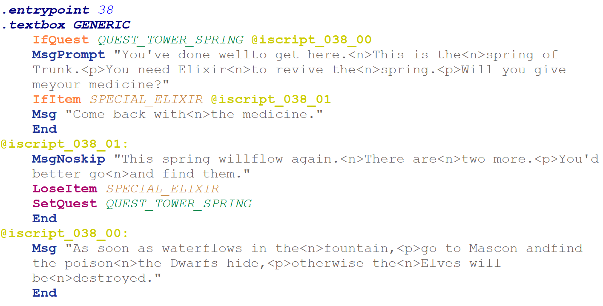

# Echoes of Eolis - Scripting Guide

This document describes the scripting and textual data interfaces provided by Echoes of Eolis for editing Faxanadu on the NES. It is assumed that users are somewhat acquainted with the game.

There are three types of scripts in the game:

* Interaction Scripts (iScripts)
* Behavior Scripts (bScripts)
* Music Scripts (mScripts)

Echoes of Eolis provides assembly interfaces for all three script types. Music can also be edited through the [MML interface](./mml-guide.md), which provides a higher-level abstraction more suitable for music composition.

In addition to the scripting interfaces, Echoes of Eolis provides a textual interface for editing miscellaneous static data.

These features are available directly from the Echoes of Eolis graphical interface. They are also exposed through the `eoe-cli` command-line application for users who prefer command-line workflows or want to automate their build process.

The command-line interface also provides a mantra encoder and decoder which takes spawn-point count into account. This currently supports only the original US version of the game.

All three script types were reverse engineered and documented by [ChipX86/Christian Hammond](http://chipx86.com/) as part of his [Faxanadu disassembly project](https://chipx86.com/faxanadu/). This functionality would not have been possible without his resources.

<hr>

If you want to edit the scripts used within Faxanadu, you will have to do some low level programming - but the languages are simple and most scripts used by the game are self-contained and easy to follow.

##### Interaction Scripts (iScripts)
The interaction script layer of Faxanadu consists of text-strings, shop data and code. The shop data and code live together in one section, whereas the strings live in a different section.

A sprite in Faxanadu - an NPC or an item - can call script code. For certain events, like picking up items, dying, trying to open a door with a key and such - the index of the script it triggers is hard coded in the game's logic. For NPCs the sprite data defines which script will be called when you interact with it.

The script code is one contiguous blob of data, and just before the script data begins there is a so called pointer table - with 152 entries by default - which tells the game where in the script code the entrypoints for the scripts are.

To see, or edit, which script is connected with a certain NPC in the game, you can inspect sprites in the [Echoes of Eolis](https://github.com/kaimitai/faxedit/) GUI.

##### Behavior Scripts (bScripts)
The behavior script layer consists only of code. This layer has 101 entrypoints, one for each sprite in the game. The scripts define how enemies, NPCs and items behave in the game.

The script code too is stored in one contiguous blob, following a pointer table.

##### Music Scripts (mScripts)
The music script layer consists of four entrypoints for each song - one entrypoint for each channel. 

##### Miscellaneous data text interface
These are not scripts, but static data of various types that we provide a textual editing interface for.

<hr>

#### Number formats

When the textual assembly files are parsed, numbers can be given in different bases. The disassembly will typically use a constant define, or whichever representation is the most suitable for any given data type - but generally the parsers will accept the following syntax (for value 200 in this example):

* Decimal: ```200```
* Hexadecimal: ```$c8``` or ```0xc8``` (not case-sensitive)
* Binary: ```%11001000``` or ```0b11001000``` (not case-sensitive)

<hr>

## Table of Contents

[Running the assembler](#editing-scripts)
- [Command-line interface](#command-line-interface)
- [ **iScript Assembly file contents** ](#iscript-assembly-file-contents)
  - [Defines](#defines)
  - [Strings](#reserved_strings)
  - [Shops](#shops)
  - [IScript](#iscript)
    - [Comments](#comments)
    - [Jumps](#jumps)
    - [Labels](#labels)
    - [.entrypoint](#entrypoint-value)
    - [.textbox](#textbox-value)
    - [Opcodes](#opcodes)
  - [A concrete example](#a-concrete-example)
  - [Editing Tips](#editing-tips)
  - [Well-formed code](#well-formed-code)
  - [Known bugs](#known-bugs)
  - [A highly technical note on Quests](#a-highly-technical-note-on-quests)
- [ **bScripts** ](#bscripts)
  - [ bScript Assembly file contents ](#bscript-assembly-file-contents)
    - [bScript defines section](#bscript-defines-section)
    - [bScript section](#bscript-section)
    - [bScript opcodes](#bscript-opcodes)
    - [bScript Editing Tips](#bscript-editing-tips)
- [ **Music** ](#music)
  - [Music Assembly file contents](#music-assembly-file-contents)
    - [mScript opcodes](#mscript-opcodes)
- [ **Miscellaneous Data** ](#miscellaneous-data)
- [ **Mantra Encoder** ](#mantra-encoder)
- [Behind the scenes](#behind-the-scenes)
- [Changelog](#changelog)

<hr>

## Editing scripts

The scripting tools can be accessed directly from Echoes of Eolis through the scripting window. From there, iScripts, bScripts, mScripts, MML and miscellaneous data can be extracted from the currently loaded ROM and built back into it.

The same functionality is available from the command line through `eoe-cli`. The CLI is useful for automated build processes and for users who prefer working directly from the command line.

### Command-line interface

```eoe-cli``` is a command-line tool which can disassemble the scripting layers of a Faxanadu ROM into human-readable and editable assembly files. It can also read an assembly file and patch the ROM with the information it contains.

The idea is that users will extract the scripting layer to files, make modifications to these files, and then patch the ROM with their changes.

The assembler needs access to a configuration file ```eoe_config.xml``` in order to use the correct constants for its calculations. These constants differ by ROM region.

The assembler will report on how much space it used for each data section, and how much more space is available, if any. If we can't fit the data within the limits patching will not take place.

##### <u>iScript commands</u>

To extract interaction scripts from a file, called "Faxanadu (U).nes" say, we run the following command from the command-line:

 ```eoe-cli extract "Faxanadu (U).nes" faxanadu.asm```

 Quotes are only necessary if any of your arguments contain spaces. You can write "x" instead of "extract".

 You can add options when extracting. They are:

* --no-shop-comments (or -p for short): Disable comments showing shop contents where a shop index is used as an operand
* --force (-f for short): Overwrite existing asm-file if it already exists. We don't allow it by default because users might inadvertently overwrite their assembly code if they aren't careful.
* --region (-r for short): Override automatic ROM region deduction. The parameter specified must match a region defined in eoe_config.xml

To build a file we go in the opposite direction, and assemble. To build a file faxanadu.asm and patch "Faxanadu (U).nes" with it, run the following command:

 ```eoe-cli build faxanadu.asm "Faxanadu (U).nes"```

 You can write "b" instead of "build".

 There are also options when building. They are:

 * --original-size (-o for short): This option will make patching fail if we use more ROM data than the original game. Use this if you are already using the free section at the end of the bank for something else. Note that the game code is packed in the code section, so if you add something you will also have to remove something else if you use this mode.
 * --source-rom (-s for short): This option takes an argument, which is a filename for the ROM you will use as a source for patching. If this option is not specified we will patch the file given as output file. Use this if you don't want to patch a ROM file directly.
 * --region (-r for short): Override automatic ROM region deduction. The parameter specified must match a region defined in eoe_config.xml

##### <u>bScript commands</u>

To extract behavior scripts from a file, called "Faxanadu (U).nes" for example, we run the following command from the command-line:

 ```eoe-cli extract-bscript "Faxanadu (U).nes" faxanadu.basm```

 Quotes are only necessary if any of your arguments contain spaces. You can write "xb" instead of "extract-bscript".

 You can add options when extracting. They are:

* --force (-f for short): Overwrite existing asm-file if it already exists. We don't allow it by default because users might inadvertently overwrite their assembly code if they aren't careful.
* --region (-r for short): Override automatic ROM region deduction. The parameter specified must match a region defined in eoe_config.xml

To build a file we go in the opposite direction, and assemble. To build a file faxanadu.basm and patch "Faxanadu (U).nes" with it, run the following command:

 ```eoe-cli build-bscript faxanadu.basm "Faxanadu (U).nes"```

 You can write "bb" instead of "build-bscript".

 There are also options when building. They are:

 * --original-size (-o for short): This option will make patching fail if we use more ROM data than the original game. Use this if you are already using the free section at the end of the bank for something else. Note that the game code is **possibly** packed in the code section, so if you add something you will also have to remove something else if you use this mode. It is quite possible however that we can extend the size of the first region, see the separate bScript documentation for more information.
 * --source-rom (-s for short): This option takes an argument, which is a filename for the ROM you will use as a source for patching. If this option is not specified we will patch the file given as output file. Use this if you don't want to patch a ROM file directly.
 * --region (-r for short): Override automatic ROM region deduction. The parameter specified must match a region defined in eoe_config.xml

##### <u>mScript commands</u>

 For extracting and inserting music assembly, the assembler is used in the following way:

 To extract music from a file, called "Faxanadu (U).nes" for example, we run the following command from the command-line:

 ```eoe-cli extract-music "Faxanadu (U).nes" faxanadu.masm```

  Quotes are only necessary if any of your arguments contain spaces. You can write "xm" instead of "extract-music".

 You can add options when extracting music. They are:

* --no-notes (or -n for short): Output raw hex bytes in the note stream instead of note names. Note names are enabled by default.
* --force (-f for short): Overwrite existing music asm-file if it already exists. We don't allow it by default because users might inadvertently overwrite their assembly code if they aren't careful.

To build a file we go in the opposite direction, and assemble. To build a file faxanadu.asm and patch "Faxanadu (U).nes" with it, run the following command:

 ```eoe-cli build-music faxanadu.asm "Faxanadu (U).nes"```

 You can write "bm" instead of "build-music".

 There are also options when building mScripts. They are:

 * --source-rom (-s for short): This option takes an argument, which is a filename for the ROM you will use as a source for patching. If this option is not specified we will patch the file given as output file. Use this if you don't want to patch a ROM file directly.
 * --region (-r for short): Override automatic ROM region deduction. The parameter specified must match a region defined in eoe_config.xml

##### <u>"miscellaneous data" commands</u>

For extracting and inserting miscellaneous data, the application is used in the following way:

 To extract misc data from a file, called "Faxanadu (U).nes" for example, we run the following command from the command-line:

 ```eoe-cli extract-misc "Faxanadu (U).nes" faxanadu.txt```

  Quotes are only necessary if any of your arguments contain spaces. You can write "xmisc" instead of "extract-misc".

 You can add options when extracting misc data. They are:

* --force (-f for short): Overwrite existing misc txt-file if it already exists. We don't allow it by default because users might inadvertently overwrite their existing files if they aren't careful.
* --original-size (-o for short): Extract miscellaneous data at its original full size. For sprite data, this includes all sprites rather than only enemies and bosses. Most users will not need this option.

To build a file we go in the opposite direction, and inject. To build a file faxanadu.txt and patch "Faxanadu (U).nes" with it, run the following command:

 ```eoe-cli build-misc faxanadu.txt "Faxanadu (U).nes"```

 You can write "bmisc" instead of "build-misc".

 There are also options when building misc. data. They are:

 * --source-rom (-s for short): This option takes an argument, which is a filename for the ROM you will use as a source for patching. If this option is not specified we will patch the file given as output file. Use this if you don't want to patch a ROM file directly.
 * --region (-r for short): Override automatic ROM region deduction. The parameter specified must match a region defined in eoe_config.xml
 
 <hr>

##### ROM region configuration

The assembler allows you to dump all region constants to a serialized text file, with a command like

```
eoe-cli dump-config faxanadu-jp.nes faxanadu-jp-config.txt
```

You can write **dc** instead of **dump-config**.

This will load a nes rom, resolve its ROM region, and then write all constants to file. This can be useful to inspect the differences between ROM regions, and for debugging if you set up your own regions based on custom ROM-hacks.

<hr>

## iScript Assembly file contents

The generated assembly files produce four sections. Defines, reserved strings, shops and iscript - which is the actual code.

### [defines]

Defines are symbolic constants used by the assembler. The point of them is that instead of remembering the byte value used by items, quests, textbox contexts and ranks - you can use the symbolic string directly in code and the assembler will translate it.

```
[defines]
 ; Item constants
define WEAPON_HAND_DAGGER $00
define WEAPON_LONG_SWORD $01
define WEAPON_GIANT_BLADE $02
```

This is the start of an extracted assembly file. Whenever you use the value WEAPON_GIANT_BLADE for example, as an opcode argument or a shop inventory entry, it will take its value from the defines - so there is no need to memorize all these values.

The defines will only replace numeric constants, and only in the [shops] and [iscript] sections.

### [reserved_strings]

The section [reserved_strings] contains a list of strings with reserved indexes. The assembler needs to know about these so they are not relocated or discarded during builds. These are strings which are used directly by game logic, and not necessarily any particular script.

```
[reserved_strings]
3: "This is not<n>enough Golds."
6: "You can't carry<n>any more."
16: "Come here<n>to buy.<n>Come here<n>to sell."
18: "You have<n>nothing to buy."
19: "Which one would<n>like to sell?"
20: "What<n>would you like?"
```
These are the reserved strings in the original game. The strings can be edited, but the indexes should be left as they are.

In general, strings are enclosed by double quotes, and we use special syntax for some characters. Valid characters you can write directly in your strings are:
* A-Z, a-z, 0-9
* . ? ' , ! - _

Then come the special characters we have our own codes for:
* &lt;title&gt;: This character will be replaced with the player's current title
* &lt;p&gt;: Newline and pause. Text output waits until player continues the dialogue.
* &lt;n&gt;: Newline
* &lt;q&gt;: Double quote. We have a special code for this since the string itself is enclosed within double quotes

Then come some glyphs which I am not sure appear in the original game, at least not in dialogue, but we have codes for them:
* &lt;block&gt;: A filled white block
* &lt;long_bar&gt;: A long bar used for arrows
* &lt;short_bar_right&gt;: Short bar used by right-pointing arrows
* &lt;arrow_right&gt;: An arrowhead pointing right
* &lt;short_bar_left&gt;: Short bar used by left-pointing arrows
* &lt;arrow_left&gt;: An arrowhead pointing left

Any other code can be encoded with &lt;N&gt; where N is a constant value from 0-254, but they are all garbage gfx or duplicates as far as I know. Codes like this will be translated to a byte value directly. 255 cannot be used as it denotes end of string. If you enter any character not in the list above into a string, assembly will fail.

Strings are stored in a certain section of ROM, and we can't extend this section without making game code modifications.

After assembly, string indexes are given by 1 byte arguments to opcodes using strings, and they are 1-indexed, meaning you can't use more than 255 distinct strings.

Many strings in the game seem to be missing spaces between words, but in those cases they are taking advantage of the fact that line breaks will occur there, every 16 characters.

Note: You can still give a string index instead of a string to string-using opcodes. The only reasonable use case might be to use string index 0 which seems to be considered an empty string by the game - if you want to add an empty dialogue without consuming a string index.

Note: The above information only applies to non-Japanese ROM regions. The Japanese characters are encoded differently with a textual symbol for each kana and kanji, although we may allow these characters directly in strings in a later version.

### [shops]

This section contains a list of shops, each with an index. This index is given to code instructions which expect a shop reference. In the actual code section the shops and code are mixed together, but we pull them out in this section so they can be edited independently.

```
[shops]
0: (KEY_J 100)
1: (WEAPON_HAND_DAGGER 400) (ITEM_RED_POTION 160) (SPECIAL_ELIXIR 320) (MAGIC_DELUGE 400)
2: (SHIELD_SMALL 800) (WEAPON_HAND_DAGGER 500) (MAGIC_DELUGE 500) (ITEM_RED_POTION 300)
```

This is the beginning of the shops section in the original game data. The symbolic constants will be filled out for you automatically when extracting, so we can immediately see that there is a shop that only sells a Jack Key for 100 golds for example, and this is indeed the Eolis key shop.

The syntax for shops is

**&lt;index&gt;: (item_1 price_1) ... (item_n price_n)**

Each instruction in later code that references a shop needs to be fed one of these indexes. If you add more shops remember to give them unique indexes.

### [iscript]

This is where we edit the actual scripts. We have implemented a custom assembly language tailored to IScript editing, but some terms need to be clear before we begin.

#### comments

Comments can be inserted on a line, starting with a semicolon. Anything from the semicolon to the end of the line will be ignored by the assembler. When we extract scripts from a ROM, we populate comments with shop contents by default - but this is for information only.

#### jumps

When code is executing, it is doing so in a linear fashion, instruction by instruction, unless it meets an end-of-script opcode (defined below) or a jump. A jump is an instruction that tells the program to continue execution in a different location.

#### labels

A label in the assembly file is a target for a jump. When you use a jump instruction in your code, you need to also provide a label that the execution can jump to.

Labels are put on lines in code, and end with a colon, like this:

```@iscript_038_01:```

If an instruction later jumps to label @iscript_038_01 it knows where it is. All labels used in your programs must be defined, and the definitions need to be in unique locations per label. You can use the labels as jump targets anywhere you want however.

Labels can have any name, but they are case-sensitive. When extracting from ROM labels will be automatically generated for you, but it is a good idea to give your labels descriptive names. I personally like to start labels with @ so they pop out in the code.

Remember:
* When defining a label it ends with a colon. It is only defined once.
* When referencing a label to redirect execution flow from somewhere else, don't add the colon.

#### .entrypoint &lt;value&gt;

The entrypoint directive tells the assembler where each script will enter the code and start executing. After compilation the linker will resolve this address to an actual value. The important thing is that at least 152 pointer table entries are known at linking time, so ensure you have at least 152 entrypoints, from 0 to 151, in your code. Several entrypoints can be at the same location - that just means several script indexes will run the same script - and in the original game there are lots of such cases. We enforce a minimum entrypoint count of 152 to be consistent with game code which references script with index 151 directly.

#### .textbox &lt;value&gt;

The .textbox directive must follow immediately after an entrypoint, and takes one argument. It determines which textbox will be used for the script. This emits one byte, so we can think of it as a pseudo-opcode - so if it is missing the code execution will be unaligned with the instruction offsets and probably crash.

We are providing the constants you can use as arguments. GENERIC is a textbox with no portrait, whereas the others - like GURU and NURSE - have portraits.

#### opcodes

Once we are past the entrypoint and have set up the textbox context, we are ready to run regular opcodes. Each opcode has a mnemonic, and an optional list of arguments and a jump target. All available opcodes are as follows:

| Opcode       | Arguments      | Jump/Read Addr | Description |
|--------------|----------------|-----------|-------------|
| End          | —              | —         | Ends the script |
| MsgNoskip    | string   | —         | Shows unskippable message |
| MsgPrompt    | string   | —         | Shows prompt message. Ends script if cancelled, continues otherwise |
| Msg          | string   | —         | Shows skippable message, script ends if skipped |
| IfTitleChange| —              | label     | Jumps to label if eligible for title change |
| LoseGold     | integer        | —         | Deducts gold from the player if he has enough gold, otherwise shows the "not enough gold"-message  |
| SetSpawn     | spawn point    | —         | Sets spawn point (0–7) |
| GetItem      | item id        | —         | Gives item to player |
| OpenShopBuy  | —              | shop index| Opens shop in buy-context |
| GetGold      | integer        | —         | Gives gold to player |
| GetMana      | byte integer   | —         | Gives mana to player |
| IfQuest      | quest id       | label     | Jumps if quest completed |
| IfRank       | rank id        | label     | Jumps if rank is sufficient |
| IfGold       | —              | label     | Jumps if player has any gold |
| SetQuest     | quest id       | —         | Marks quest as complete |
| IfBuy        | —              | label     | Jumps if player chooses "buy" |
| LoseItem     | item id        | —         | Removes item from player |
| OpenShopSell | —              | shop index| Opens shop in sell-context |
| IfItem       | item id        | label     | Jumps if player has item |
| GetHealth    | byte integer   | —         | Gives health to player |
| ShowMantra   | —              | —         | Shows mantra |
| EndGame      | —              | —         | Ends the game immediately |
| IfMsgPrompt  | string | label     | Shows prompt and jumps if accepted |
| Jump         | —              | label     | Unconditional jump |

Byte integers take values from 0 to 255, and other integers take values from 0-32767. Other IDs are byte values too, but you can replace the values with define constants in your code.

All opcodes starting with ```If``` take a label as their last argument. ```Jump``` also takes a label, but redirects execution unconditionally.

The assembler will fail if you give the wrong number of arguments to your opcodes.

Unlike labels and defines, opcodes are not case sensitive; you can write ENDGAME, endgame or EndGame for example - whichever you prefer.

## A concrete example

It will be clearer once we look at a script and inspect it. Here is the script for the dialogue with the wise old man in Tower of Fortress who wants an elixir to open the fountain. We have taken a screenshot from the script in Notepad++ with syntax highlighting.



We see that the entrypoint is 38, meaning the script ID associated with this sprite is 38. We also see that the textbox context is GENERIC, meaning there is no portrait.

The first line in the code is

```IfQuest QUEST_TOWER_SPRING @iscript_038_00```

This line says, if quest QUEST_TOWER_SPRING (the value of which is defined in the defines-section) is completed, execution jumps to label @iscript_038_00.

If the quest is not complete it continues without jumping, and then the next instruction would be:

```MsgPrompt "You've done wellto get here.<n>This is the<n>spring of Trunk.<p>You need Elixir<n>to revive the<n>spring.<p>Will you give meyour medicine?"```

which displays message with a string and prompts the user. If the user cancels the script terminates, but if the user accepts, the following instruction is run:

```IfItem SPECIAL_ELIXIR @iscript_038_01```

This says that if the player has the elixir, we jump to label @iscript_038_01.

Otherwise execution continues with another Msg-opcode, displaying message "Come back with&lt;n&gt;the medicine.". Then the script ends.

If we backtrack and see what happens if the player has the elixir when he accepts, then we jumped to label iscript_038_01.

Here this block is executed:

```
    MsgNoskip "This spring willflow again.<n>There are<n>two more.<p>You'd better go<n>and find them."
    LoseItem SPECIAL_ELIXIR
    SetQuest QUEST_TOWER_SPRING
    End
```

The wise man says the spring will flow again, then the player loses the elixir, and the quest flag for this spring is set. Then the script ends.

If we go back to the beginning and see what had happened at the initial check, when we jump to @iscript_038_00 if the quest is complete already.

The block of code at label @iscript_038_00 is:

```
    Msg "As soon as waterflows in the<n>fountain,<p>go to Mascon andfind the poison<n>the Dwarfs hide,<p>otherwise the<n>Elves will be<n>destroyed."
    End
```
So if we talk to him after already finishing the quest, we get another message before the script ends.

As a flowchart the logic looks like this:

```text
.entrypoint 38
.textbox GENERIC
     |
     v
+----------------------+
| Is QUEST_TOWER       |
| SPRING completed?    |
+----------------------+-------+
     | Yes                     | No
     v                         v
+------------------+     +-----------------------------+
| Msg "As soon     |     | MsgPrompt                   |
| "as water flows" |     | "Will you give me medicine?"|
| End              |     +-----------------------------+
+------------------+      | Accept             Decline |
                          v                            v
                +--------------------------+      Implicit End
                | Check for SPECIAL_ELIXIR |
                +--------------------------+
                    | Present       | Absent
                    v               v
          +------------------+   +------------------+
          | MsgNoskip        |   | Msg              |
          | "This spring     |   | "Come back..."   |
          | will flow        |   | End              |
          | again"           |   +------------------+
          | Lose Elixir      |
          | Set QuestComplete| 
          | End              |
          +------------------+
```


This was a script with several branches. Most scripts in the game are simple scripts with one message and then a script end, but you can make some logic and branching like this around quests and held items.

### Editing Tips

The easiest way to understand how scripting works is to see the scripts from the original game in an assembly file and trying to modify them.

Extract a ROM to an asm file, and change the following under .entrypoint 0 (there are many entrypoints here in the same location):

```
.textbox GENERIC
    MsgNoskip "I've been on<n>a long journey.<p>I came back to<n>my home town<n>to find it is<n>almost deserted.<p>The gate is<n>closed,<n>people are gone,<p>and the walls<n>are crumbling.<p>I wonder<n>what happened."
    End
```

This is the script that is called when you start the game and hit the invisible trigger. You can start by changing this script to things like:

```
.textbox PINK_SHIRT
    MsgNoskip "Hello"
    GetGold 1000
    GetHealth 50
    GetItem WEAPON_DRAGON_SLAYER
    End
```

Then assemble your file back to ROM and confirm that you get the expected results. The example above makes the Pink Shirt Guy show up in a portrait and say "Hello" and you get 1000 golds, 50 health, and you get the dragon slayer.

Use a text editor with support for assembly markup. I personally use [Notepad++](https://notepad-plus-plus.org/) which is open source and the default asm-markup helps. We have made a [user-defined syntax highlighter](./../util/NotepadPlusPlus-iScript-Syntax-Highlighting.xml) you can import to Notepad++ to help with IScript coding.

Notepad++ supports autocomplete which is helpful too, so you can get your defines easily without going back to look them up.

Use comments and descriptive labels when coding to remember what you were working on when you come back to your code.

## Well-formed code

For an asm-file to be valid, you need to specify at least 152 entrypoints, and each entrypoint must be immediately followed by a ```.textbox``` directive.

After that you need to make sure that we never hit another textbox pseudo-opcode while the code is executing, and that all possible branches that execution flow can take ultimately end with the End-opcode (or EndGame). After assembly, Echoes of Eolis validates the generated ROM by parsing the assembled script layer from every entrypoint and following all reachable control-flow paths. If any entrypoint produces malformed script code, the ROM will not be patched.

Check:

* At least 152 distinct entrypoints numbered 0-151
* Each entrypoint is followed by a .textbox before any opcode
* Code execution terminates in all branches it could possibly take, and it never hits another .textbox
* All your code can actually be reached from an entrypoint. Unreachable code cannot survive a round trip from asm to ROM and back to asm - the parser only looks for code the game could potentially reach.

<hr>

### Known Bugs

#### Multi-Line Mantra Bug

After building the iScripts, there is a chance that when you get a mantra from a Guru, the mantra will not insert a newline at the correct location if the mantra spans more than one line.

This is due to a highly esoteric bug in the game engine, described [here](https://notes.chipx86.com/Projects/Reverse-Engineering+Projects/Faxanadu+Disassembly/Bugs#Bad+Memory+Reads+During+Guru+Password+Display).

To work around this, you need to ensure that any message string displayed to the player just before the ShowMantra-opcode does not land on a bad address. To mimimize the chance of this happening, add all unique strings that are displayed just before ShowMantra to the list of reserved strings in the assembly file, and use a low index. This bug is not dangerous, so this fix can be applied at the end of a project when all strings are finalized.

For the original game data, the reserved section would look like this after applying this fix:

```
[reserved_strings]
1: "You need peace<n>of mind.<n>I will meditate<n>with you." ; This is new!
3: "This is not<n>enough Golds."
6: "You can't carry<n>any more."
16: "Come here<n>to buy.<n>Come here<n>to sell."
18: "You have<n>nothing to buy."
19: "Which one would<n>like to sell?"
20: "What<n>would you like?"
```

Here we added the only string shown before ShowMantra to the lowest unreserved index, which is 1.

#### Garbage Graphics on the Outro Screen

There is a subtle edge case in the vanilla `EndGame` script opcode.

If `EndGame` is executed while `PPU_ScrollScreen` (`$0D`) is odd, the ending graphics are uploaded correctly but the PPU displays the wrong nametable, making the background appear corrupted.

The ending routine (`SplashAnimation_DrawScenery`) always uploads the ending screen to nametable **$2000**. However, during rendering, the NMI handler rebuilds `PPUCTRL` as follows:

```asm
LDA $0D        ; PPU_ScrollScreen
AND #$01
ORA $0A        ; PPU_ControlFlags
STA PPUCTRL
```

where:

* `$0A` = `PPU_ControlFlags`
* `$0D` = `PPU_ScrollScreen`

This means:

* If `$0D` is **even**, nametable **$2000** is displayed.
* If `$0D` is **odd**, nametable **$2400** is displayed.

The outro code always writes the ending background to **$2000**, but it never resets or normalizes `PPU_ScrollScreen` before the upload. As a result, if `$0D` is odd when `EndGame` is called, the PPU displays `$2400` instead, even though the correct ending graphics were uploaded to `$2000`.

The fix is simply to clear `PPU_ScrollScreen` (`$0D`) or otherwise force nametable `$2000` before the outro begins.

This issue can be difficult to notice because many contexts invoke `EndGame` with an even `PPU_ScrollScreen` value (for example, NPC scripts executed inside buildings often have `$0D = 2`), so the assumption usually holds.


<hr>

### A highly technical note on Quests

The game holds one byte in RAM which stores information on whether a quest is complete, with eight entries - one entry per bit. These are flags that tell the game whether the 3 springs have been opened, whether you have opened the path to Mascon, whether you have gotten the Mattock from the Wyvern and whether you have gotten the Wing Boots from the stone dropper. The other two bits do not seem to be used.

When we use opcode IfQuest and SetQuest, the number we give as input is not a bitmask to be compared with the quest byte, for some reason. In actuality the number we pass in to the function is used as an index into a lookup table hard coded in the game logic, and this lookup table has 3 entries - in the game's script code only the three springs are checked. Other quest flags are queried directly within the game code itself. Each entry is a power of two; 1, 2 and 4 - and this is finally used as a bitmask in comparisons with the quest byte in RAM.

The area in ROM where this 3-byte lookup table is stored is in the middle of the action handler code used by the scripting engine. One thing we did to get more state branching into our code, was to scan the 255 bytes forward from the quest lookup table and see if we could find more perfect powers of two, and in fact there were two of them. Then we looked to see if there was any byte value which did not have overlapping bits turned on for any of the 5 quest flag indexes we had found, and there were three such values. We used one of them, called it QUEST_EXTRA, and let it represent a sixth unique state. QUEST_EXTRA will set more than one quest flag, but they will not overlap any of the 5 "clean quest flags" so it can be used independently. It does however overlap the quest bit used by the Stone Dropper Wing Boots, so the constant might as well have been called QUEST_STONE_DROPPER_WINGBOOTS.

You can extend this exploitation of going out of the original bounds of the lookup table even further; you can map all distinct values in the "extended lookup table" and use them as bitmasks where the value will be used as an OR when passed to IfQuest, and as an AND when passed to SetQuest, effectively querying or setting multiple quest flags at once.

<hr>

## bScripts

The behavior scripts work much in the same way as the interaction scripts, but one important difference to note is that bScripts have a lot of opcodes, and some of them take many arguments. Therefore we have decided to enforce named arguments in the commands used by the bScript assembler. To make the language easier to write, we have tried to make the assembler flexible.

This documentation is in large parts derived from [the Faxanadu disassembly](https://chipx86.com/faxanadu/PRG14.html), [ChipX86's bScript notes](https://notes.chipx86.com/Projects/Reverse-Engineering+Projects/Faxanadu+Disassembly/Sprite+Behavior+Scripts) and some of my own testing.

✅ We enforce named arguments, and pre-populate some constant defines, so that users don't need to remember the order of operands or the most common constants. This is the script for how bread behaves, for example:

```
.entrypoint 1 ; Bread
Behavior_Hop pixels=0 blocks=0 mode=HOP_MODE_3
Behavior_Fall ticks=255
End
```

This makes scripts easier to read and helps avoid mixing up argument order.

✅ Special rule: opcodes with exactly one operand

If an opcode only takes one parameter, you may omit the parameter name.

```Jump @label``` is the same as ```Jump addr=@label```.

The assembler treats them the same. Use whichever is more comfortable.

✅ The optional zero operand

Many opcodes in the original virtual machine include an unused extra byte. It appears to always be zero and seems to be ignored by the game engine. It has to be preserved so that the instructions get the expected number of arguments, but the assembler will hide these if it can.

Rules for the ```zero``` operand:
* You may omit it entirely — it will default to 0.
* If you do give it a value (for experimentation), it will be used.
* If a zero operand does not have the value 0 in ROM, it will be extracted and shown in the asm-file output when disassembling.

⚠ We cannot guarantee that this “zero byte” is truly unused for all opcodes. It’s possible that it has meaning for some instructions when set to non‑zero values. If you want to help explore undocumented behavior, feel free to experiment.

✅ Not all operand names are final

This scripting system is reverse‑engineered, and not all instructions are perfectly mapped out yet.

- Some operand names may not reflect their true purpose in the VM.
- Some operands might use the wrong sign. The assembler will still correctly use signed values (-128 to 127), but the disassembler will insist on showing them as unsigned (0-255) in such cases - if any.
- Some opcodes might take additional meaningful values we haven’t discovered yet.
- The naming may change in future versions if we discover more accurate meanings.

But don’t worry: The assembler is fully functional and complete in the sense that you can create any valid script already.

If you discover something new about an opcode or operand, please report it - it may improve the tool for everyone.

✅ Summary
- Write arguments as name=value, unless the opcode only has one argument.
- Single‑argument opcodes can skip the name (Jump @label is fine).
- The special zero argument is optional and defaults to 0.
- Some opcodes and operands are not fully documented — experimentation is welcome.

## bScript Assembly file contents

The generated assembly files produce two sections; defines and bscript. The defines will be pre-populated with known constants so they can be used in script code. The bscript-section contains the actual script code.

Only one command, label definition or entrypoint definition can be on any one line. (comments can be added to the end of any line however)

### bScript defines section

This works the same way as for the interaction scripts. It is a list of constants that can be used in script code and turned into numbers when assembling.

### bScript section

This also works much in the same as the interaction scripts.

bScripts have 101 entrypoints, numbered from 0 to 100 - one for each sprite in the game. The disassembler will add a comment to each entrypoint with the name of the sprite it belongs to. Some sprites share the same behavior, and therefore have the same entrypoint location.

- comments start with ```;``` - anything after a semicolon will be ignored
- labels start with ```@``` and end with a colon in the definition, but not when referenced

Branching in bScripts, however, does not depend much on user input. In fact there is very little branching at all. There is one opcode ```IfDistLessThan``` which checks how far the player is from a sprite in the x- or y-directions, and branches to different code sections depending on whether the comparison is true or false - but that is all.

Many bScripts loop linearly between the entrypoint and a Jump-instruction at the end of the script.

Some bScripts define a sprite's behavior fully, some bScripts just call a behavior command which is hard coded in the engine, and some use a mix of both.

For example, the bScript for Zorugeriru is simply:

```
.entrypoint 49 ; Zorugeriru
  Behavior_Zorugeriru
  End
```

where the command ```Behavior_Zorugeriru``` calls a behavior fully implemented in assembly code, and not in script code. Some behaviors were probably too complex to script.

For other sprites the behavior is fully defined by scripts. The behavior of the Monodron for example:

```
.entrypoint 42 ; Monodron
@label_42_1:
  Action action=ACTION_RANDOMLY_FLIP_X
  Behavior_Fall ticks=5
  Behavior_Hop pixels=0 blocks=1 mode=HOPMODE_2
  Action action=ACTION_FACE_PLAYER_X
  Behavior_Fall ticks=20
  Behavior_Hop pixels=128 blocks=1 mode=HOPMODE_2
  Jump addr=@label_42_1
```

This script does the following:
* Randomly flip x-direction
* Wait for 5 ticks while gravity acts
* Hop using hop mode 2, while also moving 1 block in the x-direction
* Face the player
* Wait for 20 ticks (1/3 of a second) while gravity acts
* Hop using hop mode 2, while also moving in the x-direction using the given pixels and blocks arguments
* Jump back to the label at the start of the script - forming an endless loop

## bScript opcodes

The following opcodes take any number of these arguments.

- **zero** — unused byte; assembler inserts 0; value 0–255 allowed
- **ticks** — engine ticks (0–255), 60 Hz
- **pixels** — X fractional speed (0–255)
- **blocks** — X full-block speed (0–255)
- **pixels_y** — Y fractional speed (0–255)
- **blocks_y** — Y full-block speed (0–255)
- **action** — action number (0–7), 8–255 undefined
- **mode** — hop mode (0–4), others undefined
- **direction** — 0=x, 1=y, others undefined
- **phase** — animation phase (0–255, defined values probably depend on the sprite)
- **ram** — RAM address $0000–$07ff (resolved per sprite slot, 8 sprites can be on the screen so a value 0-7 will be added to the given ram address)
- **value** — byte value to add to a given RAM address (-128 to 127)
- **addr** — jump label
- **true** — jump label (condition true)
- **false** — jump label (condition false)
- **byte** — general byte (0–255)

| Opcode | Mnemonic | Args | Comments |
|--------|----------|-------|----------|
| $01 | DisableJump | addr | Unclear |
| $02 | Action | action | Perform a given action |
| $03 | IfDistLessThan | direction,pixels,true,false | Checks if the player is within a given amount of pixels in a given direction, jumps to true if less-than |
| $04 | EndBehavior | | Ends the current behavior |
| $05 | Jump | addr | Unconditional jump |
| $06 | AddValue | ram, value | Adds the given value to the given RAM address. RAM address offset by sprite's slot in memory (0-7). In the original game this is used to adjust the positions of some sprites. |
| $07 | SetPhase | phase | Unclear; might set the sprite's animation frame index to the given phase value |
| $ff | End | | Ends the behavior script |

The operand ```ram``` used by opcode ```AddValue``` should resolve to a valid RAM address, which is in the range $0000-$07ff. What each address means is documented in [ChipX86's disassembly (RAM map)](https://chipx86.com/faxanadu/RAM.html).

Behavior sub-opcodes

| Opcode | Mnemonic | Args | Comments |
|--------|----------|-------|----------|
| $00 | Behavior_MoveX | ticks, pixels, blocks | Move in the x-direction |
| $01 | Behavior_Wait | ticks | Wait for a number of ticks |
| $02 | Behavior_BounceAndExpire | zero | Used only by coin |
| $03 | Behavior_Rock | zero | Used by the falling rocks |
| $04 | Behavior_WalkForward | ticks, pixels, blocks | Walks forward in the sprite's facing direction |
| $05 | Behavior_NOP | | ⚠ Unused in the original game. Argument list uncertain. |
| $06 | Behavior_Unused_06 | zero | |
| $07 | Behavior_Lightningball | zero | |
| $08 | Behavior_Charron | zero | |
| $09 | Behavior_Hop | zero, pixels, blocks, mode | Valid hop modes are in the range 0-4. Pixels and block represent changes in the x-direction. |
| $0a | Behavior_Wyvern | zero | |
| $0b | Behavior_NOP_2 | | ⚠ Unused in the original game. Argument list uncertain. |
| $0c | Behavior_Borabora | zero | |
| $0d | Behavior_Pakukame | zero | |
| $0e | Behavior_Zorugeriru | zero | |
| $0f | Behavior_Grieve | zero | |
| $10 | Behavior_ShadowEura | zero | |
| $11 | Behavior_MoveXY | ticks, pixels, blocks, pixels_y, blocks_y | Move in both the x and y directions |
| $12 | Behavior_Zoradohna | ticks, pixels, blocks, byte | |
| $13 | Behavior_MoveY | ticks, pixels, blocks | Move in the y-direction |
| $14 | Behavior_a8d7 | ticks, pixels, blocks | ⚠ Unused in the original game. Argument list uncertain. |
| $15 | Behavior_Fall | ticks | Waits for the given amount of ticks while gravity acts on the sprite |
| $16 | Behavior_NecronAides | zero | |
| $17 | Behavior_Bihoruda | zero | |
| $18 | Behavior_Lilith | zero | |
| $19 | Behavior_Yuinaru | zero | |
| $1a | Behavior_Nash | zero | |
| $1b | Behavior_MagicA | zero | Magic effect |
| $1c | Behavior_MagicB | zero | Magic effect |
| $1d | Behavior_MagicC | zero | Magic effect |
| $1e | Behavior_ClearReadySetBit7 | zero | Only used by Geributa, meaning unclear |
| $1f | Behavior_FlashDamagePlayer | zero | |
| $20 | Behavior_GiantBees | zero | |
| $21 | Behavior_Naga | zero | |
| $22 | Behavior_Yareeka | zero | |
| $23 | Behavior_Magman | zero | |
| $24 | Behavior_Unused_24 | zero | |
| $25 | Behavior_Unused_25 | zero | |
| $26 | Behavior_Unused_26 | zero | |
| $27 | Behavior_Tamazutsu | zero | |
| $28 | Behavior_SirGawaineWolfman | zero | Two sprites share behavior code |
| $29 | Behavior_ItemOintment | zero | |
| $2a | Behavior_ItemGlove | zero | |
| $2b | Behavior_ItemBattleSuit | zero | |
| $2c | Behavior_ItemBattleHelmet | zero | |
| $2d | Behavior_ItemDragonSlayer | zero | |
| $2e | Behavior_ItemMattockQuest | zero | |
| $2f | Behavior_ItemWingBootsQuest | zero | |
| $30 | Behavior_ItemBlackOnyx | zero | |
| $31 | Behavior_ItemPendant | zero | |
| $32 | Behavior_ItemMattockRandom | zero | |
| $33 | Behavior_ItemHourGlassRandom | zero | |
| $34 | Behavior_ItemRedPotionRandom | zero | |
| $35 | Behavior_ItemPoisonRandom | zero | |
| $36 | Behavior_ItemGloveRandom | zero | |
| $37 | Behavior_ItemWingBootsRandom | zero | |
| $38 | Behavior_ItemOintmentRandom | zero | |
| $39 | Behavior_SpringFinal | zero | |
| $3a | Behavior_SpringFortress | zero | |
| $3b | Behavior_SpringSky | zero | |
| $3c | Behavior_SpringJoker | zero | |
| $3d | Behavior_ItemMagicalRod | zero | |
| $3e | Behavior_BossDeath | zero | |
| $3f | Behavior_Buzz | zero | |
| $40 | Behavior_Ishiisu | zero | |
| $41 | Behavior_ExecutionHood | zero | |

The opcodes not used in the original game have uncertain argument lists, and might corrupt the assembled bytecode when used. Based on our testing we think the argument lists we use even for these have the correct size, but we make no guarantees.

#### Action operands

These are the values the Action command can take, and are defined as constants in our assembly defines-section.

| Value | Define Constant | Comments |
|-------|-------------|----------|
| $00 | ACTION_FACE_PLAYER_X | Face player in the x-direction |
| $01 | ACTION_FLIP_X | Flip x-direction |
| $02 | ACTION_FACE_PLAYER_Y | Face player in the y-direction |
| $03 | ACTION_FLIP_Y | Flip y-direction |
| $04 | ACTION_RANDOMLY_FLIP_X | Flip x-direction randomly (roughly 50/50) |
| $05 | ACTION_RANDOMLY_FLIP_Y | Flip y-direction randomly (roughly 50/50) |
| $06 | ACTION_FLY_UP | Clears the falling flag for a sprite |
| $07 | ACTION_CAST_MAGIC | Cast magic in the current x-direction |

## bScript Editing Tips

As for the iScripts, ensure all your code is reachable and that your scripts either end or loop forever. Do not let your instructions fall through to non-script data or you might crash. The assembler will test your code paths before patching ROM, but it provides no other static analysis.

"Loop forever" should come with the caveat that your loop actually has to do something that depends on game ticks, otherwise you might cause the game itself to actually loop forever and not ever yield control to other game code.

Otherwise this scripting language is not fully known by me at least, so have fun and experiment!

<hr>

## Music

An assembly interface is provided for music as well, although for actual composition it is highly recommended to use the [MML interface](./mml-guide.md) provided by the application. The assembly format is most suitable for inspecting the music bytecode, but not so much for editing. We provide this interface mostly for completeness' sake and because the MML compiler needs it.

Music in Faxanadu uses four channels per song, two square wave channels, one triangle wave channel and one noise channel.

The note lengths can be given as a one-byte value ($80-$ed represent note lengths from 0 to 109) or via a note length-setting opcode which can set note lengths up to 255 ticks. The NES runs at roughly 60 ticks per second in this context, so a note length of 60 means one second or so of sound.

When a note length has been set, all subsequent notes and rests last that long - until a new note length command is given.

Notes take on the values $01 to $7f, and start at c2. (note c, octave 2) There are 12 notes, or semitones, in an octave. They are: c, c+, d, d+, e, f, f+, g, g+, a, a+, b - where + denotes a sharp note.

The channels use different pitch offsets at several levels. The global offsets are encoded in the ROM file, and appear as comments near the top of the music asm file. In a default ROM you will see:

```
 ; ========================================
 ; SQ1 pitch offset: down 1 octave
 ; SQ2 pitch offset: down 1 octave
 ; TRI pitch offset: up 1 octave
 ; ========================================
```

This means that if you see the note c4 in an sq1 or sq2 channel, it will really be c3. For the triangle channel c4 would really be c5. It is also possible to set song-wide or channel-wide transpositions on top of the global transpositions, and they stack.

Transposition values are given as a signed byte (negative 128 to 127), and are given in semitones. A transposition which is a multiple of 12 means the pitch is shifted by an octave up or down.

### Music Assembly file contents

The generated music assembly files produce two sections. Defines and mscript - which is the actual music code.

For music you can define note length constants. If you want a quarter note to be 36 ticks, for example, you can write

```define quarter 36```

and use quarter as a symbol in your music code.

```.song directive```

.song will be followed by a song number and a channel. **1.SQ1** for example, means the square 1 channel of song 1 starts at that point.

All songs need to have entrypoints defined for all 4 channels. This is needed to construct the pointer table to the music, so the music engine knows where each channel starts.

Apart from that it is just music data (notes, rests, note lengths) and op-codes which define the music.

The noise channel works differently from the other three, and is used for percussion. In the original game only 3 different sounds (values 1, 2 and 3) are used, and they are given as the high nibble of noise bytes. The low nibble is the repeat count for that sound.

For example, a noise channel note byte of $35 will repeat noise 3 five times.

Loops are supported, but not nested loops. There is a pair of opcodes for "push address" and "pop address and jump" which can act as an infinite loop, however.

#### mScript opcodes

Once we are past the channel entrypoints, we are ready to run regular opcodes and emit notes. Each opcode has a mnemonic, and an optional list of arguments and a jump target. All available opcodes are as follows, but note that some of this information might be wrong or incomplete:


| Opcode | Name                   | Argument            | Jump Addr | Description |
|--------|-------------------------|----------------------|------------|-------------|
| `$EE`  | SQ2PitchBias           | byte                | —          | Applies a pitch offset to Square 2 (fine bias). |
| `$EF`  | SQPitchEffectDepth     | byte                | —          | Sets vibrato/tremolo depth for square channels. |
| `$F0`  | SQEnvelope             | byte (Envelope)     | —          | Selects envelope shape for square channels. |
| `$F1`  | Volume                 | byte                | —          | Decrease channel volume (0–9?). |
| `$F2`  | SQControl              | byte (SQControl)    | —          | Configures duty cycle / sweep for square channels. |
| `$F3`  | NoteLength             | byte                | —          | Overrides note duration for the next notes. |
| `$F4`  | Restart                | —                   | —          | Restarts the song when all channels have finished |
| `$F5`  | Return                 | —                   | —          | Returns from subroutine |
| `$F6`  | ChannelTranspose       | byte (PitchOffset)  | —          | Applies per‑channel pitch shift. |
| `$F7`  | GlobalTranspose        | byte (PitchOffset)  | —          | Applies global pitch shift to all channels. |
| `$F8`  | JSR                    | Addr                | Jump label       | Jumps to subroutine |
| `$F9`  | PushAddr               | —                   | —          | Pushes current address onto the return stack. |
| `$FA`  | NOP                    | —                   | —          | Does nothing (safe filler). |
| `$FB`  | NextLoopIf             | byte                | —          | Ends the current loop if the iteration count equals the argument |
| `$FC`  | EndLoop                | —                   | —          | Marks loop end (paired with BeginLoop). |
| `$FD`  | BeginLoop              | byte                | —          | Starts a counted loop with given iteration count. |
| `$FE`  | PopAddr                | —                   | —          | Pops return address and jumps. |
| `$FF`  | End                    | —                   | —          | Terminates the song. |

<hr>

## Miscellaneous Data

The miscellaneous data interface was added in order to allow easy editing of data that does not fit anywhere else. It is of static size and ROM offsets, and could be edited with a hex editor. We group them all in one place for easy region-agnostic editing, and provide some abstractions.

The commands for extracting and injecting a misc. data txt- file are ```xmisc``` and ```bmisc```. The flag ```-o``` (```--original-size```) extracts the original full data set. For sprite data, this includes all sprites; by default, only data for enemies and bosses is extracted.

The extracted txt file will have a comment header for each data section, which explains what the data represents.

Each entry in the txt file is on the form ```category<index>.field``` with a corresponding value. For example ```Sprite42.XP``` has category ```Sprite```, index ```42``` and field ```XP``` - and the value is therefore the XP received when killing enemy with index 42, which is the Monodron.

For sprite data a comment is added to each line which gives the name of the sprite, defined in the configuration xml.

For string data, the header comment says which characters are allowed to use in strings of that type. Any other character will make the data injection fail, although we have special syntax for arbitrary byte values, like we do for iScript strings. ```<n>``` will be translated to byte value n. Other special tokens are ```<q>``` and ```<copyright>``` which translate to double quotes and the copyright symbol, in some contexts. The header comments will be specific about this.

Title Screen Strings are semi-static in the sense that their entire section is of static size and offset, but each individual string is of variable length. Stick with the original lengths (pad with spaces) to make sure they look correct on the title screen.

Other strings types will be resized and padded automatically, as each individual string is of fixed max length.

#### Rank XP and Gold

```Rank.XP``` defines how much XP is needed to get that rank, and ```Rank.Gold``` defines how much gold you start with for a given rank. These both start at index 1 - as no entry is defined for rank 0, which is the starting rank.

#### Enemy Drops

Enemy drops are not given directly per sprite, but instead given as indexes into a drop table. The drop table defines the drops and has 64 entries. The first 48 entries (indexes 0-47) are gold values, and are used by sprites which drop coins. Indexes 48-63 are used by enemies which drop bread, and the value is HP healed. (can wrap-around to negative for large values)

The original data will for example contain ```DropTable9.Gold 59``` - this means that DropTable index 9 is a gold drop, and the gold value is 59.

Combine with the entry ```Sprite42.DropIndex 9 	; Monodron``` we see that sprite 42 (Monodron) uses drop table index 9 - meaning it drops 59 gold.

The entry ```Sprite71.DropIndex 50 	; Zozura``` tells us that Zozura uses drop table index 50. Since this index is >= 48, we know it drops a bread - and looking at entry 50 in the drop table we see ```DropTable50.Bread 8``` - which tells us that Zozura drops a bread that heals 8 health points.

If you want an enemy to drop nothing, give it drop index 255 ($ff) - although any value >= 64 ($40) will have that effect.

For example ```Sprite6.DropIndex 255 	; Zombie``` tells us that Zombie drops nothing.

Enemies that are bosses will drop multiple coins or breads.

#### Enemy HP

The enemy HP values shown are the values from ROM, but enemies will still be alive at 0 HP. The value has to go into the negatives for the enemy to actually die.

#### Enemy Magic Defense

Enemies can be resistant to magic spells, with a 50% or 100% reduction. The first spell, Deluge, can not be resisted. The other 4 can, however, and to understand how this works it is easiest to look at these values as binary constants - and the misc. extraction will automatically output binary values here.

The 4 spells that can be resisted are, in order; Thunder, Fire, Death and Tilte. Two bits are used for each spell when defining magic defense. The first (highest) two bits define Thunder defense, then comes Fire defense, then Death and finally Tilte.

The blocks of bits have the following meaning:

   * 00 - No defense
   * 01 - 50% defense
   * 10 or 11 - 100% defense

Let us consider a concrete example from the original data:

```Sprite6.MagicDefense %00001100 	; Zombie (Thunder=0% Fire=0% Death=100% Tilte=0%)```

Binary values are prefixed with %, so we know this is a binary constant, and the blocks are 00, 00, 11 and 00. This means the Zombie resists the Death spell completely, but has no resistance to other magics. The extraction will add this to the comments automatically.

You could also write ```Sprite6.MagicDefense 12``` or ```Sprite6.MagicDefense $0c```, but the binary representation is the clearest in this case.

A value of ```%11111111``` would mean 100% resistance to all magics - except Deluge which can never be resisted.

#### Wing Boot times

There are four values which define the duration (in seconds) of Wing Boots. Using values higher than 99 might glitch - at the very least the timer in-game expects 2 digits.

In the original game the duration of Wing Boots gets lower as your rank gets higher. There are 16 ranks, and 4 durations - meaning the first duration (index 0) is the duration for the first 4 ranks, the next duration is for the next 4 ranks, and so on.

<hr>

### Mantra Encoder

The application also comes with an interface for encoding and decoding mantras. Currently these only work for the US version of the game.

[Echoes of Eolis](https://github.com/kaimitai/faxedit) will allow you to add more spawn points than the original game, which has eight spawns in total. The mantra encodes the spawn value (0-7) in three bits, but EoE will widen this field to allow the game to encode and decode mantras correctly. Our mantra encoder also allows users to specify a total spawn count, allowing the creation of mantras for ROMs modified with more than 8 spawn points.

The spawn points are set with the iScript-opcode ```SetSpawn```, and these scripts are then set to a guru inside a guru room in the game. In the original game SetSpawn only took values from zero to seven, but we can use values up to 255 in theory. But whenever the spawn point count passes a new power of two, the mantra field for encoding the spawn point widens by one bit.

To encode or decode a mantra, we use the command **m** followed by parameters.

The flag -m, for example, decodes a mantra string. For example, to decode the mantra string **8qB?3??8TgCNQukz3kK8**, the following command can be run:

```eoe-cli m -m 8qB?3??8TgCNQukz3kK8```

which will output

```
Mantra: 8qB?3??8TgCNQukz3kK8
Checksum: 242
Character count: 20

Location: Eolis (0 of 8)
Rank: Warrior

Equipped weapon: Dragon Slayer
Equipped armor: Battle Suit
Equipped shield: Battle Helm
Equipped magic: Deluge
Equipped item: Key J

Stored weapons (0): (none)
Stored armors (0): (none)
Stored shields (0): (none)
Stored magics (4): Death, Fire, Tilte, Thunder
Stored items (7): Mattock, Key Q, Wing Boots, Wing Boots, Key A, Key K, Wing Boots

Special items (7): Ring of Elf, Ring of Ruby, Ring of Dworf, Demon's Ring, Elixir, Magical Rod, Black Onix
Gamestate flags (8): Unknown 1, Unknown 2, Path to Mascon, Wyvern Mattock, Stone Dropper Wing Boots, Dungeon Spring, Sky Spring, Tower Spring
```

The output starts with the mantra restated in canonical format, which should match what the game generates. The same game state can be encoded in different ways, but we use the same algorithm as the game and should match it exactly. The next parts of the output are the checksum and character count, which are stored inside the mantra itself and used for validation. If the checksum and character count don't match what the game expects for a given mantra, it will not be accepted by the game.

Then comes the location and rank, followed by equipped and stored items, weapons, shields, magics and items. Finally come the special items and quest flags.

To encode a password, we use other flags with parameters. They are as follows:

* -t: Terse output. Only gives the mantra, and no report on its contents. (this can also be used when decoding mantra, if you just want a mantra on canonical form)
* -sc &lt;n&gt;: Spawn count. Defaults to 8 which is what is in the original game. If you have a modified ROM with fewer or more spawn points, you need to specify this parameter or else the generated mantra could be invalid. Whenever the spawn point count passes a new power of two (&gt;2, &gt;4, &gt;8, &gt;16, &gt;32, &gt;64, &gt;128) one more bit is needed to encode the password. Also note that this is the count of spawn points, not the highest index. So if the spawn points are indexed by 0-15 for example, the count is 16. The count is always one more than the highest index (counting from 0) that is used in your ROM. This parameter must also be given when decoding a mantra, if that mantra was generated by a ROM with a modified spawn point count.

The other flags and parameters define the contents of the mantra itself:

- Meta (takes 1 parameter)
  - -r: Rank
  - -l: Location

- Equipped (takes 1 parameter)
  - -ew: Equipped weapon
  - -ea: Equipped armor
  - -es: Equipped shield
  - -em: Equipped magic
  - -ei: Equipped item

- Stored (inventory)
  - -sw: Stored weapons (max 4 parameters)
  - -sa: Stored armors (max 4 parameters)
  - -ss: Stored shields (max 4 parameters)
  - -sm: Stored magics (max 4 parameters)
  - -si: Stored items (max 8 parameters)

- Other
  - -s: Special items (max 8 parameters)
  - -g: Game flags aka quest bits (max 8 parameters)

Those flags which take multiple parameters take comma-separated lists. There must be no spaces between these commas, otherwise parsing will fail.

Possible parameter values follow. The full string is not needed if there is no ambiguity. For example ```-r m``` will match rank Myrmidon since only one rank starts with m. ```-r a``` on the other hand will fail with error message ```Ambigous value for parameter -r and value a. Matches: aspirant, adept```.

Ranks: ```"novice", "aspirant", "battler", "fighter", "adept", "chevalier", "veteran", "warrior", "swordman", "hero", "soldier", "myrmidon", "champion", "superhero", "paladin", "lord"```

Locations: ```"eolis", "apolune", "forepaw", "mascon", "victim", "conflate", "daybreak", "dartmoor"```

Locations can be given as a number instead, for example ```-l 0``` and ```-l eolis``` and ```-l e``` are all equivalent. If you use a location with index higher than 7, in other words a non-standard location, you have to specify it by number.

Weapons (stored and equipped): ```"handdagger", "longsword", "giantblade", "dragonslayer"```

Armors (stored and equipped): ```"leatherarmor", "studdedmail", "fullplate", "battlesuit"```

An armor should always be equipped. In the original game you start wearing the leather armor. If you make a mantra with no equipped armor there will be severe visual glitches.

Shields (stored and equipped): ```"smallshield", "largeshield", "magicshield", "battlehelm"```

Magics (stored and equipped): ```"deluge", "thunder", "fire", "death", "tilte", "elfring", "rubyring", "dworfring"```

Items (stored and equipped): ```"elfring", "rubyring", "dworfring", "demonsring", "ace", "king", "queen", "jack", "joker", "mattock", "rod", "crystal", "lamp", "hourglass", "book", "wingboots", "redpotion", "blackpotion", "elixir", "pendant", "blackonix", "firecrystal", "g0", "g1", "g2", "g3", "g4", "g5", "g6", "g7", "g8", "g9"```

The special items will cause glitches if used as carried items or as magics, but it is possible. The values g0-g9 are also there for completeness' sake, but they result in garbage items in the standard ROM.

Special items: ```"elfring", "rubyring", "dworfring", "demonsring", "elixir", "magicalrod", "pendant", "blackonix"```

Gamestate aka Quests: ```"u1", "u2", "masconpath", "mattock", "wingboots", "dungeonspring", "skyspring", "towerspring"```

u1 and u2 are unknown quest bits. They are not used in the original game.

One example of a mantra generation, using short-hand for some constants:

```eoe-cli m -ew giant -ea full -es mag -ei jo -sw hand -sm death,deluge,fire -si red,red,matt,ace,king,wing -s elix,black,elf -g sky,mascon,wing -l 4 -r myrmidon```

will generate the following mantra and output:

```
Mantra: 65y4kq2yggDYTQgkhXg
Checksum: 235
Character count: 19

Location: Victim (4 of 8)
Rank: Myrmidon

Equipped weapon: Giant Blade
Equipped armor: Full Plate
Equipped shield: Magic Shield
Equipped magic: (none)
Equipped item: Key Jo

Stored weapons (1): Hand Dagger
Stored armors (0): (none)
Stored shields (0): (none)
Stored magics (3): Death, Deluge, Fire
Stored items (6): Red Potion, Red Potion, Mattock, Key A, Key K, Wing Boots

Special items (3): Ring of Elf, Elixir, Black Onix
Gamestate flags (3): Path to Mascon, Stone Dropper Wing Boots, Sky Spring
```

This assumes the ROM had 8 spawn points. If you want a mantra for a ROM with 17 spawn points, for example, you would add ```-sc 17``` to the command above, which would give the output:

```
Mantra: y5kuJKtsoIA2E0IJIV4
Checksum: 203
Character count: 19

Location: Victim (4 of 17)
Rank: Myrmidon

Equipped weapon: Giant Blade
Equipped armor: Full Plate
Equipped shield: Magic Shield
Equipped magic: (none)
Equipped item: Key Jo

Stored weapons (1): Hand Dagger
Stored armors (0): (none)
Stored shields (0): (none)
Stored magics (3): Death, Deluge, Fire
Stored items (6): Red Potion, Red Potion, Mattock, Key A, Key K, Wing Boots

Special items (3): Ring of Elf, Elixir, Black Onix
Gamestate flags (3): Path to Mascon, Stone Dropper Wing Boots, Sky Spring
```

The entire gamestate was the same, but the mantra changed because five bits were used to encode the location, instead of three in the first example. This causes a ripple effect in the password string.

<hr>

### Behind the scenes

I started work on an iScript assembler a few days after releasing [Echoes of Eolis](https://github.com/kaimitai/faxedit). The iScript format is entirely mapped out in [Chipx86's Faxanadu disassembly](https://chipx86.com/faxanadu/) so we could parse the data almost immediately.

The problem I wrestled with was how to structure my data, and how to present it for editing. I had three requirements I wanted to fulfill:

* Modularize the scripts - that is turn each script we read from each entrypoint into a discrete object
* Be able to parse any valid script code from ROM and write functionally equivalent code back when patching
* Not emitting more bytes than I read in

It turns out it is almost impossible to fulfill all three. I suppose it can technically be done, but it would require us to identify all shared code and insert unconditional jumps wherever it could save us bytes - in other words code tail deduplication. When there is no limit to how the code can jump and loop, we decided to forego modularization, and decided to just present the code as it is in the ROM - as assembly code.

We move the shop data and treat it separately, as that is an abstraction we can get for free.

The other problem I had to tackle was overflowing into an unsafe ROM region. The script code in the original game is completely packed between the pointer table and unrelated data, so we had to make use of free space near the end of the ROM bank if people want to add code without at the same time removing any.

In an intermediary stage we decided to let the shop data live in original safe region 1, and let the script code start in the safe region 2. This was not incredibly hard to implement since our instruction stream became contiguous, but we did waste bytes because we left a lot of unused data in safe region 1.

For that reason we decided to let the code stream start in region 1 and be redirected to region 2 if it overflowed. This is what I refer to as smart static linking.

What it does, is as follows:

* If we overflow, find the last instruction that is completely contained in region 1
* Go backward, starting from this instruction, until a stream-ending opcode is found (End, EndGame or Jump)
* Change the instruction byte offsets for all instructions after this End or Jump, by adding the necessary delta that makes the first relocated instruction start in region 2.
* Go back and patch all pointer table entries, jump targets and so on which reference relocated instructions.

This was not trivial to get right before I made the decision to link pointer table entries and labels to instruction indexes while parsing, rather than to byte offsets directly. After the relocation - and only after all instruction byte offsets have been completely resolved - we go back and assign byte offsets to pointers and references by querying the offset of the instruction it points to.

To squeeze out even more bytes here you can insert an unconditional jump to bridge the code stream at the very last moment you overflow (but only if the last safe instruction is not already stream-ending) but you need to ensure that the jump itself completely fits in the region - and now all reference indexes after the jump shift by one. It is perfectly doable, but I opted not to do it since it will change the assembly code of the user - but we might make this optional in a future release.

The original standalone application was named FaxIScripts because it was initially intended to handle only iScripts. It was later extended to support bScripts, mScripts and other data formats. In 2026, FaxIScripts was merged into Echoes of Eolis, making the scripting functionality available directly from the graphical editor as well as through the ```eoe-cli``` command-line interface.

<hr>

### Changelog

> **Note:** This changelog is retained for historical reference and covers releases of the former standalone FaxIScripts application. FaxIScripts has since been integrated into Echoes of Eolis. For current releases and changes, see the [Echoes of Eolis changelog](./user-guide.md#changelog).

* 2026-08-01: version 0.9
  * Added an extensible script runtime library with configurable script opcodes
  * Added support for custom gameplay mechanics through new built-in script opcodes
  * Added persistent world state with up to 248 extended flags (optional SRAM support available for the English Translation Hack)
  * Added persistent tilemap changes driven by extended flags
  * Added script opcode for keeping doors unlocked via extended flags
  * Improved compatibility with ROM hacks through configurable runtime injection
  * Added comprehensive [advanced modding documentation](./advanced-modding.md)

* 2026-06-25: version 0.84
   * iScript opcode definitions can now be customized through the configuration file, making it easier to support ROM hacks with modified or extended script engines
   * Linux and macOS support
      * FaxIScripts can now be built and used on Linux and macOS
      * Added CMake build support and updated the documentation with build instructions
   * Improved support for 32-bank MMC1 ROMs (such as SUROM and SXROM) when modifying static data
   * Documentation updates and various portability and code quality improvements

* 2026-06-07: version 0.83
   * Configuration constants can now be conditionally enabled based on ROM data values, allowing fine-grained control within ROM regions

* 2026-05-25: version 0.82
   * Added support for sparse region configuration inheritance. Regions may now declare compatibility with another region and inherit unresolved config values from it, significantly reducing duplication in configuration definitions.
   * Added a new command for dumping the fully resolved runtime configuration constants for a given ROM file. This serializes the exact constants used internally by the assembler after region resolution and inheritance have been applied.
   * The config dump functionality is intended both for advanced users defining custom regions/configurations and for users interested in inspecting differences between supported ROM regions.
   * Added configuration for [New Game+](https://github.com/UnsavoryMaggot/Faxanadu-Retranslation)

* 2026-05-02: version 0.81
   * Fixed a bug where semicolons inside strings were incorrectly treated as comment delimiters. While semicolons are not supported in the original iScript strings, this change allows custom ROMs with custom character mappings to use them without issues.

* 2026-04-09: version 0.8
    * Full mantra encoding and decoding 
       - The CLI now supports encoding and decoding mantras. This includes full compatibility with ROMs that use extended spawn‑point counts.
       - Arguments used when encoding a mantra support unambiguous prefix matching.
    * Shop indexes assigned during iScript disassembly now based on ROM address, not order of discovery
       - This means that if you disassemble a script section you previously assembled, you will get the same indexes you used in the first place

* 2026-02-22: version 0.7
    * Added new miscellaneous data interface for changing static data:
       - Title Screen strings
       - Player Status strings
       - Item strings
       - Rank strings
       - XP requirement per rank
       - Starting gold per rank
       - Enemy XP, health, damage, magic defense, drops (coin values, bread healing values, nothing)
       - Weapon and Magic damage
       - Armor defense
       - Wing Boot timers
    * Added support for dynamic resizing of the interaction script pointer table, allowing the script count itself to be changed (although we still enforce a minimum count of 152  - the game code has a direct reference to index 151), and a maximum count of 255 (index 255 is an end-of-stream delimiter and can not be used in the game)
    * ROM loaders will now determine interaction script count and music track count from ROM data, rather than relying on external configuration
    * Added support for configuration file user overrides (eoe_config_override.xml) so that users who want overrides do not need to perform a config merge for each new release

* 2026-02-04: version 0.6
    * Added support for behavior script extraction and patching. The assembler now handles all three script types!
    * Improved the [MML (music macro language) documentation](./mml-guide.md) and added example MMLs graciously provided by [Jessica](https://www.romhacking.net/community/9037/)

* 2026-01-18: version 0.51
    * Added support for exporting music from MML files, or music directly from ROM, to the [LilyPond](https://lilypond.org/) format. This can be used to engrave your music and provides an alternative way to convert music to midi. Some new directives were added to the MML format so that composers can set time signatures for their songs, or set clefs per channel, in the LilyPond output. There is also an option for adding a drum staff for the percussion channel.
    * Fixed a subtle bug where the MML bytecode generator would emit two set-length commands in a row.

* 2026-01-12: version 0.5
    * Added support for extracting Faxanadu's music layer as MML files, which raises the level of abstraction and makes music editing easier for composers.
    * Added support for using binary constants in iScripts. Prefix binary constants with 0b or % - for example 0b00100110.

* 2025-12-20: version 0.4
    * Added support for extracting the music layer as an assembly file in the context of Faxanadu's music engine (mScripts). 

* 2025-11-22: version 0.3
    * Added configuration xml file with necessary constants for the major ROM regions as well as for two ROM hacks. This configuration file is also compatible with [Echoes of Eolis](https://github.com/kaimitai/faxedit/).
    * Added command-line option (-r) for overriding the automatic ROM region deduction

* 2025-11-13: version 0.2
    * Use inline strings for both disassembly and assembly. The assembler will deduplicate all strings in the code, and allocate string indexes automatically during builds. Reserved strings will retain their indexes
    * A consequence of the assembler allocating strings is that unused strings (strings not referenced in code and reserved strings) will be discarded. In the original game data we save 460 bytes by deduplicating strings and discarding unreferenced ones
    * Include [IScript syntax highlighting for Notepad++](./../util/NotepadPlusPlus-iScript-Syntax-Highlighting.xml), in a new util-folder
    * Opcode EndGame will be treated as end-of-stream
    * Added better error messages in places
    * Removed "extended ROM mode" as it had no reasonable use case

* 2025-11-09: version 0.1
  * Initial release
