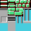
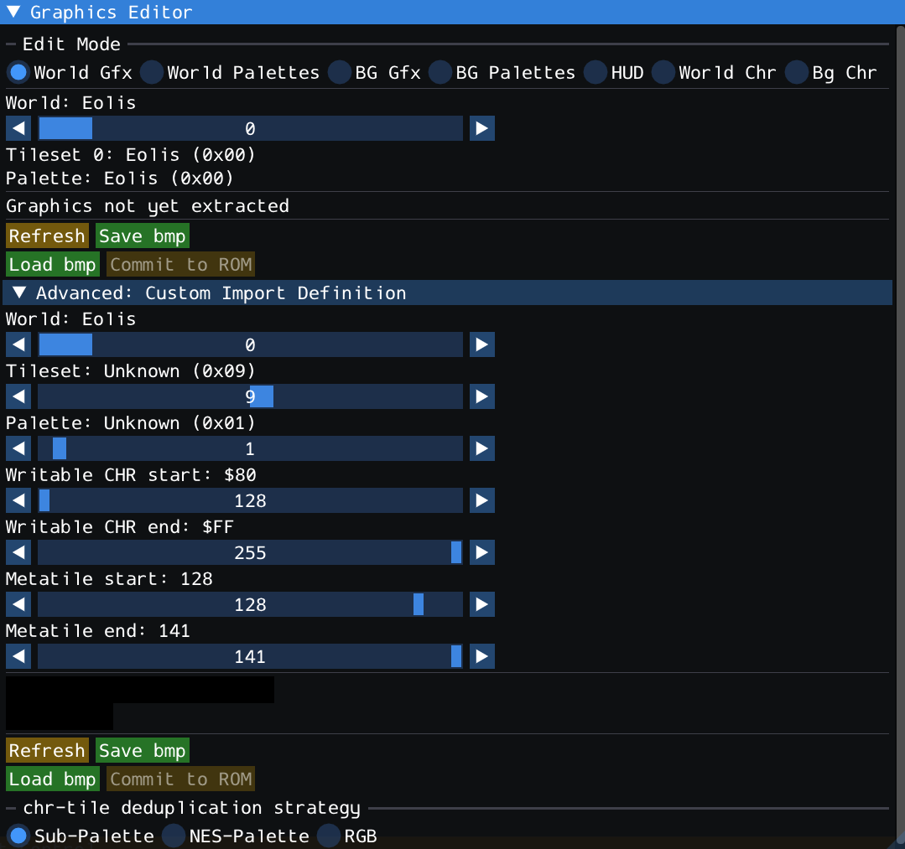
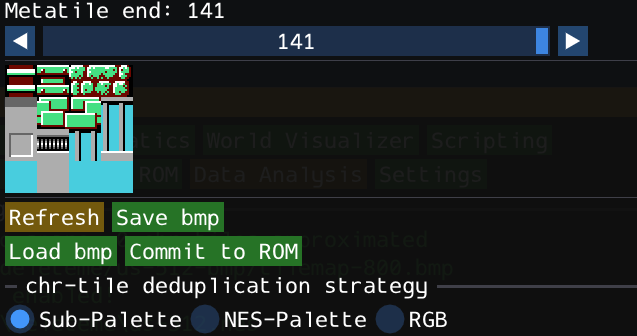
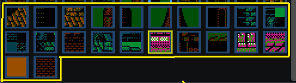
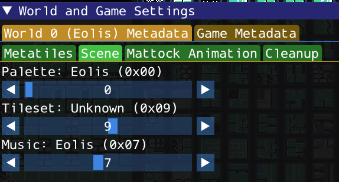
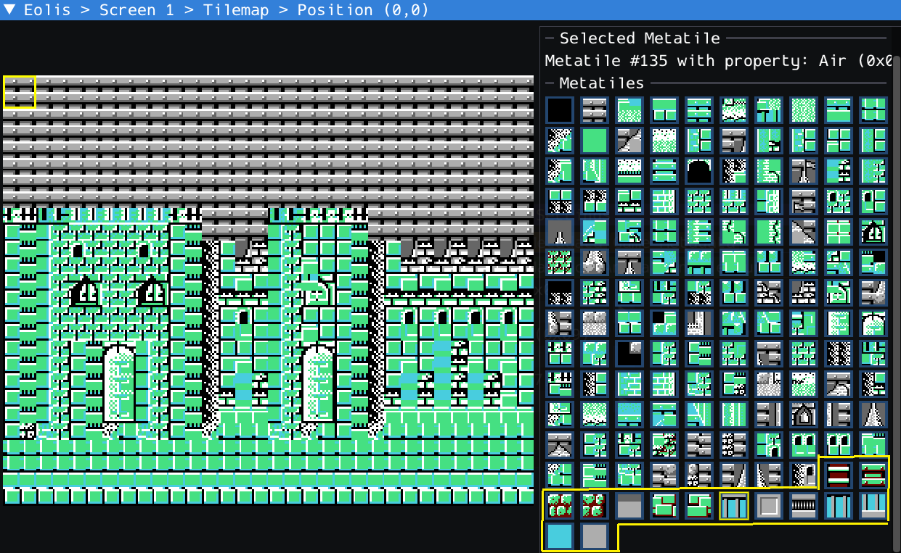
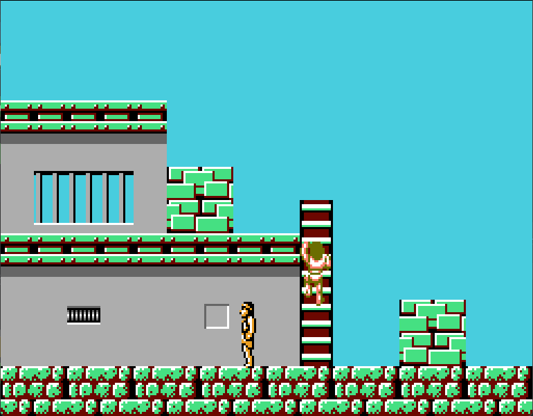

# Tileset Graphics and Metatiles

This document explains how background graphics are organized in Faxanadu and how they can be edited using [Echoes of Eolis](https://github.com/kaimitai/faxedit).

Several editor features work together to determine how a screen appears in-game. Changes made in one editor may affect graphics throughout an entire world, while others only affect specific screens.

The topics covered in this document are among:

- CHR graphics
- Tilesets
- Metatile definitions
- Background palettes
- Scene data
- Palette overrides
- DynamicTilesets

Understanding the relationship between these systems will help you make informed edits and avoid unexpected graphical changes elsewhere in the game.

The following sections explain each of these components and how they are represented within the editor.

---

# Table of Contents

- [Tileset Graphics and Metatiles](#tileset-graphics-and-metatiles)
- [CHR Graphics](#chr-graphics)
- [Tilesets](#tilesets)
    - [PPU Placement](#ppu-placement)
- [Metatile Definitions](#metatile-definitions)
  - [Per-World Definitions](#per-world-definitions)
- [Palettes](#palettes)
  - [Adding Color](#adding-color)
- [Scene Data](#scene-data)
  - [Overview](#overview)
  - [Regular Worlds](#regular-worlds)
  - [Buildings World](#buildings-world)
- [Palette Overrides](#palette-overrides)
  - [Same Graphics, Different Appearance](#same-graphics-different-appearance)
- [Putting It All Together](#putting-it-all-together)
- [BMP Import](#bmp-import)
  - [Overview](#overview-1)
  - [Conversion Process](#conversion-process)
  - [Shared Tilesets](#shared-tilesets)
  - [Buildings World Importing](#buildings-world-importing)
    - [Import Partitioning](#import-partitioning)
  - [Import Report](#import-report)
    - [Approximations](#approximations)
- [DynamicTilesets Hack](#dynamictilesets-hack)
  - [How It Works](#how-it-works)
- [Custom Import Definition](#custom-import-definition)
  - [Overview](#overview-2)
  - [Parameters](#parameters)
    - [World Number](#world-number)
    - [Tileset Number](#tileset-number)
    - [Palette Number](#palette-number)
    - [Metatile Range](#metatile-range)
    - [CHR Range](#chr-range)
  - [DynamicTileset Example](#dynamictileset-example)
    - [Preparation](#preparation)
    - [Import](#import)
    - [Patching](#patching)

---

# CHR Graphics

All tileset graphics in vanilla Faxanadu are stored in **Bank 4**. If you enable the `Double Tileset` hack, available for 32-bank ROMs, **Bank 28** will be used to hold a second collection of tilesets.

Banks are 16kb in size, and each CHR tile is 16 bytes, meaning a bank can contain a total of **1024 CHR tiles**. Each CHR tile is an 8×8 pixel graphic used as a building block for larger background graphics.

```text
Bank 4 (16 KB)

Tile 0000
Tile 0001
Tile 0002
...
Tile 1023
```

At this level, tiles contain only pixel patterns and sub-palette indexes (0-3). They do not contain color information and are not placed directly onto maps.

Instead, CHR tiles are organized into tilesets, which are then referenced by metatile definitions.

---

# Tilesets

The 1024 CHR tiles contained in Bank 4 are divided into nine **tilesets**.

A tileset determines which graphics are available when rendering a scene.

```text
Bank 4
┌─────────────┐
│ Tileset 0   │
├─────────────┤
│ Tileset 1   │
├─────────────┤
│ Tileset 2   │
├─────────────┤
│ ...         │
└─────────────┘
```

Each world selects a tileset number as part of its scene data. Metatile definitions for that world reference graphics from the selected tileset.

### PPU Placement

A tileset does not simply define which graphics are used. It also defines where those graphics are loaded in the background pattern table.

The lower portion of the pattern table is reserved for graphics that must remain available at all times, including HUD graphics and dynamically loaded graphics such as dialogue characters.

For this reason, tilesets are normally loaded starting at tile index `$80` or higher.

Because the highest valid tile index is `$FF`, the tileset size and starting index must be chosen such that the loaded graphics do not exceed the available range.

The tileset metadata stores this PPU start index along with the source graphics and tile count.

Most tilesets have 128 CHR-tiles with index 128-255. (0x80-0xff) Some tilesets, used by building screens, might start at a later index and contain fewer tiles. All tilesets do not need to be of equal size.

The total count of CHR-tiles across all tilesets must be no more than 1024 to fit in a single bank.

# Metatile Definitions

Screens in Faxanadu are built from **16×16 metatiles**, not directly from 8×8 CHR tiles.

Each metatile consists of four CHR tiles arranged in a 2×2 grid.

```text
+-----+-----+
| TL  | TR  |
+-----+-----+
| BL  | BR  |
+-----+-----+
```

A metatile definition contains:

- Top-left CHR tile
- Top-right CHR tile
- Bottom-left CHR tile
- Bottom-right CHR tile
- Palette index

For example:

```text
+-----+-----+
| 12  | 13  |
+-----+-----+
| 28  | 29  |
+-----+-----+

Palette = 2
```

When the game needs to draw a metatile, it retrieves the four CHR tiles specified by the definition and renders them using the assigned palette.

Metatile definitions do not reference a tileset directly. They reference CHR tile indexes in the PPU pattern table. The active tileset determines which graphics are loaded at those indexes.

This means the same metatile definition can produce completely different graphics when used with a different tileset.

## Per-World Definitions

Each world has its own set of metatile definitions.

Although multiple worlds may use the same tileset, they can define completely different metatiles from those graphics.

This means that a metatile index does not have a universal meaning.

The same metatile index may represent entirely different graphics depending on which world's metatile definitions are being used.

As a result, metatile definitions should always be considered part of the world's graphics configuration rather than a global resource.

This applies even to Buildings (world 4).

---

# Palettes

## Adding Color

CHR tiles contain pixel and sub-palette index data only. They do not contain color information.

Color is provided by the background palettes.

Each metatile definition includes a palette index that determines which palette should be used when rendering the metatile.

```text
Metatile
    +
Palette
    =
Final Appearance
```

Because palette selection occurs after the graphics are assembled, the same metatile can appear very different when rendered with another palette.

This allows the game to reuse graphics while creating visually distinct environments, like exteriors and interiors. (towers, for example)

---

# Scene Data

## Overview

The editor refers to the combination of tileset and palette assignments as **Scene Data**. (music is also considered part of the scene, but is not relevant here)

Scene data determines how a world or screen should be rendered.

A scene contains:

```text
Scene
├─ Tileset Number
└─ Palette Number
```

The game combines:

- Scene tileset
- Scene palette
- World metatile definitions
- Screen tilemap data

to produce the final background graphics shown to the player.

Throughout this document, the term *Scene Data* refers specifically to the tileset and palette selection used by a world, or a building screen.

---

## Regular Worlds

For most worlds, scene data is defined on a per-world basis.

```text
World
├─ Tileset Number
└─ Palette Number
```

All screens belonging to that world inherit the same default scene data.

For example:

```text
World 2

Tileset = 3
Palette = 10
```

Every screen in World 2 will use those settings unless a palette override is applied.

---

## Buildings World

World 4 is a special case.

Instead of defining scene data per world, it defines scene data per screen.

```text
Screen 0
├─ Tileset 6
└─ Palette 17

Screen 4
├─ Tileset 7
└─ Palette 20

Screen 8
├─ Tileset 8
└─ Palette 25
```

This allows individual interiors to use different graphics and color schemes.

As a result, shops, houses, castles, and other building interiors can all have unique visual styles despite belonging to the same world.

This also means that the metatile definitions target different tilesets. Any world, including buildings, can have at most 256 metatile definitions. In the original game, the metatiles for the buildings world are partitioned into three blocks; one for each tileset used across the building screens.

---

# Palette Overrides

## Same Graphics, Different Appearance

Although a world has a default palette assignment, that palette can sometimes be overridden.

This occurs through:

- Same-world doors
- Same-world transitions

In these cases, the game's graphics remain unchanged while only the active palette changes.

```text
Default Scene

Tileset = 3
Palette = 0
```

```text
After Override

Tileset = 3
Palette = 2
```

The metatile definitions are identical.

The CHR graphics are identical.

Only the palette has changed.

As a result, the exact same map data can appear significantly different depending on the active palette. This is how towers are made in the original game.


Note that if the `sameworld door to stage door-hack` is active, these hack doors will also obey palette changes.

---

# Putting It All Together

The complete rendering process can be summarized as follows:

```text
CHR Tiles
    ↓
Tileset
    ↓
Metatile Definition
    ↓
Palette
    ↓
Screen Tilemap
```

Understanding this flow is important when modifying graphics, because each layer serves a different purpose:

- CHR tiles provide raw graphics.
- Tilesets select available graphics.
- Metatiles combine graphics into usable map pieces.
- Palettes provide color.
- Screens are arrangements of metatiles.

---

# BMP Import

## Overview

The BMP Import feature generates metatile definitions from an image.

Unlike the Screen Tilemap Editor, which determines where metatiles are placed on a screen, the BMP Importer focuses on how those metatiles look.

The importer analyzes the image, attempts to recreate its appearance using Faxanadu's graphics constraints, and generates new metatile definitions and supporting CHR graphics as needed.

The import target is:

- A world number for normal worlds.
- A screen number for World 4 (Buildings).

The selected target determines which metatile definitions, scene data, palettes, and tileset are used during the conversion process.

## Conversion Process

The importer divides the source image into 16×16 pixel regions.

Each region is treated as a candidate metatile.

For each metatile-sized region, the importer attempts to:

1. Split the region into four 8×8 CHR tiles.
2. Reuse existing CHR tiles whenever possible.
3. Generate new CHR tiles when necessary.
4. Select the best matching sub-palette from the target's scene data.
5. Create a metatile definition that most closely matches the original image.

The goal is to reproduce the source image while staying within the graphical limitations of the selected tileset and palette configuration.

## Shared Tilesets

Multiple worlds may reference the same tileset.

When importing graphics, the importer only updates CHR graphics that are referenced by metatiles belonging to the selected import target.

It does not modify unrelated metatile definitions from other worlds, even if they use the same tileset.

This helps prevent unexpected graphical changes elsewhere in the ROM.

In other words, importing graphics into one world will not automatically rewrite metatile definitions belonging to another world.

## Buildings World Importing

World 4 (Buildings) requires special consideration when using the BMP Import feature.

Although scene data is defined per screen, metatile definitions are shared across the entire Building World.

In theory, this means multiple screens using different tilesets can reference the same metatile definition. In practice, this creates ambiguity when the importer needs to modify graphics.

To avoid introducing unexpected changes, the importer determines which metatile definitions belong to the selected tileset by analyzing actual screen usage.

Only metatile definitions used by screens that share the selected tileset will be considered candidates for modification.

Metatile definitions used exclusively by screens assigned to different tilesets will be left untouched.

### Import Partitioning

For the Building World, the importer automatically partitions the shared metatile definition space based on actual screen usage.

Conceptually, the importer treats the metatile set as if it were divided into independent groups:

```text
Tileset A
 ├─ Screen 00
 ├─ Screen 01
 └─ Uses Metatiles ...

Tileset B
 ├─ Screen 02
 ├─ Screen 03
 └─ Uses Metatiles ...
```

The actual partition is determined from the screens and metatiles currently in use, not from any predefined configuration.

It is strongly recommended that each Building World tileset maintain its own set of metatile definitions.

Avoid intentionally sharing metatiles between screens that use different tilesets.

Doing so makes it difficult for the importer to determine ownership and may prevent it from fully optimizing the generated graphics.

For best results:

- Treat each Building World tileset as its own graphical environment.
- Avoid mixing metatile definitions across tilesets.
- Keep metatile usage localized to screens that share the same tileset.

Following these guidelines allows the importer to generate better results while minimizing unintended changes to unrelated screens.

## Import Report

Before committing any changes, the importer displays a report showing how successfully the image could be represented.

The report includes information on:

- Available tileset capacity post import
- Number of approximations performed

### Approximations

An approximation occurs when the importer cannot reproduce part of the image exactly using the available graphics and palette constraints.

Common causes include:

- Insufficient tileset space
- Palette limitations
- Excessive graphical detail

Whenever possible, aim for:

```text
Approximations: 0
```

A result with zero approximations indicates that the imported image was reproduced exactly within the constraints of the selected target.

---

# DynamicTilesets Hack

## How It Works

In the original game, outdoor worlds use a single tileset assignment for the entire world.

```text
World 1
 └─ Tileset 2
```

Every screen in that world uses the same tileset.

World 4 (buildings) is the only exception, allowing tilesets to be selected on a per-screen basis.

The DynamicTilesets hack removes this limitation.

Instead of selecting a tileset per world, a tileset can be assigned to individual screens.

```text
Screen 0 → Tileset 2
Screen 1 → Tileset 2
Screen 2 → Tileset 5
Screen 3 → Tileset 1
Screen 4 → Tileset 7
```

This allows outdoor areas to mix graphics from different tilesets in a way that is not possible in the original game.

When combined with the `Double Tileset` hack, this feature enables a lot more variety.


The Dynamic Tilesets hack installs data defining the tileset overrides, as well as a loader which interprets this data, and changes the tileset on the fly if a match is found.

Tilesets will not change during normal screen-scroll transitions, as that would not be possible to do in a seamless way. The source and target screens are rendered at the same time during the transition.

Based on the parameters used when installing this hack, dynamic tilesets can be applied when using:

- Sameworld doors
- Sameworld transitions
- Stage doors
- Otherworld transitions
- Exiting a building
- Entering a building

Using dynamic tileset when entering a building screen is probably of limited value, as tilesets are set on a per-screen basis already for the buildings world.

Also note that if the stage-door hack is enabled, these doors are considered sameworld doors even though they take you to (potentially) another world.

---

# Custom Import Definition

## Overview

The Custom Import Definition feature provides manual control over the BMP Import process.

Its primary purpose is to support projects that use the DynamicTilesets hack.

Normally, a world uses a single tileset and the standard BMP Import feature can automatically determine the resources that should be modified.

When multiple tilesets are used within the same world, it becomes necessary to partition both CHR graphics and metatile definitions so that each tileset has its own graphics set.

Custom Import Definitions allow the user to explicitly define that partition.

The importer is given:

- The world whose metatile definitions should be updated.
- The alternate tileset where CHR graphics should be stored.
- The palette used for color matching.
- The metatile range assigned to that tileset.
- The CHR range assigned to that tileset.

This makes it possible to build independent graphics sets within the same world without affecting existing graphics.

## Parameters

### World Number

Determines which world's metatile definitions will be updated.

### Tileset Number

Determines where generated CHR graphics will be stored. Crucially, you can choose another tileset than the world's default.

### Palette Number

Determines the palette used during color matching.

The importer will attempt to reproduce the source image using this palette.

### Metatile Range

Determines which metatile definitions the importer is allowed to modify.

This is the most important parameter when using DynamicTilesets.

By reserving different metatile ranges for different tilesets, a single world can safely use multiple tilesets without those tilesets interfering with one another.

Example:

```text
Metatiles $00-$3F
Tileset A

Metatiles $40-$7F
Tileset B

Metatiles $80-$BF
Tileset C
```

The importer will only modify metatiles within the specified range.

### CHR Range

Determines which CHR tiles within the selected tileset may be modified.

This allows a tileset to be partitioned into multiple independent regions if desired. Tilesets are already space-constrained, but this functionality is available if you want to further partition a tileset into smaller virtual sub-tilesets.

Example:

```text
CHR $80-$BF
Environment Graphics

CHR $C0-$FF
Special Graphics
```

The importer will only allocate graphics inside the specified range. In practice though, the entire CHR-range ($80-$ff) will be used for a normal metatile collection. If your chosen chr-range is too small relative to the number of different metatiles we're trying to generate, the bmp import might not be able to produce good results as it will have to do more approximations.

## DynamicTileset Example

For this example we will start with a vanilla US rom, and make it so that the start screen remains vanilla, while screen 1 - the first door's destination screen - becomes a Mega Mana scene.

Assume we have ROM file `us.nes`, a vanilla US rom. We start by expanding the ROM to be a 512k SUROM instead, as we will use the `Double Tileset` feature and import our new graphics into a brand new tileset.

### Preparation

From a command-line shell, run the command `eoe-cli us.nes us-512.nes`.

This should give an output like this:

```text
Echoes of Eolis beta-9.1 - Command-line interface
Author: Kai E. Frøland (https://github.com/kaimitai/faxedit)
Build date: Sep  9 2026 10:49:51 CET

Attempting to read us.nes
ROM region resolved to 'us'
ROM expanded!
```

This will create a new ROM file `us-512.nes` which we can use as a new base for modding. When loading this into the GUI editor, it will be determined to have ROM region 'us-512' unlike the vanilla 'us'.

By default tilesets cannot be doubled in vanilla ROMs as the feature consumes an entire 16k bank.

> ℹ️ **Advanced note**: It is possible to enable double tilesets for a vanilla ROM, but then you will not be able to put **anything** else in the only free bank (bank 9) like dynamic tilesets or screen tilemaps. To enable this feature anyway, add the following under `consts` in your `eoe_config_override.xml`:
> 
> ```xml
>   <const name="tileset_secondary_bank" value="9" />
> ```
> 
> This tells the editor to use bank 9 for this feature.

We have also prepared a bmp-file with 14 new metatiles. (the last two are copies of the empty tile and can be disregarded for this example)



After opening our new expanded ROM, we go to `Settings > Advanced` and click the button `Enable Double Tileset`. This will create nine new tilesets, a doubling of whatever tilesets you currently have.

Next we need to select a palette to use with the metatiles we are going to import, as the bmp importer needs a color target when converting.

Copy the following to clipboard:

```text
EOE-PALETTE
0F 30 2B 06 0F 30 2B 2C 0F 20 10 00 0F 20 10 2C
```

Go to `BG Gfx > World Palettes > Palette 1`

and click `Paste`. Your palette 1 will be updated.

Next, we need to prepare new metatile targets for our import. World 0, Eolis, has 128 metatiles indexed from 0 to 127. We want to make 14 new metatiles, so we go to `World and Game Settings > World 0 (Eolis) Metadata > Metatiles` and click `Add metatile` 14 times. This will create 14 new metatiles as copies of whichever metatile is currently selected.

### Import

Go to `BG Gfx > World Gfx > World: Eolis` and expand the middle dropdown saying `Advanced: Custom Import Definition`.

Let us import chr for the new metatiles to new tileset with index 9.

Here we have to select the following:

- World: Eolis, because this is the metatile definitions we are going to update
- Tileset: 9 (new, created when enabling `Double Tilesets`)
- Palette: 1, because this is the one we prepared beforehand to match our new metatiles
- Writable chr-start: 128 - the first writable chr-tile of the tileset
- Writable chr-end: 255 - the last writable chr-tile of the tileset

We will see during import how many chr-tiles we actually need to describe our metatiles.

- Metatile start: 128, because this is the first new metatile we added for Eolis
- Metatile end: 141, because this is the last new metatile for Eolis



If we click `Refresh` it will generate a custom metatile tilemap based on our parameters. It will be meaningless, but we can save it, in which case it will write `<prefix>-bmp/tilemap-800.bmp` to disk. This is the filename expected by the custom import.

Overwrite this file with the bmp of the metatiles we actually want to use, and then click `Load bmp`. We will now get a preview of the result, and a report of how well the importer did.

In this case, the preview will look like this:



And the report under the output messages will say

```text
92 chr-tiles to spare, 0 chr-tiles approximated
```

which means we were well within our chr-budget. We allowed the importer to use the full writable chr-range from $80 to $ff, which is 128 tiles, but the importer only needed 36.

Any unused chr-tile during bmp-import will be made "empty" to indicate free space. If we want to preserve the rest of the chr-tiles, we can slide the end-index back and import again. (the import will not make any changes to our data before we commit)

When `Writable CHR start` is 128 and `Writable CHR end` is 162, and we `Load bmp`, the output will say:

```text
0 chr-tiles to spare, 0 chr-tiles approximated
```

which means it fits exactly. When there are zero approximated chr-tiles, that means there is no distortion. (If we stop at index 162, we can do another custom import for another set of chr-tiles into the same tileset, but starting from CHR-index 163)

We now click `Commit to ROM`. This will update chr-indexes 128 to 162 in tileset 9, and also update the 14 metatiles we added to Eolis.

Going back to the Tilemap Editor, we will see 14 new strange-looking metatiles for Eolis. That is because Eolis is currently drawn using its default tileset, which has index 0. Our new metatiles only make sense under tileset 9.



We want screen 1 to render under our new palette 1, so go to the door data for Eolis screen 0, and change "Destination palette/music" to 1.

In the tilemap editor let us go to Eolis screen 1 via "Enter door" so that palette 1 takes effect. We now want to make screen 1 using our new Mega Man metatiles. Go to `World 0 (Eolis) Metadata > Scene` and set tileset to 9 - which is the tileset we imported chr-tiles to. We will then see the screen as it will look during runtime, after the dynamic tileset switch has taken place.



The tilemap for screen one will now look like this:



Screen one is now drawn with the wrong tileset, but the last 14 metatiles now make sense. We can update these metatiles with new properties (they might all have property "Air" right now), and draw a screen using these 14 metatiles.

⚠️ Once the screen is drawn **remember to set Eolis default tileset back to 0** in the Scene data.

### Patching

Before we patch ROM, we need to ensure that the `DynamicTilesets` hack will be active, and that it will use tileset 9 for world 0, screen 1. (the palette change happens via the door)

In `eoe_config_override.xml` it will look like this:

```
 <string name="general_hacks">
    DynamicTilesets bank=28 addr=$8000 data=0:1:9
 </string>
 ```

 This says we will install general hack `DynamicTilesets`, and that for world `0`, screen `1` - it will use tileset `9` instead of the world default. The loader routine and lookup data will be installed in empty bank `28` at cpu address `$8000`, which is the start of the bank.
 
⚠️ If bank is not given, the loader and data will be put into bank 15 where free space is precious. For non-expanded ROMs this might be necessary.

 To add more dynamic tileset screens, combine entries with `+`, for example `DynamicTilesets data=0:1:9+2:3:12` etc.

 Tilesets do not change on regular scrolling connections as mentioned, so make sure to partition a world using multiple tilesets using sameworld doors and sameworld transitions. These can both take palette overrides.

 Patch ROM and start the game in an emulator. The very first screen should look normal, but when entering the door to screen 1, you should now see the screen you created with new tiles. 


