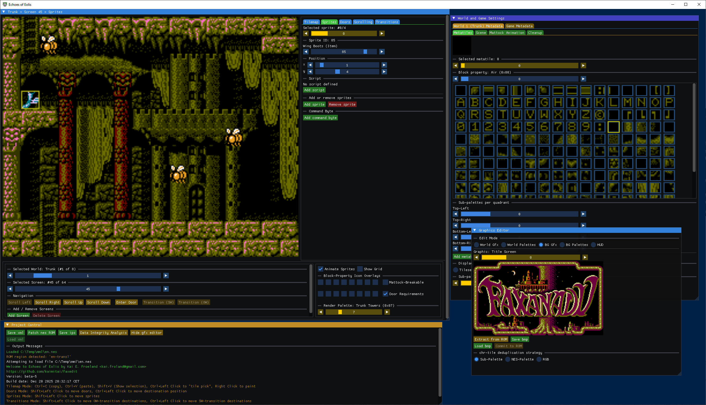

# Echoes of Eolis - An editor for Faxanadu (NES)

Welcome to the Echoes of Eolis code repository and release page. The code is standard C++20, and the project files were created using Microsoft Visual Studio Community 2022. You can compile the application from source, or get the latest precompiled Windows x64 build under the [repository releases](https://github.com/kaimitai/faxedit/releases/).

Make sure to read the [documentation](./docs/doc.md) for a detailed overview of all the inter-connected data in this game.

## Editor Capabilities

The following data is editable:

### Screen Data

* Screen tilemaps
* Screen scrolling connections
* Screen transition connections
* Screen doors
* Screen sprites

### World Data

* Metatile definitions
* Default palette
* Mattock animations

### Game Data
* Stage definitions
* Spawn points
* Building parameter sprite-sets
* Push-Block metadata
* Jump-On Block metadata

###### The editor will show screen, world and game metadata information
The editor can save your project as a patched NES ROM file or as an IPS patch. We also support our own XML format, which allows users to more easily compare file versions, use version control systems to track file history, and collaborate on projects.

### Roadmap

This editor was built during a few intense weeks of development, and is being released as a beta. Some bugs are expected. While we stabilize the codebase, we will prioritize bug-fixing. Once the technical debt has been paid down, we want to prioritize the following additions:

* Support graphics editing, perhaps by way of bmp imports and exports
* Add an undo feature
* Add configuration support for more ROM-hacks
* General UI improvements

### Version History

* 2025-11-29: version beta-4

  * Optimized tilemap placement: The editor now dynamically distributes the eight world tilemaps across available ROM banks, eliminating the rigid fixed layout of the original game. This includes support for placing tilemap data in previously unused banks, unlocking new storage capacity. We are now breaking an invariant that has existed for almost forty years.
  * Building Sprite Set editor: World 4 (Buildings) now supports direct visual editing of sprite sets. We also enabled the "Enter Door"-button for doors to buildings, in which case the door's screen and sprite set both will be selected.
  * Gridline toggle in tilemap window: Developers can enable or disable gridlines for clearer visual alignment when editing maps.
  * Default palette: The palette used to render screens will not go back to the world's default palette whenever you change screens via the slider. If you navigate to another world, however, it will revert to the default again.
  * Configurable NES palette: The palette definition has been moved into the configuration XML, allowing custom overrides and experimentation with color schemes.
  * Cursor tile coordinate tooltip: When not in tilemap editing mode, the mouse cursor tile coordinates on the tilemap will show as a tooltip to make it a little easier to set door destinations and such.

  Compatibility note: ROMs created with earlier versions of the editor remain fully compatible with this new release. However, ROMs created with beta-4 or later may not be compatible with earlier versions of the editor.

  This is because earlier releases relied on a hard-coded world-to-bank and pointer index mapping, while the new editor reads and writes these mappings dynamically from the ROM itself. The ROM format is still faithful to the game’s design — the difference lies only in how the editor interprets and patches the tilemap metadata.

* 2025-11-22: version beta-3
  * We show iScript code directly in the editor, with syntax highlighting. To actually edit and assemble the code, however, you need to use a separate tool like [FaxIScripts](https://github.com/kaimitai/FaxIScripts/).
  * We introduce a configuration xml file with region definitions, and constants needed by the editor per region. We now support all major regions, and two ROM hacks, by default.
  * Block Property icon overlays - We can toggle icon overlay rendering for each block property. Currently I am using my own placeholder graphics, but if anyone wants to contribute graphics let me know
  * Door Requirement icon overlays - We can toggle overlays for door requirements too (keys and rings)
  * Sprite animations - Sprites can be rendered using all of their animation frames
  * Made some internal adjustments to sprites which have different positional offsets in the game data versus how they are actually rendered
  * Improved sprite descriptions and categories by verifying the animations in the editor versus actual in-game rendering and behavior
  * Screen tilemap rendering - Some screens in the Buildings world and Mist were rendering slightly incorrectly due to a NES tile mismatch between the editor and the actual game. This has been fixed.
  * We allow patching ROM files in-place by holding shift when using the patch ROM-button
  * Will not show message "clipboard data pasted" when only showing the selection rectangle

* 2025-11-14: version beta-2
  * The editor will extract sprite graphics and metadata when loading a ROM-file, and present them in the UI during sprite-editing
  * Added support for defining the game-wide "Jump-On" tile animation. This is a feature supported by the original game, but it was left unused.

* 2025-11-01: version beta-1
  * Initial release

### Credits

Special thanks to the following contributors and fellow digital archaeologists:

[ChipX86/Christian Hammond](http://chipx86.com/) - For helping me directly with many previously unknown details that helped me achieve a high level of generality - and also for providing everyone with an invaluable source in his [Faxanadu disassembly](https://chipx86.com/faxanadu/) project

["Vagla"](https://www.romhacking.net/community/627/) - For providing the original documentation of various Faxanadu data formats

[Sebastian Porst](https://github.com/sporst) - For discovering and documenting the data format for special screen-transitions and mapping out the door data

### Curiosa

In order to animate sprites in the editor, I had to investigate and map out the animation frame format. I rendered all the animation frames with the tilesets most likely to be associated with each frame, and to my surprise the third and fourth frames of the Maskman enemy (sprite with id 32) showed a walking female NPC never seen before.

The character data for this NPC is stored in the middle of the character data for Maskman, and the animation frames are similarly entangled. The fact that no ID is associated with this sprite is probably the reason it remained undiscovered for so long.

Here is the animation:

