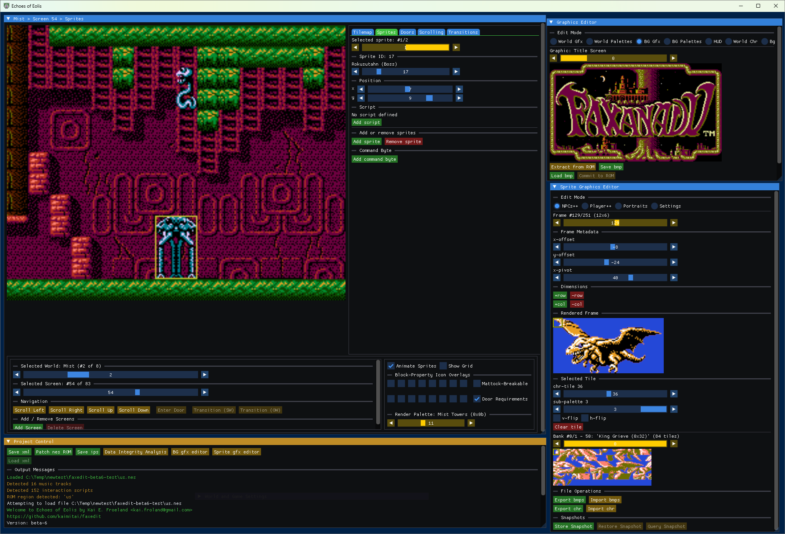
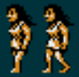

# Echoes of Eolis - An editor for Faxanadu (NES)

Welcome to the Echoes of Eolis code repository and release page. The code is standard C++20, and the project files were created using Microsoft Visual Studio Community 2022. You can compile the application from source, or get the latest precompiled Windows x64 build under the [repository releases](https://github.com/kaimitai/faxedit/releases/).

A MacOS-build is also available. See instructions on [how to run an unsigned DMG-file](https://discord.com/channels/859610833323556884/1434979888049426532/1476410785851772928), or you can build from source.

Make sure to read the [documentation](./docs/doc.md) for a detailed overview of all the inter-connected data in this game.

This application will always be shipped with the latest version of [FaxIScripts](https://github.com/kaimitai/FaxIScripts), which is a command-line application that can disassemble and assemble various script types, music and miscellaneous data - in other words data that is not necessarily suitable for a GUI editor.

The application is compatible out of the box with the following ROM regions: US, US Revision A, EU, JP and a well-known [English Translation Hack](https://www.romhacking.net/translations/4281/).

See the [Changelog](./docs/doc.md#changelog) for version history.

<hr>

## Editor Capabilities

The following data is editable:

### Screen Data

* Screen tilemaps
* Screen scrolling connections
* Screen transition connections
* Screen doors
* Screen sprites

### World Data

* Metatile definitions
* Scenes: World palette, music and tilesets
* Mattock animations

### Game Data
* Stage definitions
* Spawn points
* Building parameter sprite-sets
* Push-Block metadata
* Jump-On Block metadata
* Palette to music mapping
* Fog parameters

### Graphics
* Tilesets for metatiles
* Images used in the game
* Sprite Graphics and animation frames

### Cinematics
* Intro animaton metadata
* Outro animation metadata
* All cinematic animation graphics

### Visualizer
* World maps can be exported as parametrized png-images

<hr>

The main editor screen supports zooming, panning and showing subsections of scroll-adjacent screens.


###### The editor will show screen, world and game metadata information
The editor can save your project as a patched NES ROM file or as an IPS patch. We also support our own XML format, which allows users to more easily compare file versions, use version control systems to track file history, and collaborate on projects.

<hr>

### Recommended Workflow

The editor allows you to work directly on ROM files, and for small or experimental changes this is perfectly fine. A ROM contains all necessary data, and you can patch and save it repeatedly without needing any external files other than ```eoe_config.xml```.

For larger or long‑term projects, however, it is strongly recommended to export your project data to XML and treat that XML file as your **primary source of truth**. The XML format stores all world tilesets, game graphics, palettes, tilemaps, and related metadata in a clean, editable, and version‑friendly way.

If your project also involves editing **music** or **scripts** for use with [FaxIScripts](https://github.com/kaimitai/FaxIScripts), you should keep these text files as part of your project’s source as well. These text‑based assets integrate naturally with the project as a whole and will give you full control over every part of the game the editor and assembler support.

Using a version control system such as **git** is highly encouraged. Text files (XML, scripts, music sources) are:

- easy to diff  
- easy to merge  
- easy to revert  
- acts as a backup system with file history

These files are also **region‑agnostic** for the most part. (The only exception are strings in iScripts for the jp-region) When patching a ROM, the editor reads all region‑specific offsets and layout information from `eoe_config.xml`, ensuring that your exported data is always routed to the correct locations regardless of whether you’re working with EU, US, or US Rev A ROMs - or any custom compatible ROM hack - as long as it is defined in the configuration xml.

In short:

- **Small edits:** you can work directly on the ROM
- **Serious projects:** keep XML + script/music sources under version control  
- **ROM region differences:** handled automatically through configuration  

This approach gives you a clean, reliable workflow and protects your work over time.

If you use a configuration file override (eoe_config_override.xml) this should usually also be considered part of the project masterdata.

<hr>

### Credits

Special thanks to the following contributors and fellow digital archaeologists:

[ChipX86/Christian Hammond](http://chipx86.com/) - For helping me directly with many previously unknown details that helped me achieve a high level of generality - and also for providing everyone with an invaluable source in his [Faxanadu disassembly](https://chipx86.com/faxanadu/) project

["Vagla"](https://www.romhacking.net/community/627/) - For providing the original documentation of various Faxanadu data formats

[Sebastian Porst](https://github.com/sporst) - For discovering and documenting the data format for special screen-transitions and mapping out the door data

[Jessica](https://www.romhacking.net/community/9037/) - for testing out the MML functionality of [the assembler](https://github.com/kaimitai/faxiscripts) and improving the [MML documentation](./docs/faxiscripts_mml.md) - and for providing example music files which were also added to the docs.

[Rob Porter aka "Songbirder"](https://github.com/rgeraldporter) for providing MacOS build scripts and binaries, and for helping out with testing, bug-reports and suggestions for new features.

[Ok Impala!](https://www.okimpala.net) for feedback and suggestions.

<hr>

### Curiosa

In order to animate sprites in the editor, I had to investigate and map out the animation frame format. I rendered all the animation frames with the tilesets most likely to be associated with each frame, and to my surprise the third and fourth frames of the Maskman enemy (sprite with id 32) showed a walking female NPC never seen before.

The character data for this NPC is stored in the middle of the character data for Maskman, and the animation frames are similarly entangled. The fact that no ID is associated with this sprite is probably the reason it remained undiscovered for so long.

Here is the animation:



<hr>

**ROM Hack Project Links**

* You can find me on the **Faxanadu Randomizer & Romhacking** Discord server, the main hub for all things Faxanadu.

  [](https://discord.gg/AyJErR8kyV)

<hr>

* Dont't miss [Root of Decay](https://www.okimpala.net/faxanadu-root-of-decay) - An upcoming Faxanadu ROM hack by Ok Impala!
* Check out [Jessica's Alternate Soundtrack hack](https://www.romhacking.net/hacks/9396/), a full music replacement hack for Faxanadu!
* Songbirder's [Faxanadu 40th Anniversary edition](https://fax40.net/) ROM hack (currently in beta) is available!
